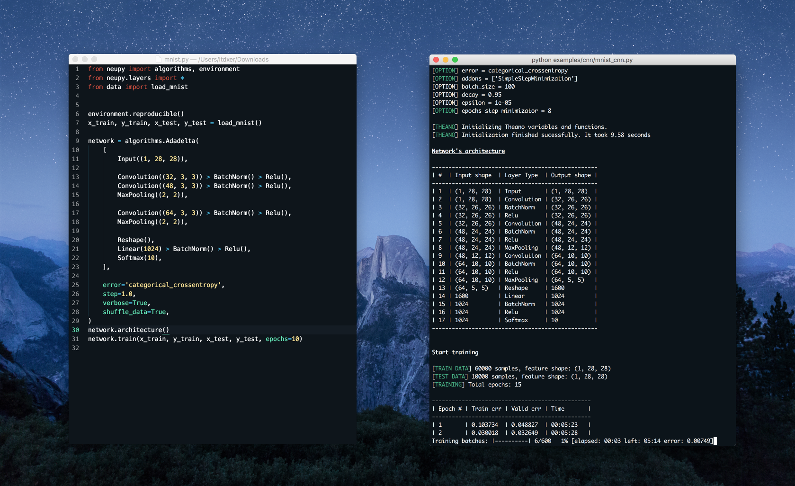

|Travis|_ |Dependency Status|_ |License|_

.. |Travis| image:: https://api.travis-ci.org/itdxer/neupy.png?branch=master
.. _Travis: https://travis-ci.org/itdxer/neupy

.. |Dependency Status| image:: https://dependencyci.com/github/itdxer/neupy/badge
.. _Dependency Status: https://dependencyci.com/github/itdxer/neupy

.. |License| image:: https://img.shields.io/badge/license-MIT-blue.svg
.. _License: https://github.com/itdxer/neupy/blob/master/LICENSE

NeuPy v0.4.1
============

NeuPy is a Python library for Artificial Neural Networks. NeuPy supports many different types of Neural Networks from a simple perceptron to deep learning models.

Installation
------------

.. code-block:: bash

    $ pip install neupy

User Guide
----------

* `Install NeuPy <http://neupy.com/pages/installation.html>`_
* Check the `tutorials <http://neupy.com/docs/tutorials.html>`_
* Learn more about NeuPy in the `documentation <http://neupy.com/pages/documentation.html>`_
* Explore lots of different `neural network algorithms <http://neupy.com/pages/cheatsheet.html>`_.
* Read `articles <http://neupy.com/archive.html>`_ and learn more about Neural Networks.

Links
-----

* `Tutorials <http://neupy.com/docs/tutorials.html>`_
* `Documentation <http://neupy.com/pages/documentation.html>`_
* `Articles <http://neupy.com/archive.html>`_
* `Cheat sheet <http://neupy.com/docs/cheatsheet.html>`_
* `Open Issues <https://github.com/itdxer/neupy/issues>`_

Articles
--------

* `Hyperparameter optimization for Neural Networks  <http://neupy.com/2016/12/17/hyperparameter_optimization_for_neural_networks.html>`_
* `Visualize Backpropagation Algorithms <http://neupy.com/2015/07/04/visualize_backpropagation_algorithms.html>`_
* `MNIST classification <http://neupy.com/2016/11/12/mnist_classification.html>`_
* `Predict prices for houses in the area of Boston <http://neupy.com/2015/07/04/boston_house_prices_dataset.html>`_
* `Password recovery <http://neupy.com/2015/09/21/password_recovery.html>`_
* `Discrete Hopfield Network <http://neupy.com/2015/09/20/discrete_hopfield_network.html>`_

Examples
--------

Convolutional Neural Networks
~~~~~~~~~~~~~~~~~~~~~~~~~~~~~~

* `MNIST CNN <examples/cnn/mnist_cnn.py>`_
* `CIFAR10 CNN <examples/cnn/cifar10_cnn.py>`_
* `Pre-trained AlexNet CNN <examples/cnn/alexnet.py>`_
* `Pre-trained VGG16 CNN <examples/cnn/vgg16.py>`_
* `Pre-trained VGG19 CNN <examples/cnn/vgg19.py>`_
* `Pre-trained SqueezeNet <examples/cnn/squeezenet.py>`_
* `GoogleNet <examples/cnn/googlenet.py>`_
* `Inception v3 <examples/cnn/inception_v3.py>`_
* `ResNet 50 <examples/cnn/resnet50.py>`_

Autoencoders
~~~~~~~~~~~~

* `MNIST, Denoising Autoencoder <examples/autoencoder/denoising_autoencoder.py>`_
* `MNIST, Convolutional Autoencoder <examples/autoencoder/conv_autoencoder.py>`_
* `MNIST, Stacked Convolutional Autoencoders <examples/autoencoder/stacked_conv_autoencoders.py>`_
* `MNIST, Variational Autoencoder <examples/autoencoder/variational_autoencoder.py>`_

Boltzmann Machine
~~~~~~~~~~~~~~~~~

* `Feature Learning from the MNIST Images, Restricted Boltzmann Machine (RBM) <examples/boltzmann_machine/rbm_mnist.py>`_
* `Gibbs sampling using face images, Restricted Boltzmann Machine (RBM) <examples/boltzmann_machine/rbm_faces_sampling.py>`_

MLP Neural Networks
~~~~~~~~~~~~~~~~~~~

* `MNIST, Multilayer perceptron <examples/mlp/mnist_mlp.py>`_
* `Rectangle images, Multilayer perceptron <examples/mlp/rectangles_mlp.py>`_
* `Boston House Price prediction, Hessian algorithm <examples/mlp/boston_price_prediction.py>`_
* `Learning Algorithms Visualization, Gradient Descent, Momentum, RPROP and Conjugate Gradient <examples/mlp/gd_algorithms_visualization.py>`_
* `IMDB review classification using CBOW and RPROP MLP <examples/mlp/imdb_review_classification>`_
* `MLP with categorical and numerical features <examples/mlp/mix_categorical_numerical_inputs.py>`_

Competitive Neural Networks
~~~~~~~~~~~~~~~~~~~~~~~~~~~

* `Simple SOFM example <examples/competitive/sofm_basic.py>`_

Neural Networks with Radial Basis Functions
~~~~~~~~~~~~~~~~~~~~~~~~~~~~~~~~~~~~~~~~~~~

* `Classify iris dataset, Probabilistic Neural Network (PNN) <examples/rbfn/pnn_iris.py>`_
* `Regression using Diabetes dataset, Generilized Neural Nerwork (GRNN) <examples/rbfn/grnn_params_selection.py>`_
* `Music-Speech audio classification, Probabilistic Neural Network (PNN) <examples/rbfn/music_speech>`_

Memory based Neural Networks
~~~~~~~~~~~~~~~~~~~~~~~~~~~~

* `Sinus function approximation, CMAC <examples/memory/cmac_basic.py>`_
* `Visualize Discrete Hopfield Neural Network energy function <examples/memory/dhn_energy_func.py>`_
* `Password recovery, Discrete Hopfield Neural Network <examples/memory/password_recovery.py>`_

Dependencies
------------

* Python 2.7, 3.4, 3.5, 3.6
* Theano == 0.8.2
* NumPy >= 1.9.0
* SciPy >= 0.14.0
* Matplotlib >= 1.4.0
* graphviz == 0.5.1
