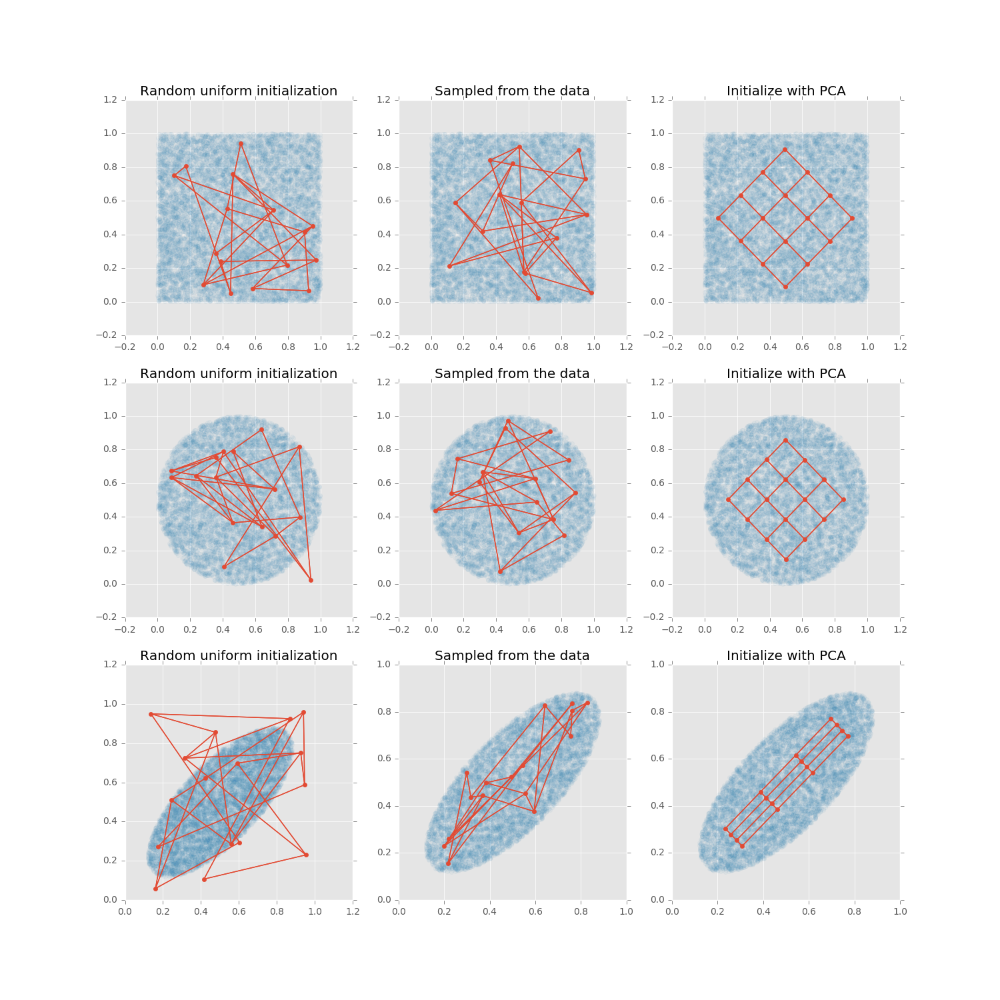
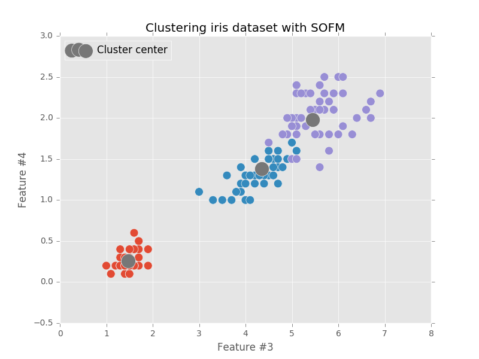

# Examples of competitive neural networks

## Visualizing MNIST dataset

```bash
$ python sofm_digits.py
```


## Visualizing high-dimensional datasets

```bash
$ python sofm_heatmap_visualization.py
```


## Learning topology of the moon shaped cluster

```bash
$ python sofm_moon_topology.py
```


## Compare different SOFM's grid types

```bash
$ python sofm_compare_grid_types.py
```


## Compare different SOFM's weight initializations

```bash
$ python sofm_compare_weight_init.py
```



## Cluster iris dataset using SOFM

```bash
$ python sofm_iris_clustering.py
```


