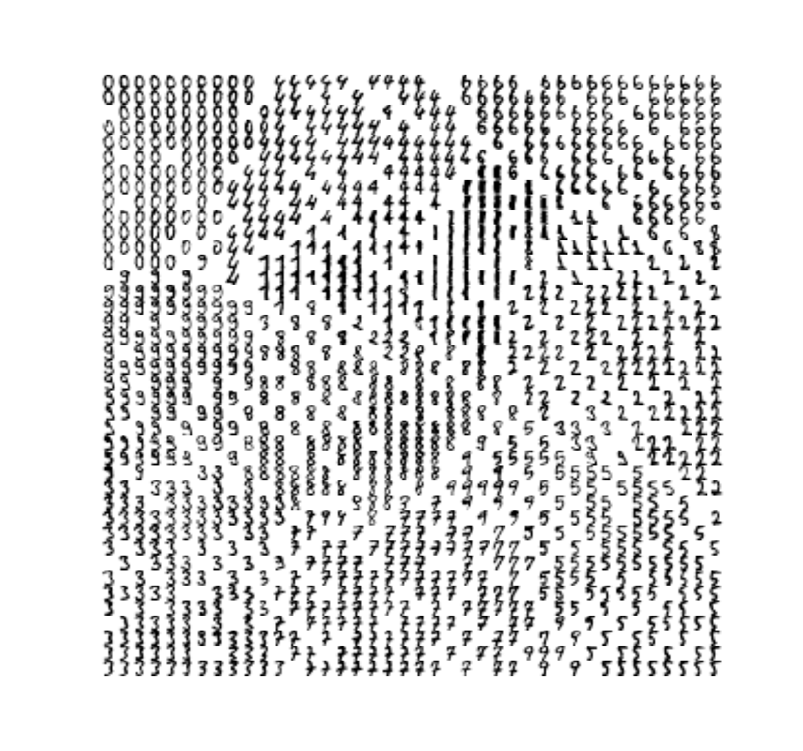
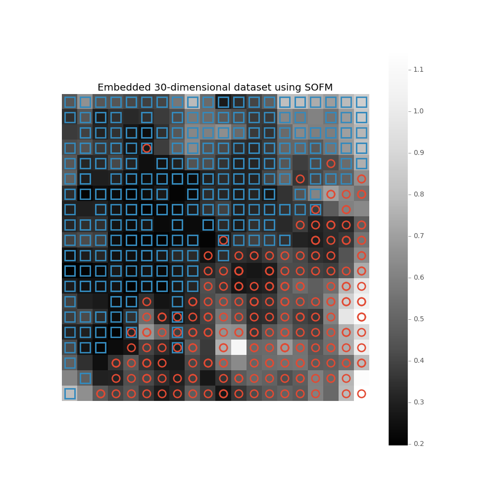
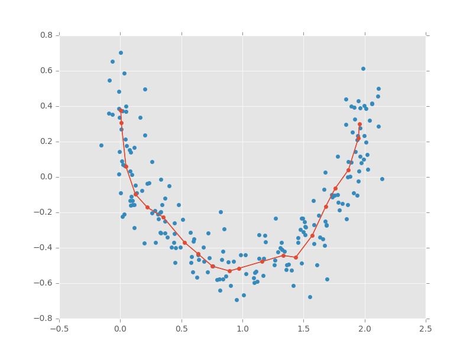
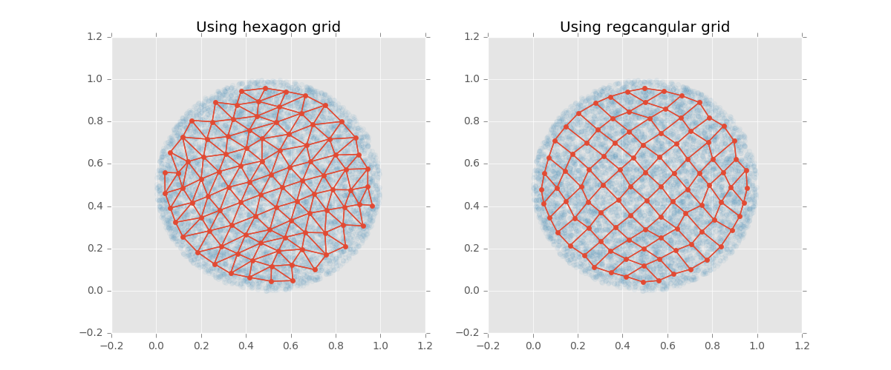

# Examples of competitive neural networks

## Output from sofm_digits.py

## Output from sofm_heatmap_visualization.py

## Output from sofm_moon_topology.py

## Output from sofm_compare_grid_types.py

