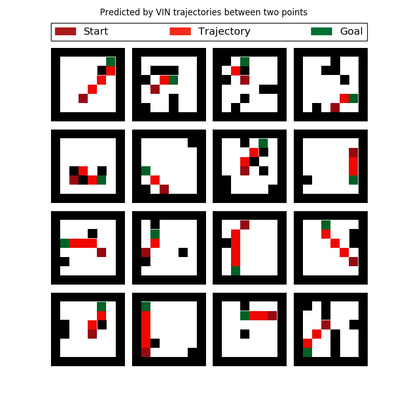
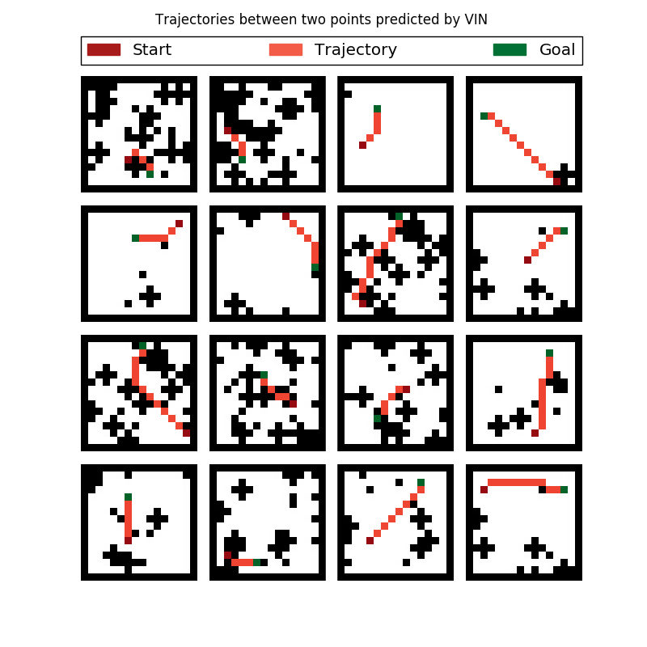
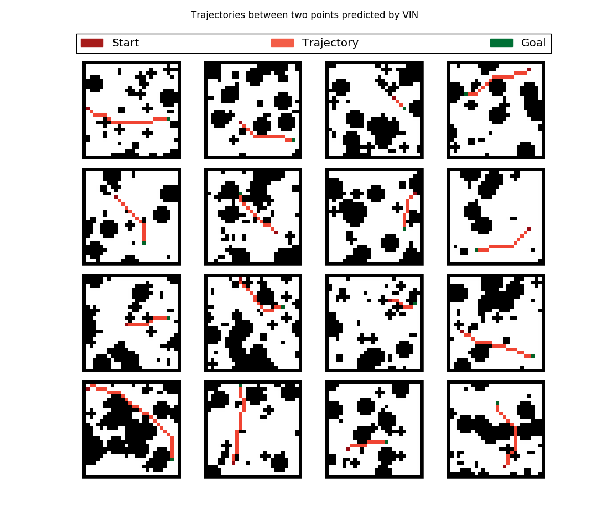

Value Iteration Network (VIN)
=============================

Implementation of Value Iteration Network (VIN) in NeuPy. Original code for the `paper <https://arxiv.org/abs/1602.02867>`_ you can find `here <https://github.com/avivt/VIN>`_.

Code description
----------------

.. csv-table::
    :header: "File name", "Description"

    "loaddata.py","Read data from MAT file, split it into train and test samples and store everything in pickle files"
    "train_vin.py","Train VIN and validate its accuracy"
    "visualize.py","Sample a few grids from test dataset and visualize trajectories predicted by the pretrained network"
    "evaluations.py","Functions that help to evaluate network's prediction quality"
    "settings.py","Different configurations for different image sizes"

Perfomance
----------

.. csv-table::
    :header: "Problem", "Prediction loss", "Success rate"

    "Grid world 8x8","0.0049","99.89%"
    "Grid world 16x16","0.0427","99.46%"
    "Grid world 28x28","0.0954","98.03%"

For each grid we select 10 start positions and using VIN we generate trajectory between two points. In addition we calculate shortest path between two points with `Lee algorithm <https://en.wikipedia.org/wiki/Lee_algorithm>`_. Using this information we are calculating two metrics:

1. **Success rate**. We compare length of the predicted trajectory with the length of the shortest possible path. We assume that prediction is correct in case if they have equal length. Success rate measures percentage of trajectories with shortets possible length. We compare trajectory length, because there can be multiple way to define shortest path between two points on the grid.

.. image:: https://monosnap.com/image/5JnDsgTimA5rIjoSYnk2nFsDNL2fDI.png

2. **Prediction loss**. This measurment defines average difference between shortest and predicted trajectories. Prediction loss is not the one that we are trying to minimize in the ``train_vin.py`` script. In the ``train_vin.py`` file we are minimizing negative log-likelihood function.

Data preprocessing
------------------

To be able to convert .mat files to format suitable for network training you need to run ``loaddata.py`` file. Files for the 8x8 grid have been already generated and stored in the ``data`` directory. Other files you need to generate with the following command.

.. code-block:: bash

    $ # For grid world with 16x16 images
    $ python loaddata.py --imsize=16
    $
    $ # For grid world with 28x28 images
    $ python loaddata.py --imsize=28

Network training
----------------

In the ``models`` folder you can find pretrained weights for VIN network. Some you can run ``visualize.py`` script and play with the final results. In case if you are interested in trying network with different parameters then you can train network from scratch.

.. code-block:: bash

    $ # For grid world with 8x8 images
    $ python train_vin.py --imsize=8
    $
    $ # For grid world with 16x16 images
    $ python train_vin.py --imsize=16
    $
    $ # For grid world with 28x28 images
    $ python train_vin.py --imsize=28

Visualizations
--------------

8x8 Grid world
~~~~~~~~~~~~~~

.. code-block:: bash

    $ python visualize.py --imsize=8

16x16 Grid world
~~~~~~~~~~~~~~~~

.. code-block:: bash

    $ python visualize.py --imsize=16

28x28 Grid world
~~~~~~~~~~~~~~~~

.. code-block:: bash

    $ python visualize.py --imsize=28

