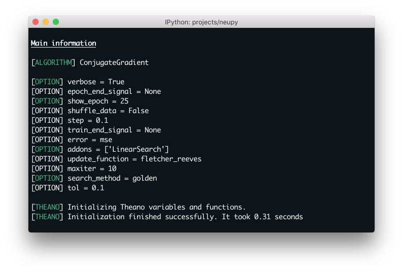

.. _boston-house-price:

Predict prices for houses in the area of Boston
===============================================

For this article we are going to predict house prices using Conjugate Gradient algorithm.

For the beginning we should load the data.

.. code-block:: python

    from sklearn import datasets

    dataset = datasets.load_boston()
    data, target = dataset.data, dataset.target

Let's look closer into the data.

.. raw:: html

    <table border="1" class="dataframe">
      <thead>
        <tr>
          <th>CRIM</th>
          <th>ZN</th>
          <th>INDUS</th>
          <th>CHAS</th>
          <th>NOX</th>
          <th>RM</th>
          <th>AGE</th>
          <th>DIS</th>
          <th>RAD</th>
        </tr>
      </thead>
      <tbody>
        <tr>
          <td>0.00632</td>
          <td>18</td>
          <td>2.31</td>
          <td>0</td>
          <td>0.538</td>
          <td>6.575</td>
          <td>65.2</td>
          <td>4.0900</td>
          <td>1</td>
        </tr>
        <tr>
          <td>0.02731</td>
          <td>0</td>
          <td>7.07</td>
          <td>0</td>
          <td>0.469</td>
          <td>6.421</td>
          <td>78.9</td>
          <td>4.9671</td>
          <td>2</td>
        </tr>
        <tr>
          <td>0.02729</td>
          <td>0</td>
          <td>7.07</td>
          <td>0</td>
          <td>0.469</td>
          <td>7.185</td>
          <td>61.1</td>
          <td>4.9671</td>
          <td>2</td>
        </tr>
        <tr>
          <td>0.03237</td>
          <td>0</td>
          <td>2.18</td>
          <td>0</td>
          <td>0.458</td>
          <td>6.998</td>
          <td>45.8</td>
          <td>6.0622</td>
          <td>3</td>
        </tr>
        <tr>
          <td>0.06905</td>
          <td>0</td>
          <td>2.18</td>
          <td>0</td>
          <td>0.458</td>
          <td>7.147</td>
          <td>54.2</td>
          <td>6.0622</td>
          <td>3</td>
        </tr>
      </tbody>
    </table>

    <table border="1" class="dataframe">
      <thead>
        <tr>
          <th>TAX</th>
          <th>PTRATIO</th>
          <th>B</th>
          <th>LSTAT</th>
          <th>MEDV</th>
        </tr>
      </thead>
      <tbody>
        <tr>
          <td>296</td>
          <td>15.3</td>
          <td>396.90</td>
          <td>4.98</td>
          <td>24.0</td>
        </tr>
        <tr>
          <td>242</td>
          <td>17.8</td>
          <td>396.90</td>
          <td>9.14</td>
          <td>21.6</td>
        </tr>
        <tr>
          <td>242</td>
          <td>17.8</td>
          <td>392.83</td>
          <td>4.03</td>
          <td>34.7</td>
        </tr>
        <tr>
          <td>222</td>
          <td>18.7</td>
          <td>394.63</td>
          <td>2.94</td>
          <td>33.4</td>
        </tr>
        <tr>
          <td>222</td>
          <td>18.7</td>
          <td>396.90</td>
          <td>5.33</td>
          <td>36.2</td>
        </tr>
      </tbody>
    </table>

Data contains 14 columns.
The last column ``MEDV`` is a median value of owner-occupied homes in $1000's.
The goal is to predict this prices.
Other columns we can use for Neural Network training.
All columns description you can find below.

- CRIM     per capita crime rate by town
- ZN       proportion of residential land zoned for lots over 25,000 sq.ft.
- INDUS    proportion of non-retail business acres per town
- CHAS     Charles River dummy variable (= 1 if tract bounds river; 0 otherwise)
- NOX      nitric oxides concentration (parts per 10 million)
- RM       average number of rooms per dwelling
- AGE      proportion of owner-occupied units built prior to 1940
- DIS      weighted distances to five Boston employment centres
- RAD      index of accessibility to radial highways
- TAX      full-value property-tax rate per $10,000
- PTRATIO  pupil-teacher ratio by town
- B        1000(Bk - 0.63)^2 where Bk is the proportion of blacks by town
- LSTAT    % lower status of the population

From data set description we can find that there are 13 continuous attributes (including "class" attribute "MEDV") and 1 binary-valued attribute.
There is no multiple categorical data, so we don't need to change feature dimension.
But we already have one problem.
If you look closer, you will find that every column has its own data range.
This situation is a bad thing for Neural Network training, because input values ​​make different contributions to the calculation of the output values.
Bigger values will be more important for Network which can be perceived as invalid assumption based on data.
For example in the first row, in the table above, column ``B`` contains value `396.90` and column ``CRIM`` - `0.00632`.
To fix this issue we should transfrom all columns to get similar ranges.

.. code-block:: python

    from sklearn import preprocessing

    data_scaler = preprocessing.MinMaxScaler()
    target_scaler = preprocessing.MinMaxScaler()

    data = data_scaler.fit_transform(data)
    target = target_scaler.fit_transform(target.reshape(-1, 1))

After transformation data looks like this.

.. raw:: html

    <table border="1" class="dataframe">
      <thead>
        <tr>
          <th>CRIM</th>
          <th>ZN</th>
          <th>INDUS</th>
          <th>CHAS</th>
          <th>NOX</th>
          <th>...</th>
        </tr>
      </thead>
      <tbody>
        <tr>
          <td>0.000000</td>
          <td>0.18</td>
          <td>0.067815</td>
          <td>0</td>
          <td>0.314815</td>
          <td>...</td>
        </tr>
        <tr>
          <td>0.000236</td>
          <td>0.00</td>
          <td>0.242302</td>
          <td>0</td>
          <td>0.172840</td>
          <td>...</td>
        </tr>
        <tr>
          <td>0.000236</td>
          <td>0.00</td>
          <td>0.242302</td>
          <td>0</td>
          <td>0.172840</td>
          <td>...</td>
        </tr>
        <tr>
          <td>0.000293</td>
          <td>0.00</td>
          <td>0.063050</td>
          <td>0</td>
          <td>0.150206</td>
          <td>...</td>
        </tr>
        <tr>
          <td>0.000705</td>
          <td>0.00</td>
          <td>0.063050</td>
          <td>0</td>
          <td>0.150206</td>
          <td>...</td>
        </tr>
      </tbody>
    </table>

All the data is now in the range between 0 and 1.

Then we should split our data set into train and validation.
We use 85% of data for train.

.. code-block:: python

    from sklearn.model_selection import train_test_split
    from neupy import environment

    environment.reproducible()

    x_train, x_test, y_train, y_test = train_test_split(
        data, target, train_size=0.85
    )

Now we are ready to build Neural Network which will predict house prices.

.. code-block:: python

    from neupy import algorithms, layers

    cgnet = algorithms.ConjugateGradient(
        connection=[
            layers.Input(13),
            layers.Sigmoid(50),
            layers.Sigmoid(1),
        ],
        search_method='golden',
        show_epoch=25,
        verbose=True,
        addons=[algorithms.LinearSearch],
    )

We define network with one hidden layer.
Input size for this layer is 50.
This value is just a guess.
For better and more accurate result we should choose it with other methods, but for now we can use this value.
As the main algorithm we take Conjugate Gradient.
This implementation of backpropagation is a little bit different from main interpretation of Conjugate Gradient.
For GradientDescent implementation we can't guarantee that we get the local minimum in n-th steps (where `n` is the dimension).
To optimize it we should use linear search.
It will fix and set up better steps for Conjugate Gradient.

Now we are going to train the network.
For training we set up 100 epochs.
Also we will add test data into training function to check validation error on every epoch.

.. code-block:: python

    cgnet.train(x_train, y_train, x_test, y_test, epochs=100)

.. figure:: images/boston/cgnet-train.png
    :width: 80%
    :align: center
    :alt: Conjgate Gradient train

To make sure that all training processes go in a right way we can check erros updates while the training is in process.

.. code-block:: python

    from neupy import plots
    plots.error_plot(cgnet)

.. figure:: images/boston/cgnet-error-plot.png
    :width: 80%
    :align: center
    :alt: Conjgate Gradient train

Error minimization procedure looks fine.
The problem is, that last error doesn't show us the full picture of prediction accuracy.
Our output is always between zero and one and we count the results always into Mean Square Error.
To fix it, we are going to inverse our transformation for predicted and actual values and for accuracy measurment we will use Root Mean Square Logarithmic Error (RMSLE).

.. code-block:: python

    from neupy.estimators import rmsle

    y_predict = cgnet.predict(x_test).round(1)
    error = rmsle(target_scaler.inverse_transform(y_test),
                  target_scaler.inverse_transform(y_predict))
    print(error)

Now we can see that our error approximately equals to `0.22` which is pretty small.
In the table below you can find 10 randomly chosen errors.

.. raw:: html

    <table border="1" class="dataframe">
      <thead>
        <tr>
          <th>Actual</th>
          <th>Predicted</th>
        </tr>
      </thead>
      <tbody>
        <tr>
          <td>31.2</td>
          <td>27.5</td>
        </tr>
        <tr>
          <td>18.7</td>
          <td>18.5</td>
        </tr>
        <tr>
          <td>20.1</td>
          <td>18.5</td>
        </tr>
        <tr>
          <td>17.2</td>
          <td>9.5</td>
        </tr>
        <tr>
          <td>8.3</td>
          <td>9.5</td>
        </tr>
        <tr>
          <td>50.0</td>
          <td>41.0</td>
        </tr>
        <tr>
          <td>42.8</td>
          <td>32.0</td>
        </tr>
        <tr>
          <td>20.5</td>
          <td>18.5</td>
        </tr>
        <tr>
          <td>16.8</td>
          <td>23.0</td>
        </tr>
        <tr>
          <td>11.8</td>
          <td>9.5</td>
        </tr>
      </tbody>
    </table>

The results are good for the first network implementation.
There are a lot of things which we can do to improve network results, but we will discuss them in an another article.

.. author:: default
.. categories:: none
.. tags:: supervised, backpropagation, regression, tutorials
.. comments::
