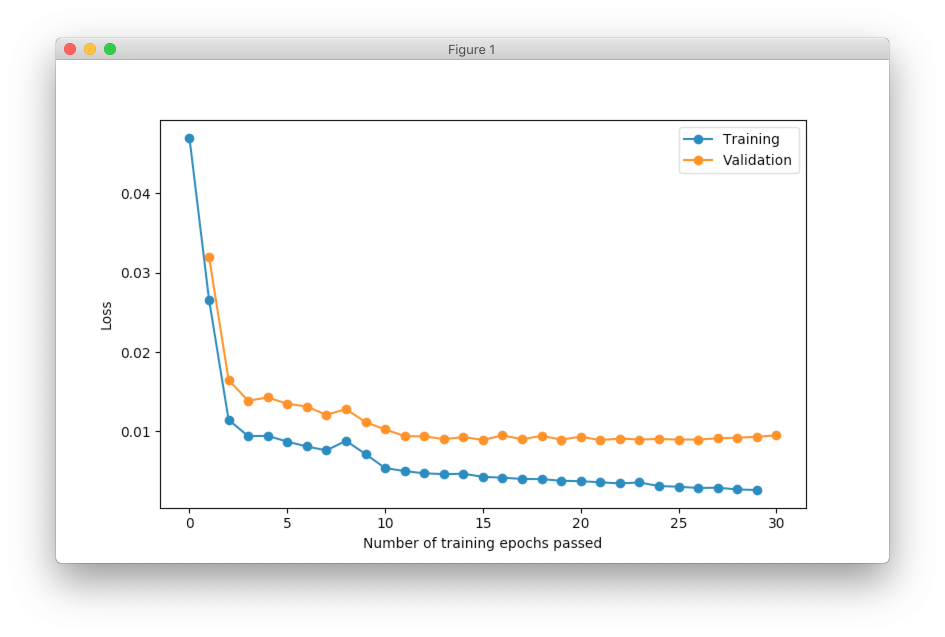

.. _boston-house-price:

Predict prices for houses in the area of Boston
===============================================

.. raw:: html

    

        

        Boston house prices is a classical dataset for regression. This article shows how to make a simple data processing and train neural network for house price prediction.
        

    

Boston house prices is a classical example of the regression problem. This article shows how to make a simple data processing and train neural network for house price forecasting.

Dataset can be downloaded from many different resources. In order to simplify this process we will use scikit-learn library. It will download and extract and the data for us.

.. code-block:: python

    from sklearn import datasets

    dataset = datasets.load_boston()
    data, target = dataset.data, dataset.target

We can print few first rows from the dataset just to make sure that

.. raw:: html

    <table border="1" class="dataframe">
      <thead>
        <tr>
          <th>CRIM</th>
          <th>ZN</th>
          <th>INDUS</th>
          <th>CHAS</th>
          <th>NOX</th>
          <th>RM</th>
          <th>AGE</th>
          <th>DIS</th>
          <th>RAD</th>
        </tr>
      </thead>
      <tbody>
        <tr>
          <td>0.00632</td>
          <td>18</td>
          <td>2.31</td>
          <td>0</td>
          <td>0.538</td>
          <td>6.575</td>
          <td>65.2</td>
          <td>4.0900</td>
          <td>1</td>
        </tr>
        <tr>
          <td>0.02731</td>
          <td>0</td>
          <td>7.07</td>
          <td>0</td>
          <td>0.469</td>
          <td>6.421</td>
          <td>78.9</td>
          <td>4.9671</td>
          <td>2</td>
        </tr>
        <tr>
          <td>0.02729</td>
          <td>0</td>
          <td>7.07</td>
          <td>0</td>
          <td>0.469</td>
          <td>7.185</td>
          <td>61.1</td>
          <td>4.9671</td>
          <td>2</td>
        </tr>
        <tr>
          <td>0.03237</td>
          <td>0</td>
          <td>2.18</td>
          <td>0</td>
          <td>0.458</td>
          <td>6.998</td>
          <td>45.8</td>
          <td>6.0622</td>
          <td>3</td>
        </tr>
        <tr>
          <td>0.06905</td>
          <td>0</td>
          <td>2.18</td>
          <td>0</td>
          <td>0.458</td>
          <td>7.147</td>
          <td>54.2</td>
          <td>6.0622</td>
          <td>3</td>
        </tr>
      </tbody>
    </table>

    <table border="1" class="dataframe">
      <thead>
        <tr>
          <th>TAX</th>
          <th>PTRATIO</th>
          <th>B</th>
          <th>LSTAT</th>
          <th>MEDV</th>
        </tr>
      </thead>
      <tbody>
        <tr>
          <td>296</td>
          <td>15.3</td>
          <td>396.90</td>
          <td>4.98</td>
          <td>24.0</td>
        </tr>
        <tr>
          <td>242</td>
          <td>17.8</td>
          <td>396.90</td>
          <td>9.14</td>
          <td>21.6</td>
        </tr>
        <tr>
          <td>242</td>
          <td>17.8</td>
          <td>392.83</td>
          <td>4.03</td>
          <td>34.7</td>
        </tr>
        <tr>
          <td>222</td>
          <td>18.7</td>
          <td>394.63</td>
          <td>2.94</td>
          <td>33.4</td>
        </tr>
        <tr>
          <td>222</td>
          <td>18.7</td>
          <td>396.90</td>
          <td>5.33</td>
          <td>36.2</td>
        </tr>
      </tbody>
    </table>

Data contains 14 columns.
The last column ``MEDV`` is a median value of owner-occupied homes in $1000's. The goal is to predict this value. Other columns we can use for neural network training.

It's quite hard to understand data just from the column names. Scikit-learn also provides description.

.. code-block:: python

    print(dataset.DESCR)

- ``CRIM`` - per capita crime rate by town
- ``ZN`` - proportion of residential land zoned for lots over 25,000 sq.ft.
- ``INDUS`` - proportion of non-retail business acres per town
- ``CHAS`` - Charles River dummy variable (= 1 if tract bounds river; 0 otherwise)
- ``NOX`` - nitric oxides concentration (parts per 10 million)
- ``RM`` - average number of rooms per dwelling
- ``AGE`` - proportion of owner-occupied units built prior to 1940
- ``DIS`` - weighted distances to five Boston employment centres
- ``RAD`` - index of accessibility to radial highways
- ``TAX`` - full-value property-tax rate per $10,000
- ``PTRATIO`` - pupil-teacher ratio by town
- ``B`` - 1000(Bk - 0.63)^2 where Bk is the proportion of blacks by town
- ``LSTAT`` - % lower status of the population

There are 13 continuous attributes (including "class" attribute "MEDV") and 1 binary-valued attribute. There are no columns that have multiple categories, which simplifies initial data processing..

From the table above you can notice that every column has values in different scales. It might slow down or completely break networks convergence. In order to fix this issue, we should normalize values in every column. One of the simplest way to do it is to map every value into range between 0 and 1, where maximum value in every column will be equal to 1 and the smallest one - to 0.

.. code-block:: python

    from sklearn import preprocessing

    data_scaler = preprocessing.MinMaxScaler()
    target_scaler = preprocessing.MinMaxScaler()

    data = data_scaler.fit_transform(data)
    target = target_scaler.fit_transform(target.reshape(-1, 1))

After transformation data looks like this.

.. raw:: html

    <table border="1" class="dataframe">
      <thead>
        <tr>
          <th>CRIM</th>
          <th>ZN</th>
          <th>INDUS</th>
          <th>CHAS</th>
          <th>NOX</th>
          <th>...</th>
        </tr>
      </thead>
      <tbody>
        <tr>
          <td>0.000000</td>
          <td>0.18</td>
          <td>0.067815</td>
          <td>0</td>
          <td>0.314815</td>
          <td>...</td>
        </tr>
        <tr>
          <td>0.000236</td>
          <td>0.00</td>
          <td>0.242302</td>
          <td>0</td>
          <td>0.172840</td>
          <td>...</td>
        </tr>
        <tr>
          <td>0.000236</td>
          <td>0.00</td>
          <td>0.242302</td>
          <td>0</td>
          <td>0.172840</td>
          <td>...</td>
        </tr>
        <tr>
          <td>0.000293</td>
          <td>0.00</td>
          <td>0.063050</td>
          <td>0</td>
          <td>0.150206</td>
          <td>...</td>
        </tr>
        <tr>
          <td>0.000705</td>
          <td>0.00</td>
          <td>0.063050</td>
          <td>0</td>
          <td>0.150206</td>
          <td>...</td>
        </tr>
      </tbody>
    </table>

Neural networks are prune to overfitting and we always need to have validation dataset that we will use to assess networks performance after the training.

.. code-block:: python

    from sklearn.model_selection import train_test_split
    from neupy import environment

    # Make sure that split between train and
    # validation datasets will be reproducible
    environment.reproducible()

    x_train, x_test, y_train, y_test = train_test_split(
        # 85% of the data we will use for training
        # and the other 15% will be used for validation
        data, target, test_size=0.15
    )

Since we have all the data the last thing that we need is a neural network. We can design simple network with only one hidden layer.

.. code-block:: python

    from neupy.layers import *

    # Number of features that we want
    # to use during the training
    n_inputs = 13

    # Number of outputs in the network. For the house price
    # forecasting we want to predict single value per every
    # input sample.
    n_outputs = 1

    network = join(
        # This layer doesn't do any computation. It just
        # defines how many inputs network should expect.
        Input(n_inputs),

        # Hidden layer. Number of neurons can be adjusted
        # in order to improve performance or deal with overfitting
        Sigmoid(50),

        # Sigmoid outputs values between 0 and 1 and all
        # the prices that we want to predict has been rescaled
        # to the same range.
        Sigmoid(n_outputs),
    )

Now that we have the our network we can use one of the large `training algorithms supported by neupy <../../../pages/cheatsheet.html#algorithms>`_. Our datasets is quite small and network has small number of parameters. For cases like this we can take advantage of the more algorithms that can converge much faster. I'll use :network:`Levenberg-Marquardt <LevenbergMarquardt>`, but you can feel free to experiment with different algorithms.

.. code-block:: python

    from neupy import algorithms

    lmnet = algorithms.LevenbergMarquardt(
        # First argument has to be neural network
        network,

        # With this option enabled network shows its configuration
        # before the training and its progress during the training
        verbose=True,

        # In order to avoid showing information about
        # network training progress after every epoch we can
        # do it less frequently, for example, every 5th epoch.
        show_epoch=5,
    )

Output after initialization might look like this

.. code-block:: python

    Main information

    [ALGORITHM] LevenbergMarquardt

    [OPTION] verbose = True
    [OPTION] epoch_end_signal = None
    [OPTION] show_epoch = 5
    [OPTION] shuffle_data = False
    [OPTION] train_end_signal = None
    [OPTION] error = mse
    [OPTION] mu = 0.01
    [OPTION] mu_update_factor = 1.2

    [TENSORFLOW] Initializing Tensorflow variables and functions.
    [TENSORFLOW] Initialization finished successfully. It took 0.46 seconds

And finally, we can use our data in order to train the network. In addition, neupy allows to specify validation datasets. It won't use it for training. Instead, at the end of every epoch it will use validation data to estimate network forecasting performance on the unseen data.

.. code-block:: python

    lmnet.train(x_train, y_train, x_test, y_test, epochs=30)

Output during the training might look like this

.. code-block:: python

    Start training

    [TRAINING DATA] shapes: (430, 13)
    [TEST DATA] shapes: (76, 13)
    [TRAINING] Total epochs: 30

    ---------------------------------------------------------
    |    Epoch    |  Train err  |  Valid err  |    Time     |
    ---------------------------------------------------------
    |           1 |    0.079689 |    0.037351 |      376 ms |
    |           5 |   0.0097019 |    0.014112 |       73 ms |
    |          10 |    0.011091 |    0.011521 |       76 ms |
    |          15 |   0.0045973 |   0.0092206 |       72 ms |
    |          20 |    0.003823 |   0.0098822 |       75 ms |
    |          25 |   0.0031455 |   0.0087205 |       71 ms |
    |          30 |   0.0025977 |   0.0095658 |       74 ms |
    ---------------------------------------------------------

It's also useful to visualize network training progress using line plot. In the figure below you can see two lines. One line shows training error and the other one validation error.

.. code-block:: python

    from neupy import plots
    plots.error_plot(lmnet)

We typically want to see decrease for the validation error. The training error might be useful during debugging. For example, it might be used in order to see if network overfits.

During the training we used mean squared error as a loss function on the scaled prediction values. We can use different function in order to measure network's forecasting performance. For example, we can use Root Means Squared Logarithmic Error (RMSLE) and compare prediction to the exact value that were scaled back to the original scale.

.. code-block:: python

    import numpy as np

    def rmsle(expected, predicted):
        log_expected = np.log1p(expected + 1)
        log_predicted = np.log1p(predicted + 1)
        squared_log_error = np.square(log_expected - log_predicted)
        return np.sqrt(np.mean(squared_log_error))

    y_predict = lmnet.predict(x_test).round(1)
    error = rmsle(
        target_scaler.inverse_transform(y_test),
        target_scaler.inverse_transform(y_predict),
    )
    print(error)  # ~0.18

The final result is quite good for the first prototype.

.. author:: default
.. categories:: none
.. tags:: supervised, backpropagation, regression, tutorials
.. comments::
