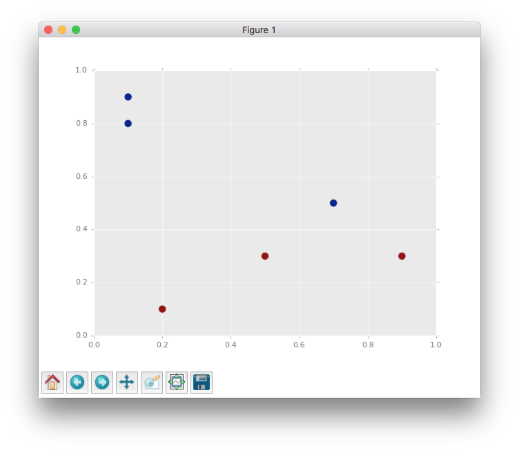
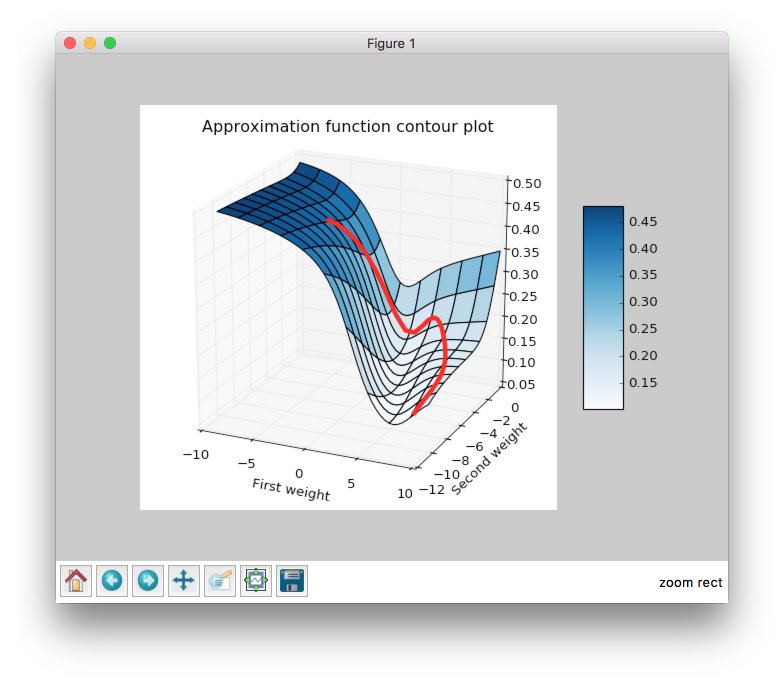
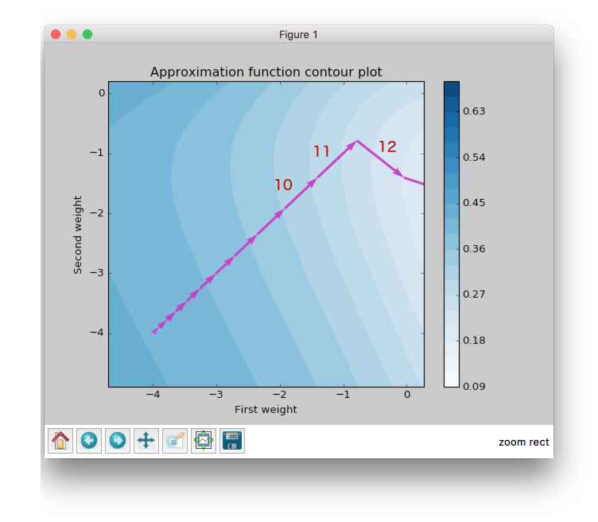
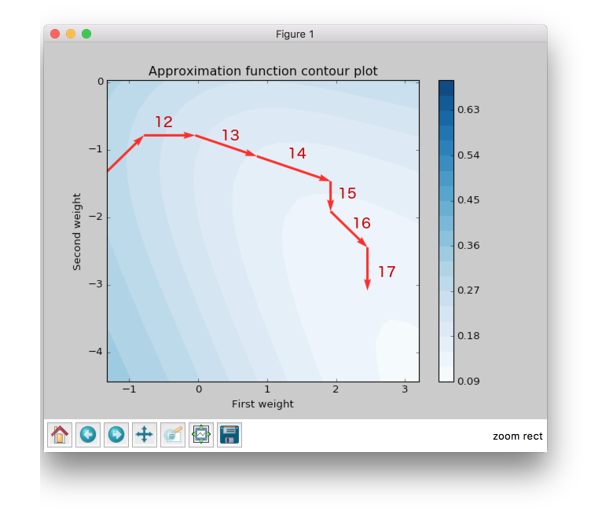
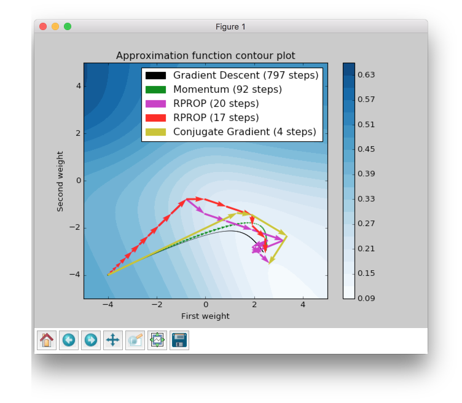
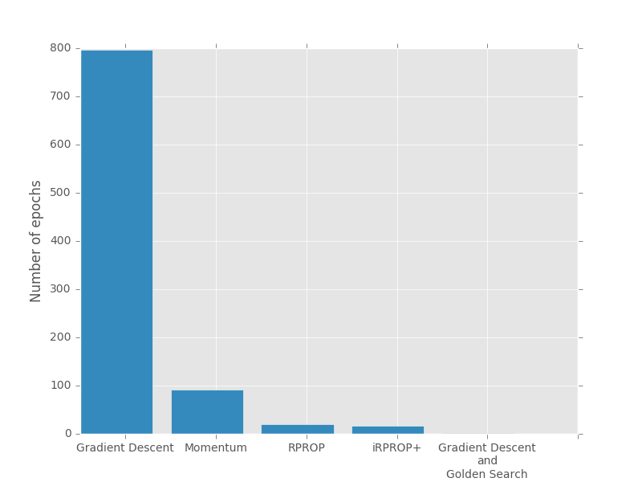

Visualize Algorithms based on the Backpropagation
=================================================

.. contents::

In this article we will be testing different algorithms based on the backpropagation method, visualizing them and trying to figure out some important features from the plots.

Checking data
-------------

First of all we need to define simple dataset which contains 6 points with two features.

.. code-block:: python

    import numpy as np

    input_data = np.array([
        [0.9, 0.3],
        [0.5, 0.3],
        [0.2, 0.1],
        [0.7, 0.5],
        [0.1, 0.8],
        [0.1, 0.9],
    ])
    target_data = np.array([
        [1],
        [1],
        [1],
        [0],
        [0],
        [0],
    ])

So we can make a scatter plot and look closer at this dots.

.. code-block:: python

    import matplotlib.pyplot as plt

    plt.scatter(input_data[:, 0], input_data[:, 1], c=target_data, s=100)
    plt.show()

From the figure above we can clearly see that all dots are linearly separable and we are able to solve this problem with simple perceptron. But the goal of this article is to make clear visualization of learning process for different algorithm based on the backpropagation method, so the problem has to be as simple as possible, because in other cases it will be complex to visualize.

So, since the problem is linear separable we can solve it without hidden layers in network. There are two features and two classes, so we can build network which will take 2 input values and will produce 1 output. We need just two weights, so we can visualize them in contour plot.

Initialize contour
------------------

I won't  add all code related to the plots building in the article. In case if you are interested you can check the main script `here <https://github.com/itdxer/neupy/blob/master/examples/mlp/gd_algorithms_visualization.py>`_.

.. image:: images/visualize_gd/raw-contour-plot.png
    :width: 80%
    :align: center
    :alt: Approximation function contour plot

The plot above shows error rate that depends on the network's weights. The best result corresponds to the smallest error value. The best weights combination for this problem should be near the bottom right corner in the white area.

Next, we are going to look at 5 algorithms based on the Backpropagation. They are:

* Gradient descent
* Momentum
* RPROP
* iRPROP+
* Gradient Descent + Golden Search

Let's define start point for our algorithms. I've chosen the `(-4, -4)` point, because at this point network gives bad results and it will be interesting to observe the learning progress from a bad initialization point. In the script you can set up any other starting point you like.

This function will train the network until the error will be smaller than `0.125`. Every network starts at place with coordinates `(-4, -4)` and finishes near the point with the error value lower than `0.125`.

Visualize algorithms based on the Backpropagation
-------------------------------------------------

Gradient Descent
++++++++++++++++

Let's primarily check :network:`Gradient Descent <GradientDescent>`.

.. figure:: images/visualize_gd/bp-steps.png
    :width: 80%
    :align: center
    :alt: Weight update steps for the Gradient Descent

Gradient Descent got to the value close to 0.125 using 797 steps and this black curve is just tiny steps of gradient descent algorithm. We can zoom it and look even closer.

.. figure:: images/visualize_gd/bp-steps-zoom.png
    :width: 80%
    :align: center
    :alt: Zoomed weight update steps for the Gradient Descent

Now we can see some information about gradient descent algorithm. All steps for gradient descent algorithm have approximately similar magnitude. Their direction doesn't vary because contours in the zoomed picture are parallel to each other and in it we can see that there are still a lot of steps that are needed to be made to achieve the minimum. Also we can see that small vectors are perpendicular to the contour.

The problem is that the step size is a very sensitive parameter for the gradient descent. In typical problem we won't be able to visualize the learning progress and we won't have an ability to see that our updates over the epochs are inefficient. For this result I've used step size equal to ``0.3``, but if we increased it to ``10`` we would reach our goal in ``25`` steps. I haven't added any improvements to make a fair comparison to other algorithms in the summary chapter.

Momentum
++++++++

Now let's look at another very popular algorithm - :network:`Momentum`.

.. figure:: images/visualize_gd/momentum-steps.png
    :width: 80%
    :align: center
    :alt: Momentum steps

:network:`Momentum` got to the value close to 0.125 by 92 steps, which is more than 8 times less than for the gradient descent. The basic idea behind :network:`Momentum` algorithm is that it accumulates gradients from the previous epochs. It means that if the gradient has the same direction after each epoch weight update vector magnitude will increase. But if the gradient stars changing its direction weight update vector magnitude will decrease. Check the figure again. Imagine that you're standing at a skatepark. Than you throw a ball into a half-pipe in a way that makes it roll smoothly on the surface. While it rolls down the gravity force drags it down and it makes the ball roll faster and faster. Let's get back to the :network:`Momentum` algorithm and try to find these properties in the plot.

.. figure:: images/visualize_gd/momentum-steps-zoom.png
    :width: 80%
    :align: center
    :alt: Momentum steps zoom on increasing weight update size

When we zoom the plot we can see that the direction for weight update vectors is almost the same and gradient's direction doesn't change after every epoch. In the picture above the vector which is the last on the right is bigger than the first one on the same plot on the left. Since it always moves forward it speeds up.

Let's get back to the ball example. What happens when the ball reaches the pit of the half-pipe for the first time? Will it stop? Of course not. Ball gained enough speed for moving. So it will go up. But after that the ball will start to slow down and its amplitude will become smaller and smaller, because of the gravity force, that will continue to push it down to the pit and eventually it will stop to move. Let's try to find the similar behavior in the same plot.

.. figure:: images/visualize_gd/momentum-steps-zoom-decrease.png
    :width: 80%
    :align: center
    :alt: Momentum steps zoom on decreasing weight update size

From the figure above it’s clear that weight update magnitude became smaller. Like a ball that slows down and changes its direction towards the minimum.

And finally to make it even more intuitive you can check weight update trajectory in 3D plot. It looks much more like the ball and half-pipe in skatepark analogy.

RPROP
+++++

:network:`Momentum` makes fewer steps to reach the specified minimum point, but we still can do better. Next algorithm that we are going to check is :network:`RPROP`.

.. figure:: images/visualize_gd/rprop-steps.png
    :width: 80%
    :align: center
    :alt: RPROP steps

This improvement looks impressive. Now we are able to see steps without zooming. We got almost the same value as before using just 20 steps, which is approximately 5 times less than :network:`Momentum` and approximately 40 times less than :network:`Gradient Descent <GradientDescent>`.

Now we are going to figure out what are the main features of :network:`RPROP`. We can notice just by looking at the plot above :network:`RPROP` has a unique step for each weight. There are just two steps for each weight in the input layer for this network. :network:`RPROP` will increase the step size if gradient don't change the sign compare to previous epoch, and it will decrease otherwise.

Let's check a few first weight updates.

From the figure above you can see that first 11 updates have the same direction, so both steps increase their value after each iteration. For the first epoch steps are equal to the same value which we set up at network initialization step. In further iterations they increased by the same constant factor, so after six iteration they got bigger, but they are still equal because they move in one direction all the time.

Now let's check the next epochs from the figure below. At the 12th epoch gradient changed the direction, but steps are still the same in value. But we can clearly see that gradient changed the sign for the second weight. :network:`RPROP` updated the step after weight had updated, so the step for the second weight should be smaller for the 13th epoch.

.. figure:: images/visualize_gd/rprop-11th-to-14th-epochs.png
    :width: 80%
    :align: center
    :alt: RPROP from 11th to 14th steps

Now let's look at the 13th epoch. It shows us how gradient sign difference at the 12th epoch updated steps. Now the steps are not equal. From the picture above we can see that update on the second weight (y axis) is smaller than on the first weight (x axis).

At the 16th epoch gradient on y axis changed the sign again. Network decreased by constant factor and updated for the second weight at the 17th epoch would be smaller than at the 16th.

To train your intuition you can check the other epochs updates and try to figure out how steps depend on the direction.

iRPROP+
+++++++

:network:`iRPROP+ <IRPROPPlus>` is almost the same algorithm as :network:`RPROP` except a small alteration.

.. figure:: images/visualize_gd/irprop-plus-steps.png
    :width: 80%
    :align: center
    :alt: iRPROP+ steps

As in :network:`RPROP` algorithm :network:`iRPROP+ <IRPROPPlus>` make exactly the same first 11 steps.

Now let's look at the 12th step in the figure below.

Second weight (on the y axis) didn't change the value. At the same epoch :network:`RPROP` changed the gradient comparing to the previous epoch and just decreased step value after weight update whereas, :network:`iRPROP+ <IRPROPPlus>` disabled weight update for current epoch (set it up to `0`). And of course it also decreased the step for the second weight. Also you can find that vector for the 12th epoch that looks smaller than for the :network:`RPROP` algorithm, because we ignored the second weight update. If we check the x axis update size we will find that it has the same value as in :network:`RPROP` algorithm.

At 13th epoch network again included second weight into the update process, because compared to the previous epoch gradient didn't change its sign.

The nice thing about this algorithm is that it tries to move in a new direction instead of going back and force and trying to redo updates from the previous epochs.

Gradient Descent and Golden Search
++++++++++++++++++++++++++++++++++

The last algorithm that I want to show is a :network:`Golden Search <LinearSearch>`. This algorithm is not able to train a network by itself, but it can help other algorithms to do it better. I will use Gradient Descent to show the huge improvement that gives :network:`Golden Search <LinearSearch>`.

.. figure:: images/visualize_gd/grad-descent-and-gold-search-steps.png
    :width: 80%
    :align: center
    :alt: Gradient Descent with Golden Search steps

It took just two steps to reach the goal. Let's check the first step. :network:`Golden Search <LinearSearch>` helps to find the best step size that can be in a specified direction. So basically, it just tries multiple combinations until it finds the best one. As you can see from the plot the first step size is almost perfect for the specified direction. If you went farther you would increase the error.

The main disadvantage of :network:`Golden Search <LinearSearch>` is a time complexity. It will take a while to find a good step in specified direction. So for the more complicated networks it can take a lot of time to find a perfect step size.

Bring them all together
-----------------------

Summary
-------

.. csv-table:: Summary table
    :header: "Algorithm", "Number of epochs"

    Gradient Descent, 797
    Momentum, 92
    RPROP, 20
    iRPROP+, 17
    Gradient Descent + Golden Search, 2

There is no perfect algorithm for neural network that can solve all problems. All of them have their own pros and cons. Some of the algorithms can be memory or computationally overwhelming and you have to choose an algorithm depending on the task you want to solve.

All code is available at `GitHub <https://github.com/itdxer/neupy/blob/master/examples/mlp/gd_algorithms_visualization.py>`_. You can play around with the script and set up different learning algorithms and hyperparameters. More algorithms you can find at NeuPy's :ref:`cheat-sheet`.

.. author:: default
.. categories:: none
.. tags:: supervised, backpropagation, visualization
.. comments::
