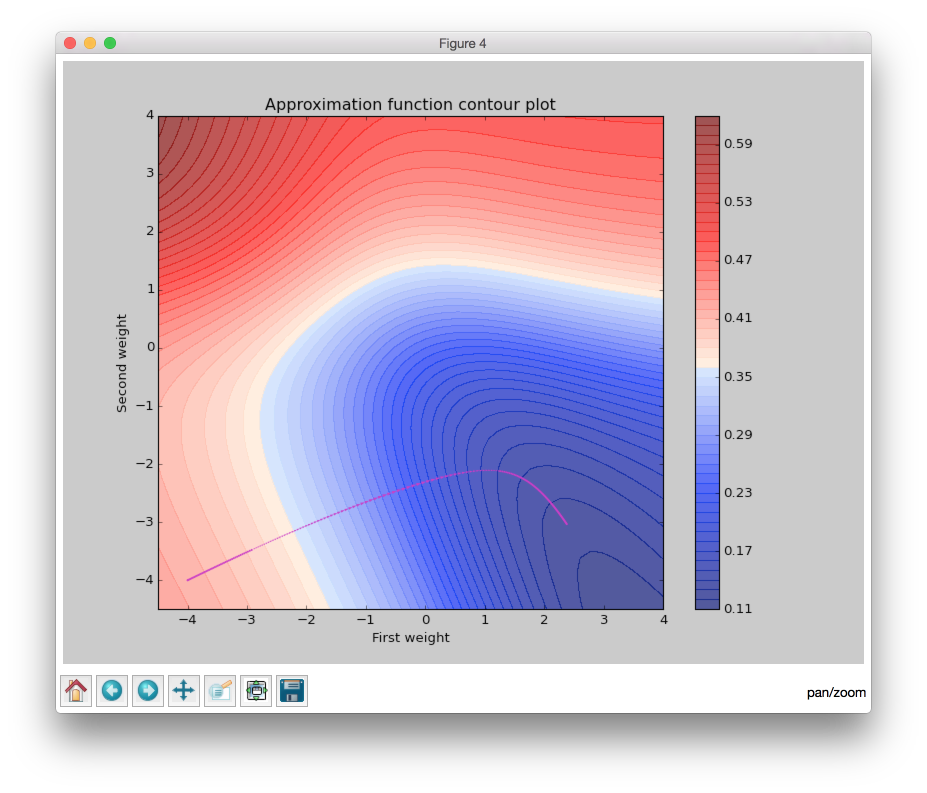
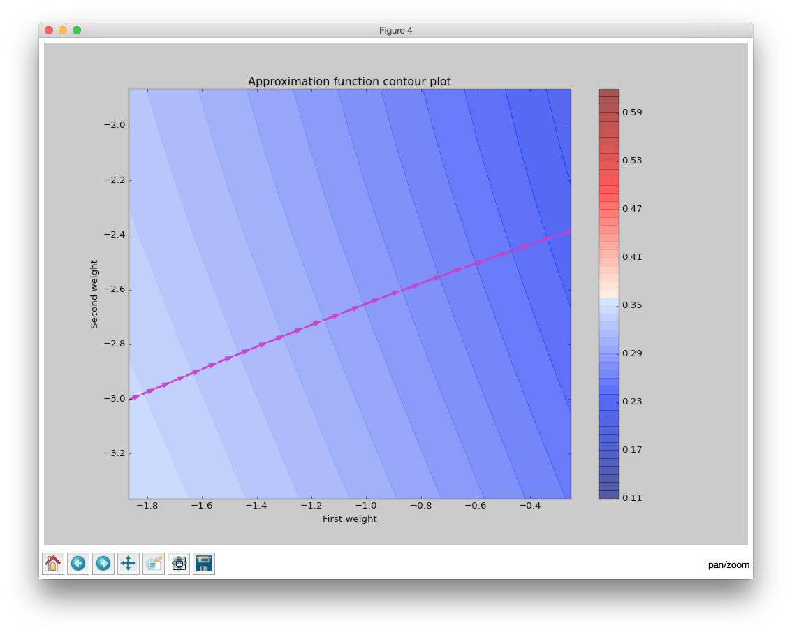
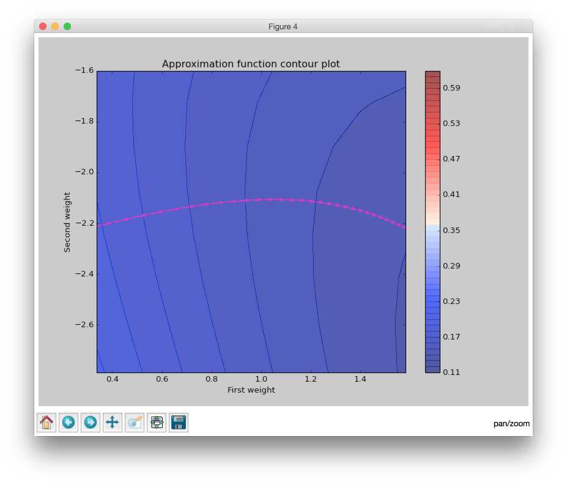
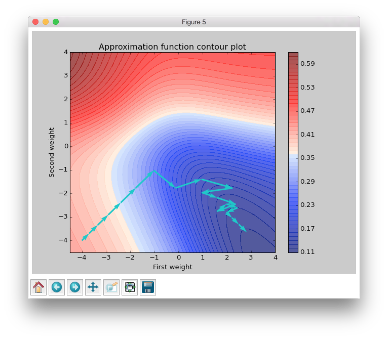

Visualize Backpropagation Algorithms
====================================

.. contents::

In this tutorial we will test different variations of Backpropagation algorithms, visualize them and try to figure out some important features from a plot that we will get.

Checking data
-------------

First of all we need to define simple data set which contains 6 points with two features.

.. code-block:: python

    import numpy as np

    input_data = np.array([
        [0.9, 0.3],
        [0.5, 0.3],
        [0.2, 0.1],
        [0.7, 0.5],
        [0.1, 0.8],
        [0.1, 0.9],
    ])
    target_data = np.array([
        [1],
        [1],
        [1],
        [0],
        [0],
        [0],
    ])

So we can make a scatter plot and look closer at this dots.

.. code-block:: python

    import matplotlib.pyplot as plt

    plt.scatter(input_data[:, 0], input_data[:, 1], c=target_data, s=100)
    plt.show()

.. figure:: images/bp-vis-scatter.png
    :width: 80%
    :align: center
    :alt: Dataset scatter plot

From the figure above we can clearly see that all dots are linearly separable and we are able to solve this problem with simple perceptron.
But a goal of this tutorial is to make clear visualization of learning process for different Backpropagation algorithm variations, so the problem must be as simple as possible, because in other cases it will be complex to visualize.

So, as the problem is linear separable we can solve it without hidden layers in network.
There are two features and two classes, so we can build network which will take 2 input values and 1 output.
We need just two weights, so we can visualize them in contour plot.

Initialize contour
------------------

Below I will describe several functions that will be needed for visualization later.
For understanding of the entire content of the article it is not necessary to understand all code below.

.. code-block:: python

    from functools import partial
    from neupy import algorithms, layers

    # Got color from page:
    # http://matplotlib.org/examples/pylab_examples/custom_cmap.html
    blue_red_cmap = {
        'red':  ((0.00, 0.0, 0.0),
                 (0.25, 0.0, 0.0),
                 (0.50, 0.8, 1.0),
                 (0.75, 1.0, 1.0),
                 (1.00, 0.4, 1.0)),

        'green': ((0.00, 0.0, 0.0),
                  (0.25, 0.0, 0.0),
                  (0.50, 0.9, 0.9),
                  (0.75, 0.0, 0.0),
                  (1.00, 0.0, 0.0)),

        'blue':  ((0.00, 0.0, 0.4),
                  (0.25, 1.0, 1.0),
                  (0.50, 1.0, 0.8),
                  (0.75, 0.0, 0.0),
                  (1.00, 0.0, 0.0))
    }

    # Setup default networks settings which we will use in all algorithms
    # which we will vizualize.
    network_settings = dict(
        step=0.3,
        # Disable bias, because we need two parameters for visualization
        use_bias=False,
        verbose=False,
    )

    def draw_countour(xgrid, ygrid, target_function):
        output = np.zeros((xgrid.shape[0], ygrid.shape[0]))

        for i, x in enumerate(xgrid):
            for j, y in enumerate(ygrid):
                output[j, i] = target_function(x, y)

        X, Y = np.meshgrid(xgrid, ygrid)

        plt.register_cmap(name='BlueRed', data=blue_red_cmap)
        plt.contourf(X, Y, output, 50, alpha=.75, cmap='BlueRed')
        plt.colorbar()

    def target_function(network, x, y):
        network.input_layer.weight = np.array([[x], [y]])
        predicted = network.predict(input_data)
        return network.error(predicted, target_data)

    def prepare_plot():
        plt.figure()
        plt.title("Approximation function contour plot")
        plt.xlabel("First weight")
        plt.ylabel("Second weight")

        draw_countour(
            np.linspace(-4.5, 4, 50),
            np.linspace(-4.5, 4, 50),
            network_target_function
        )

    bp_network = algorithms.Backpropagation(
        layers.Sigmoid(2) > layers.Output(1),
        **network_settings
    )
    network_target_function = partial(target_function, bp_network)

    prepare_plot()
    plt.show()

.. image:: images/raw-contour-plot.png
    :width: 80%
    :align: center
    :alt: Approximation function contour plot

The plot above shows the approximation error rate depence on the network weights.
The best error must be as small as possible.
The best weights combination for this problem should be near the lower right corner in the blue area.

Next, we are going to look at 5 algorithms based on Backpropagation. They are:

* Gradient descent
* Momentum
* RPROP
* iRPROP+
* Conjugate Gradient + Golden Search

Before starting learning process visualization we should define a few functions which will
give us possibility to use quiver graph as the direction and size of changes in
the weights after an epoch.

Let's define start point for our algorithms.
As we can see from the figure above the dot (-4, -4) is on the red part of the plot
and the error for it would be approximetly 0.43, so we define default weights on this dot.

.. code-block:: python

    default_weight = np.array([[-4.], [-4.]])

Also we should track weight updates after every epoch and store them in some global variable.
For this option we define a signal which will run our ``save_weight_in_epoch`` function.

.. code-block:: python

    weights = None

    def save_weight_in_epoch(net):
        global weights
        input_layer_weight = net.train_layers[0].weight.copy()
        weights[:, net.epoch + 1:net.epoch + 2] = input_layer_weight

    network_settings['epoch_end_signal'] = save_weight_in_epoch

The next function draws weight update history in a plot.
If you are not familiar with `matplotlib` library quiver, you can skip this code.

.. code-block:: python

    def weight_quiver(weights, color='c'):
        plt.quiver(weights[0, :-1],
                   weights[1, :-1],
                   weights[0, 1:] - weights[0, :-1],
                   weights[1, 1:] - weights[1, :-1],
                   scale_units='xy', angles='xy', scale=1,
                   color=color)

And the last important function will do the rest of the work.

.. code-block:: python

    import matplotlib.patches as mpatches

    def draw_quiver(network_class, name, color='r'):
        global weights

        input_layer = layers.Sigmoid(2, weight=default_weight.copy())
        output_layer = layers.Output(1)

        bpn = network_class(
            input_layer > output_layer,
            **network_settings
        )
        # 1000 is an upper limit for all network epochs, later we
        # will fix it size
        weights = np.zeros((2, 1000))
        weights[:, 0:1] = default_weight.copy()
        bpn.train(input_data, target_data, epsilon=0.125)
        weights = weights[:, :bpn.epoch + 1]
        weight_quiver(weights, color=color)

        label = "{name} ({n} steps)".format(name=name, n=bpn.epoch)
        return mpatches.Patch(color=color, label=label)

Function ``draw_quiver`` takes 3 parameters.
First one is the network class which we want to visualize.
Second one is the network name and the third one is the quiver color.

This function will train the network until the error will be smaller than `0.125`.
Path for all networks would be the same.
Every network starts at dot with coordinates `(-4, -4)` and finishes near the point with the closest value to `0.125`.

Visualize Backpropagation algorithms
------------------------------------

Gradient Descent
++++++++++++++++

Let's primarily check :network:`Gradient Descent <Backpropagation>`.

.. code-block:: python

    prepare_plot()
    draw_quiver(algorithms.Backpropagation, 'Gradient Descent', 'k')
    plt.show()

.. figure:: images/bp-steps.png
    :width: 80%
    :align: center
    :alt: Backpropagation steps

Backpropagation got to the value close to 0.125 using 798 steps and this black curve are just tiny steps of backpropagation algorithm.
We can zoom it and look closer.

.. figure:: images/bp-steps-zoom.png
    :width: 80%
    :align: center
    :alt: Backpropagation steps on zoom

Now we can see a lot of information about backpropagation algorithm.
All steps for backpropagation algorithm have approximately similar magnitude.
Their direction doesn't vary because contours in the zoomed picture are parallel to each other and in it we can see that there is still a lot of steps to achieve the minimum.
Also we can see that small vectors are perpendicular to the contour.

Momentum
++++++++

Now let's look at another important algorithm - :network:`Momentum`.

.. code-block:: python

    prepare_plot()
    draw_quiver(algorithms.Momentum, 'Momentum', 'm')
    plt.show()

:network:`Momentum` got to the value close to 0.125 by 202 steps, which is almost 4 times fewer steps than previously.
The basic idea behind :network:`Momentum` algorithm, compared to the previous epoch, is that we are strengthening the update if the sign is not changed, and minimize it in another case.

Even if the number of steps fewer than in :network:`Backpropagation` we still can't clearly see the updates.
For our eye they are just appeared as a line.

When we zoom the plot we can see that the direction for weight update vectors is almost the same and gradient sign doesn't change after each epoch.
At the end of the zoomed plot above vector is bigger than the first one on the same plot.
Update vector hasn't changed the sign before it's value, so every next update is the same and it is increased by previous gradient magnitude.
Also we can encounter a situation when weight update size reduces over epochs.

In plot above we moved to the part where we can see that weight update vector had changed its direction, so the magnitude of this vector had decreased.

RPROP
+++++

:network:`Momentum` makes fewer steps for a prediction, but we still can
find minimum in fewer number of steps.
Now we are going to run :network:`RPROP` algorithm.

.. code-block:: python

    prepare_plot()
    draw_quiver(algorithms.RPROP, 'RPROP', 'c')
    plt.show()

This improvment looks impressive.
Now we are able to see steps without zooming.
We got almost the same value as before using just 19 steps, which is 10 times fewer than :network:`Momentum` and 40 times fewer than :network:`Gradient Descent <Backpropagation>`.

Now we are going to figure out what are the main features of :network:`RPROP` just by looking at the plot above.
:network:`RPROP` has a unique step for each weight.
There are just two steps for each weight in the input layer for this network.
:network:`RPROP` will increase the step size if gradient don't change the sign before its value, and it will decrease in a different situation.
This update rule is not the same as for :network:`Momentum` algorithm.

.. figure:: images/rprop-first-6-steps.png
    :width: 80%
    :align: center
    :alt: RPROP first 6 steps

From the figure above you can see that first 6 updates have the same direction, so both steps are increase after each iteration.
For the first epoch steps are equal to the same value which we set up at network initialization step.
On the every next iterations they have been increased by the same factor, so after six iteration they became bigger, but they are still equal because they were getting bigger by the same factor.

Now let's check the next epochs from the figure below.
On the 7th epoch gradient changed the direction, but steps are still the same.
But we can clearly see that gradient changed the sign for the second weight.
:network:`RPROP` updated the step after weight had updated, so the step for the second weight must be fewer for the 8th epoch.

.. figure:: images/rprop-6th-to-9th-epochs.png
    :width: 80%
    :align: center
    :alt: RPROP from 6th to 9th steps

Now let's look at the 8th epoch.
It shows us how gradient sign difference on the 7th epoch updated steps.
Now the steps are not equal.
From the picture above we can see that update on the second weight (y axis) is fewer than on the first weight (x axis).

On the 8th epoch gradient on y axis changed the sign again.
Network decreased by constant factor and update for the second weight on the 9th epoch would be fewer than on the 8th.

To train your intuition you can check the other epochs updates and try to figure out
how steps are dependent on the direction.

iRPROP+
+++++++

:network:`iRPROP+ <IRPROPPlus>` is almost the same algorithm as :network:`RPROP` except a small addition.

.. code-block:: python

    prepare_plot()
    draw_quiver(algorithms.IRPROPPlus, 'iRPROP+', 'y')
    plt.show()

.. figure:: images/irprop-plus-steps.png
    :width: 80%
    :align: center
    :alt: iRPROP+ steps

As in :network:`RPROP` algorithm :network:`iRPROP+ <IRPROPPlus>` make exacly the
same first 6 steps.

Now let's look at the 7th step in the figure below.

.. figure:: images/irprop-plus-6th-to-12th-epochs.png
    :width: 80%
    :align: center
    :alt: iRPROP+ from 6th to 12th epoch updates.

Second weight (on the y axis) didn't change the value.
On the same epoch :network:`RPROP` changed the gradient comparing to the previous
epoch and just decreased step value after weight update.
Instead, :network:`iRPROP+ <IRPROPPlus>` just disabled weight update for current
epoch (set it up to `0`).
And of course it also decreased the step for the second weight.
Also you can find that vector for the 7th epoch that looks smaller than for the :network:`RPROP` algorithm, because we ignored the second weight update.
If we check the x axis update size we will find that it has the same value
as in :network:`RPROP` algorithm.

On 8th epoch network included again second weight into the update process, because
compared to the previous epoch gradient didn't change its sign.

Next steps are doing the same job, but 11th epoch differs from others.
There are a few updates which are related specifically to :network:`iRPROP+ <IRPROPPlus>`, but the most important we have not seen before.
After weight update on the 11th epoch network error increased, so our update made our prediction worse.
Now on the 12th epoch network tried to rollback vector update.
It decreased steps on the 11th epoch and weight update didn't go to the same point after the rollback procedure, it just took opposite direction with a smaller step.

Conjugate Gradient and Golden Search
++++++++++++++++++++++++++++++++++++

Now let's look at :network:`Conjugate Gradient <ConjugateGradient>` with
:network:`Golden Search <LinearSearch>`.
Conjugate Gradient in Backpropagation variation is a little bit different than in
Multivariable Calculus notation and it doesn't guarantee converge into n-th steps
(`n` means dimmention size for specific problem).
Steps don't have a perfect size for :network:`Conjugate Gradient <ConjugateGradient>`,
so :network:`Golden Search <LinearSearch>` is always a good choice for a step selection.

.. code-block:: python

    prepare_plot()
    cgnet_golde_search = partial(algorithms.ConjugateGradient,
                                 optimizations=[algorithms.LinearSearch])
    draw_quiver(cgnet_golde_search,
                'Conjugate Gradient + Golden Search', 'r')
    plt.show()

.. figure:: images/conj-grad-and-gold-search-steps.png
    :width: 80%
    :align: center
    :alt: Conjugate Gradient with Golden Search steps

From the figure above we can see almost perfect step for the specific direction.
Each of the fifth steps make a great choice for the step size.
Of course it's not a great assumption.
Golden Search is just trying to figure out the most perfect step size by using a simple search.
But it doing a greate job.

Finally network made 5 steps, but in plot we can clearly see just 4 of them.
The reason is that the update for the second epoch was really small compared to others.
We can zoom the plot and find this tiny step update.

.. figure:: images/conj-grad-small-step.png
    :width: 80%
    :align: center
    :alt: Conjugate Gradient with Golden Search small second step

If we add the same :network:`Golden Search <LinearSearch>` algorithm to the classic Gradient Descent we will get to the minimum into a few steps as well.

Bring them all together
-----------------------

.. code-block:: python

    algorithms = (
        (algorithms.Backpropagation, 'Gradient Descent', 'k'),
        (algorithms.Momentum, 'Momentum', 'm'),
        (algorithms.RPROP, 'RPROP', 'c'),
        (algorithms.IRPROPPlus, 'iRPROP+', 'y'),
        (cgnet_golde_search, 'Conjugate Gradient + Golden Search', 'r'),
    )

    prepare_plot()
    patches = []
    for network_params in algorithms:
        quiver_patch = draw_quiver(*network_params)
        patches.append(quiver_patch)

    plt.legend(handles=patches)
    plt.show()

.. figure:: images/all-algorithms-steps.png
    :width: 80%
    :align: center
    :alt: All algorithms steps

Summary
-------

.. csv-table:: Summary
    :header: "Algorithm", "Number of steps"

    Gradient Descent, 798
    Momentum, 202
    RPROP, 19
    iRPROP+, 17
    Conjugate Gradient + Golden Search, 5

There is no perfect algorithm for neural network that can solve all problems.
All of them have there own pros and cons.
Some of the algorithms can be memory or computationally expensive and you have to choose an algorithm depend on the task which you want to solve.

.. author:: default
.. categories:: none
.. tags:: supervised, backpropagation, visualization
.. comments::
