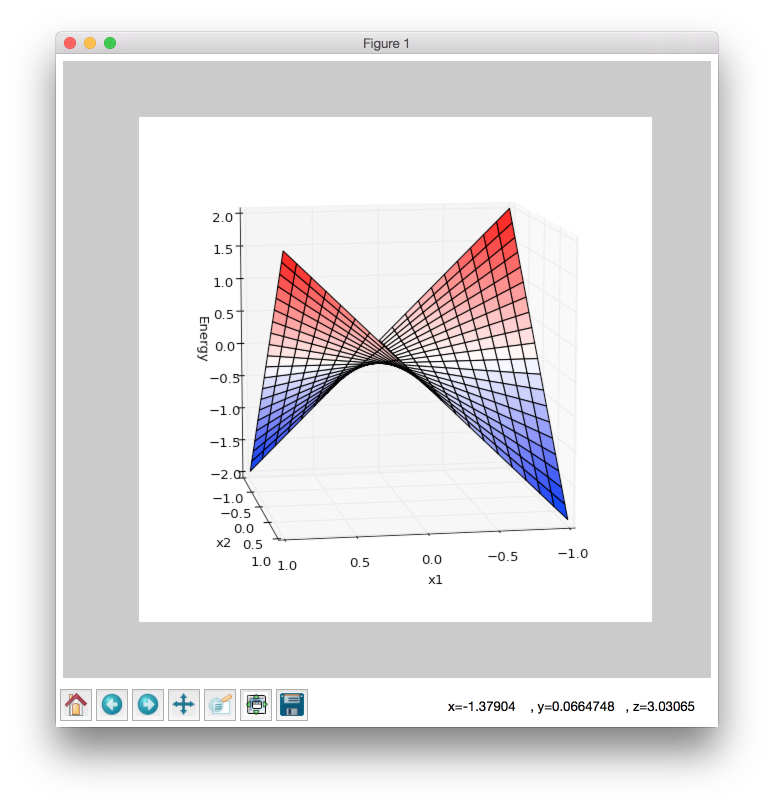

.. _discrete-hopfield-network:

Discrete Hopfield Network
=========================

.. raw:: html

    

        
        

        In this article, we describe core ideas behind discrete hopfield networks and try to understand how it works. In addition, we explore main problems related to this algorithm. And finally, we take a look into simple example that aims to memorize digit patterns and reconstruct them from corrupted samples.
        

         
    

.. contents::

In this article we are going to learn about :network:`Discrete Hopfield Network <DiscreteHopfieldNetwork>` algorithm.

:network:`Discrete Hopfield Network <DiscreteHopfieldNetwork>` is a type of algorithms which is called - `Autoassociative memories <https://en.wikipedia.org/wiki/Autoassociative_memory>`_
Don't be scared of the word `Autoassociative`.
The idea behind this type of algorithms is very simple.
It can store useful information in `memory` and later it is able to reproduce this information from partially broken patterns.
You can perceive it as human memory.
For instance, imagine that you look at an old picture of a place where you were long time ago, but this picture is of very bad quality and very blurry.
By looking at the picture you manage to recognize a few objects or places that make sense to you and form some objects even though they are blurry.
It can be a house, a lake or anything that can add up to the whole picture and bring out some associations about this place.
With these details that you got from your memory so far other parts of picture start to make even more sense.
Though you don't clearly see all objects in the picture, you start to remember things and withdraw from your memory some images, that cannot be seen in the picture, just because of those very familiarly-shaped details that you've got so far.
That's what it is all about.
Autoassociative memory networks is a possibly to interpret functions of memory into neural network model.

Don't worry if you have only basic knowledge in Linear Algebra; in this article I'll try to explain the idea as simple as possible.
If you are interested in proofs of the :network:`Discrete Hopfield Network <DiscreteHopfieldNetwork>` you can check them at R. Rojas. Neural Networks [1]_ book.

Architecture
------------

:network:`Discrete Hopfield Network <DiscreteHopfieldNetwork>` is an easy algorithm.
It's simple because you don't need a lot of background knowledge in Maths for using it.
Everything you need to know is how to make a basic Linear Algebra operations, like outer product or sum of two matrices.

Let's begin with a basic thing.
What do we know about this neural network so far?
Just the name and the type.
From the name we can identify one useful thing about the network.
It's `Discrete`.
It means that network only works with binary vectors.
But for this network we wouldn't use binary numbers in a typical form.
Instead, we will use bipolar numbers.
They are almost the same, but instead of 0 we are going to use -1 to decode a negative state.
We can't use zeros.
And there are two main reasons for it.
The first one is that zeros reduce information from the network weight, later in this article you are going to see it.
The second one is more complex, it depends on the nature of bipolar vectors.
Basically they are more likely to be orthogonal to each other which is a critical moment for the :network:`Discrete Hopfield Network <DiscreteHopfieldNetwork>`.
But as I mentioned before we won't talk about proofs or anything not related to basic understanding of Linear Algebra operations.

So, let's look at how we can train and use the :network:`Discrete Hopfield Network <DiscreteHopfieldNetwork>`.

Training procedure
~~~~~~~~~~~~~~~~~~

We can't use memory without any patterns stored in it.
So first of all we are going to learn how to train the network.
For the :network:`Discrete Hopfield Network <DiscreteHopfieldNetwork>` train procedure doesn't require any iterations.
It includes just an outer product between input vector and transposed input vector.

.. math::

    \begin{align*}
        W = x \cdot x^T =
        \left[
        \begin{array}{c}
          x_1\\
          x_2\\
          \vdots\\
          x_n
        \end{array}
        \right]
        \cdot
        \left[
        \begin{array}{c}
          x_1 & x_2 & \cdots & x_n
        \end{array}
        \right]
    \end{align*}
    =

.. math::

    \begin{align*}
        =
        \left[
        \begin{array}{c}
          x_1^2 & x_1 x_2 & \cdots & x_1 x_n \\
          x_2 x_1 & x_2^2 & \cdots & x_2 x_n \\
          \vdots\\
          x_n x_1 & x_n x_2 & \cdots & x_n^2 \\
        \end{array}
        \right]
    \end{align*}

:math:`W` is a weight matrix and :math:`x` is an input vector.
Each value :math:`x_i` in the input vector can only be -1 or 1.
So on the matrix diagonal we only have squared values and it means we will always see 1s at those places.
Think about it, every time, in any case, values on the diagonal can take just one possible state.
We can't use this information, because it doesn't say anything useful about patterns that are stored in the memory and even can make incorrect contribution into the output result.
For this reason we need to set up all the diagonal values equal to zero.
The final weight formula should look like this one below.

.. math::

    \begin{align*}
        W =
        x x^T - I =
        \left[
        \begin{array}{c}
          0 & x_1 x_2 & \cdots & x_1 x_n \\
          x_2 x_1 & 0 & \cdots & x_2 x_n \\
          \vdots\\
          x_n x_1 & x_n x_2 & \cdots & 0 \\
        \end{array}
        \right]
    \end{align*}

Where :math:`I` is an identity matrix.

But usually we need to store more values in memory.
For another pattern we have to do exactly the same procedure as before and then just add the generated weight matrix to the old one.

.. math::

    W = W_{old} + W_{new}

And this procedure generates us a new weight that would be valid for both previously stored patterns.
Later you can add other patterns using the same algorithm.

But if you need to store multiple vectors inside the network at the same time you don't need to compute the weight for each vector and then sum them up.
If you have a matrix :math:`X \in \Bbb R^{m\times n}` where each row is the input vector, then you can just make product matrix between transposed input matrix and input matrix.

.. math::

    W = X^T X - m I

Where :math:`I` is an identity matrix (:math:`I \in \Bbb R^{n\times n}`), :math:`n` is a number of features in the input vector and :math:`m` is a number of input patterns inside the matrix :math:`X`.
Term :math:`m I` removes all values from the diagonal.
Basically we remove 1s for each stored pattern and since we have :math:`m` of them, we should do it :math:`m` times.
Practically, it's not very good to create an identity matrix just to set up zeros on the diagonal, especially when dimension on the matrix is very big.
Usually linear algebra libraries give you a possibility to set up diagonal values without creating an additional matrix and this solution would be more efficient.
For example in NumPy library it's a `numpy.fill_diagonal <http://docs.scipy.org/doc/numpy/reference/generated/numpy.fill_diagonal.html>`_ function.

Let's check an example just to make sure that everything is clear.
Let's pretend we have a vector :math:`u`.

.. math::

    u = \left[\begin{align*}1 \\ -1 \\ 1 \\ -1\end{align*}\right]

Assume that network doesn't have patterns inside of it, so the vector :math:`u` would be the first one.
Let's compute weights for the network.

.. math::

    \begin{align*}
        U = u u^T =
        \left[
            \begin{array}{c}
                1 \\
                -1 \\
                1 \\
                -1
            \end{array}
        \right]
        \left[
            \begin{array}{c}
                1 & -1 & 1 & -1
            \end{array}
        \right]
        =
        \left[
            \begin{array}{cccc}
                1 & -1 & 1 & -1\\
                -1 & 1 & -1 & 1\\
                1 & -1 & 1 & -1\\
                -1 & 1 & -1 & 1
            \end{array}
        \right]
    \end{align*}

Look closer to the matrix :math:`U` that we got.
Outer product just repeats vector 4 times with the same or inversed values.
First and third columns (or rows, it doesn't matter, because matrix is symmetrical) are exactly the same as the input vector.
The second and fourth are also the same, but with an opposite sign.
That's because in the vector :math:`u` we have 1 on the first and third places and -1 on the other.

To make weight from the :math:`U` matrix, we need to remove ones from the diagonal.

.. math::

    W = U - I = \left[
        \begin{array}{cccc}
            1 & -1 & 1 & -1\\
            -1 & 1 & -1 & 1\\
            1 & -1 & 1 & -1\\
            -1 & 1 & -1 & 1
        \end{array}
    \right] -
    \left[
        \begin{array}{cccc}
            1 & 0 & 0 & 0\\
            0 & 1 & 0 & 0\\
            0 & 0 & 1 & 0\\
            0 & 0 & 0 & 1
        \end{array}
    \right] =

.. math::

    = \left[
        \begin{array}{cccc}
            0 & -1 & 1 & -1\\
            -1 & 0 & -1 & 1\\
            1 & -1 & 0 & -1\\
            -1 & 1 & -1 & 0
        \end{array}
    \right]

:math:`I` is the identity matrix and :math:`I \in \Bbb R^{n \times n}`, where :math:`n` is a number of features in the input vector.

When we have one stored vector inside the weights we don't really need to remove 1s from the diagonal.
The main problem would appear when we have more than one vector stored in the weights.
Each value on the diagonal would be equal to the number of stored vectors in it.

Recovery from memory
~~~~~~~~~~~~~~~~~~~~

The main advantage of Autoassociative network is that it is able to recover pattern from the memory using just a partial information about the pattern.
There are already two main approaches to this situation, synchronous and asynchronous. We are going to master both of them.

Synchronous
^^^^^^^^^^^

Synchronous approach is much more easier for understanding, so we are going to look at it firstly. To recover your pattern from memory you just need to multiply the weight matrix by the input vector.

.. math::

    \begin{align*}
        s = {W}\cdot{x}=
        \left[
        \begin{array}{cccc}
          w_{11} & w_{12} & \ldots & w_{1n}\\
          w_{21} & w_{22} & \ldots & w_{2n}\\
          \vdots & \vdots & \ddots & \vdots\\
          w_{n1} & w_{n2} & \ldots & w_{nn}
        \end{array}
        \right]
        \left[
        \begin{array}{c}
          x_1\\
          x_2\\
          \vdots\\
          x_n
        \end{array}
        \right]
        =
    \end{align*}

.. math::

    \begin{align*}
        =
        \left[
            \begin{array}{c}
              w_{11}x_1+w_{12}x_2 + \cdots + w_{1n} x_n\\
              w_{21}x_1+w_{22}x_2 + \cdots + w_{2n} x_n\\
              \vdots\\
              w_{n1}x_1+w_{n2}x_2 + \cdots + w_{nn} x_n\\
            \end{array}
        \right]
    \end{align*}

Let's analyze the result.
We summed up all information from the weights where each value can be any integer with an absolute value equal to or smaller than the number of patterns inside the network.
It's clear that total sum value for :math:`s_i` is not necessary equal to -1 or 1, so we have to make additional operations that will make bipolar vector from the vector :math:`s`.

Let's think about this product operation.
What does it actualy do?
Basically after training procedure we saved our pattern dublicated :math:`n` times (where :math:`n` is a number of input vector features) inside the weight.
When we store more patterns we get interception between them (it's called a **crosstalk**) and each pattern add some noise to other patterns.
So, after perfoming product matrix between :math:`W` and :math:`x` for each value from the vector :math:`x` we'll get a recovered vector with a little bit of noise.
For :math:`x_1` we get a first column from the matrix :math:`W`, for the :math:`x_2` a second column, and so on.
Then we sum up all vectors together.
This operation can remind you of voting.
For example we have 3 vectors.
If the first two vectors have 1 in the first position and the third one has -1 at the same position, the winner should be 1.
We can perform the same procedure with :math:`sign` function.
So the output value should be 1 if total value is greater then zero and -1 otherwise.

.. math::

    sign(x) = \left\{
        \begin{array}{lr}
            &1 && : x \ge 0\\
            &-1 && : x < 0
        \end{array}
    \right.\\

    y = sign(s)

That's it.
Now :math:`y` store the recovered pattern from the input vector :math:`x`.

Maybe now you can see why we can't use zeros in the input vectors.
In `voting` procedure we use each row that was multiplied by bipolar number, but if values had been zeros they would have ignored columns from the weight matrix and we would have used only values related to ones in the input pattern.

Of course you can use 0 and 1 values and sometime you will get the correct result, but this approach give you much worse results than explained above.

Asynchronous
^^^^^^^^^^^^

Previous approach is good, but it has some limitations. If you change one value in the input vector it can change your output result and value won't converge to the known pattern. Another popular approach is an **asynchronous**. This approach is more likely to remind you of real memory. At the same time in network activates just one random neuron instead of all of them. In terms of neural networks we say that **neuron fires**. We iteratively repeat this operation multiple times and after some point network will converge to some pattern.

Let's look at this example: Consider that we already have a weight matrix :math:`W` with one pattern :math:`x`  inside of it.

.. math::

    \begin{align*}
        W =
        \left[
        \begin{array}{cccc}
          0 & 1 & -1 \\
          1 & 0 & -1 \\
          -1 & -1 & 0
        \end{array}
        \right]
    \end{align*}

.. math::

    \begin{align*}
        x =
        \left[
            \begin{array}{c}
              1\\
              1\\
              -1
            \end{array}
        \right]
    \end{align*}

Let's assume that we have a vector :math:`x^{'}` from which we want to recover the pattern.

.. math::

    \begin{align*}
        x^{'} =
        \left[
            \begin{array}{c}
              1\\
              -1\\
              -1
            \end{array}
        \right]
    \end{align*}

In first iteration one neuron fires. Let it be the second one. So we multiply the first column by this selected value.

.. math::

    \begin{align*}
        x^{'}_2 =
        sign(\left[
            \begin{array}{c}
              1 & -1 & -1
            \end{array}
        \right] \cdot \left[
            \begin{array}{c}
              1\\
              0\\
              -1
            \end{array}
        \right]) = sign(2) = 1
    \end{align*}

And after this operation we set up a new value into the input vector :math:`x`.

.. math::

    \begin{align*}
        x^{'} =
        \left[
            \begin{array}{c}
              1\\
              1\\
              -1
            \end{array}
        \right]
    \end{align*}

As you can see, after first iteration value is exactly the same as :math:`x` but we can keep going. In second iteration random neuron fires again. Let's pretend that this time it was the third neuron.

.. math::

    \begin{align*}
        x^{'}_3 =
        sign(\left[
            \begin{array}{c}
              1 & 1 & -1
            \end{array}
        \right] \cdot \left[
            \begin{array}{c}
              -1\\
              -1\\
              0
            \end{array}
        \right]) = sign(-2) = -1
    \end{align*}

:math:`x^{'}_3` is exactly the same as in the :math:`x^{'}` vector so we don't need to update it. We can repeat it as many times as we want, but we will be getting the same value.

Memory limit
------------

Obviously, you can't store infinite number of vectors inside the network.
There are two good rules of thumb.

Consider that :math:`n` is the dimension (number of features) of your input vector and :math:`m` is the number of patterns that you want to store in the network.
The first rule gives us a simple ration between :math:`m` and :math:`n`.

.. math::

    m \approx 0.18 n

The main problem with this rule is that proof assumes that stored vectors inside the weight are completely random with an equal probability.
Unfortunately, that is not always true.
Let's suppose we save some images of numbers from 0 to 9.
Pictures are black and white, so we can encode them in bipolar vectors.
Will the probabilities be the same for seeing as many white pixels as black ones?
Usually no.
More likely that number of white pixels would be greater than number of black ones.
Before use this rule you have to think about type of your input patterns.

The second rule uses a logarithmic proportion.

.. math::

    m = \left \lfloor \frac{n}{2 \cdot log(n)} \right \rfloor

Both of these rules are good assumptions about the nature of data and its possible limits in memory. Of course, you can find situations when these rules will fail.

Hallucinations
--------------

Hallucinations is one of the main problems in the :network:`Discrete Hopfield Network <DiscreteHopfieldNetwork>`.
Sometimes network output can be something that we hasn't taught it.

To understand this phenomena we should firstly define the Hopfield energy function.

.. math::

    E = -\frac{1}{2} \sum_{i=1}^{n} \sum_{j=1}^{n} w_{ij} x_i x_j + \sum_{i=1}^{n} \theta_i x_i

Where :math:`w_{ij}` is a weight value on the :math:`i`-th row and :math:`j`-th column.
:math:`x_i` is a :math:`i`-th values from the input vector :math:`x`.
:math:`\theta` is a threshold.
Threshold defines the bound to the sign function.
For this reason :math:`\theta` is equal to 0 for the :network:`Discrete Hopfield Network <DiscreteHopfieldNetwork>`.
In terms of a linear algebra we can write formula for the :network:`Discrete Hopfield Network <DiscreteHopfieldNetwork>` energy Function more simpler.

.. math::

    E = -\frac{1}{2} x^T W x

But linear algebra notation works only with the :math:`x` vector, we can't use matrix :math:`X` with multiple input patterns instead of the :math:`x` in this formula.
For the energy function we're always interested in finding a minimum value, for this reason it has minus sign at the beginning.

Let's try to visualize it.
Assume that values for vector :math:`x` can be continous in order and we can visualize them using two parameters.
Let's pretend that we have two vectors `[1, -1]` and `[-1, 1]` stored inside the network.
Below you can see the plot that visualizes energy function for this situation.

As you can see we have two minimum values at the same points as those patterns that are already stored inside the network.
But between these two patterns function creates a saddle point somewhere at the point with coordinates :math:`(0, 0)`.
In this case we can't stick to the points :math:`(0, 0)`.
But in situation with more dimensions this saddle points can be at the level of available values and they could be hallucination.
Unfortunately, we are very limited in terms of numbers of dimensions we could plot, but the problem is still the same.

Full source code for this plot you can find on `github <https://github.com/itdxer/neupy/tree/master/examples/memory/dhn_energy_func.py>`_

Example
-------

Now we are ready for a more practical example.
Let's define a few images that we are going to teach the network.

.. code-block:: python

    >>> import numpy as np
    >>> from neupy import algorithms
    >>>
    >>> def draw_bin_image(image_matrix):
    ...     for row in image_matrix.tolist():
    ...         print('| ' + ' '.join(' *'[val] for val in row))
    ...
    >>> zero = np.matrix([
    ...     0, 1, 1, 1, 0,
    ...     1, 0, 0, 0, 1,
    ...     1, 0, 0, 0, 1,
    ...     1, 0, 0, 0, 1,
    ...     1, 0, 0, 0, 1,
    ...     0, 1, 1, 1, 0
    ... ])
    >>>
    >>> one = np.matrix([
    ...     0, 1, 1, 0, 0,
    ...     0, 0, 1, 0, 0,
    ...     0, 0, 1, 0, 0,
    ...     0, 0, 1, 0, 0,
    ...     0, 0, 1, 0, 0,
    ...     0, 0, 1, 0, 0
    ... ])
    >>>
    >>> two = np.matrix([
    ...     1, 1, 1, 0, 0,
    ...     0, 0, 0, 1, 0,
    ...     0, 0, 0, 1, 0,
    ...     0, 1, 1, 0, 0,
    ...     1, 0, 0, 0, 0,
    ...     1, 1, 1, 1, 1,
    ... ])
    >>>
    >>> draw_bin_image(zero.reshape((6, 5)))
    |   * * *
    | *       *
    | *       *
    | *       *
    | *       *
    |   * * *

We have 3 images, so now we can train network with these patterns.

.. code-block:: python

    >>> data = np.concatenate([zero, one, two], axis=0)
    >>>
    >>> dhnet = algorithms.DiscreteHopfieldNetwork(mode='sync')
    >>> dhnet.train(data)

That's all. Now to make sure that network has memorized patterns right we can define the broken patterns and check how the network will recover them.

.. code-block:: python

    >>> half_zero = np.matrix([
    ...     0, 1, 1, 1, 0,
    ...     1, 0, 0, 0, 1,
    ...     1, 0, 0, 0, 1,
    ...     0, 0, 0, 0, 0,
    ...     0, 0, 0, 0, 0,
    ...     0, 0, 0, 0, 0,
    ... ])
    >>> draw_bin_image(half_zero.reshape((6, 5)))
    |   * * *
    | *       *
    | *       *
    |
    |
    |
    >>>
    >>> half_two = np.matrix([
    ...     0, 0, 0, 0, 0,
    ...     0, 0, 0, 0, 0,
    ...     0, 0, 0, 0, 0,
    ...     0, 1, 1, 0, 0,
    ...     1, 0, 0, 0, 0,
    ...     1, 1, 1, 1, 1,
    ... ])
    >>> draw_bin_image(half_two.reshape((6, 5)))
    |
    |
    |
    |   * *
    | *
    | * * * * *

Now we can reconstruct pattern from the memory.

.. code-block:: python

    >>> result = dhnet.predict(half_zero)
    >>> draw_bin_image(result.reshape((6, 5)))
    |   * * *
    | *       *
    | *       *
    | *       *
    | *       *
    |   * * *
    >>>
    >>> result = dhnet.predict(half_two)
    >>> draw_bin_image(result.reshape((6, 5)))
    | * * *
    |       *
    |       *
    |   * *
    | *
    | * * * * *

Cool! Network catches the pattern right.

But not always we will get the correct answer. Let's define another broken pattern and check network output.

.. code-block:: python

    >>> half_two = np.matrix([
    ...     1, 1, 1, 0, 0,
    ...     0, 0, 0, 1, 0,
    ...     0, 0, 0, 1, 0,
    ...     0, 0, 0, 0, 0,
    ...     0, 0, 0, 0, 0,
    ...     0, 0, 0, 0, 0,
    ... ])
    >>>
    >>> result = dhnet.predict(half_two)
    >>> draw_bin_image(result.reshape((6, 5)))
    |   * *
    |     *
    |     *
    |   * *
    | *   *
    | * * * * *

We hasn't clearly taught the network to deal with such pattern. But if we look closer, it looks like mixed pattern of numbers 1 and 2.

This problem we can solve using the asynchronous network approach. We don't necessary need to create a new network, we can just simply switch its mode.

.. code-block:: python

    >>> from neupy import utils
    >>> utils.reproducible()
    >>>
    >>> dhnet.mode = 'async'
    >>> dhnet.n_times = 400
    >>>
    >>> result = dhnet.predict(half_two)
    >>> draw_bin_image(result.reshape((6, 5)))
    |   * *
    |     *
    |     *
    |     *
    |     *
    |     *
    >>> result = dhnet.predict(half_two)
    >>> draw_bin_image(result.reshape((6, 5)))
    | * * *
    |       *
    |       *
    |   * *
    | *
    | * * * *

Our broken pattern is really close to the minimum of 1 and 2 patterns. Randomization helps us choose direction but it's not necessary the right one, especially when the broken pattern is close to 1 and 2 at the same time.

Check last output with number two again. Is that a really valid pattern for number 2? Final symbol in output is wrong. We are not able to recover patter 2 from this network, because input vector is always much closer to the minimum that looks very similar to pattern 2.

In plot below you can see first 200 iterations of the recovery procedure. Energy value was decreasing after each iteration until it reached the local minimum where pattern is equal to 2.

.. figure:: images/hopfield-energy-vis.png
    :width: 80%
    :align: center
    :alt: Asynchronous Discrete Hopfield Network energy update after each iteration

And finally we can look closer to the network memory using Hinton diagram.

.. code-block:: python

    >>> from neupy import plots
    >>> import matplotlib.pyplot as plt
    >>>
    >>> plt.figure(figsize=(14, 12))
    >>> plt.title("Hinton diagram")
    >>> plots.hinton(dhnet.weight)
    >>> plt.show()

.. figure:: images/hinton-diagram.png
    :width: 80%
    :align: center
    :alt: Asynchronous Discrete Hopfield Network energy update after each iteration

This graph above shows the network weight matrix and all information stored inside of it. Hinton diagram is a very simple technique for the weight visualization in neural networks. Each value encoded in square where its size is an absolute value from the weight matrix and color shows the sign of this value. White is a positive and black is a negative. Usually Hinton diagram helps identify some patterns in the weight matrix.

Let's go back to the graph. What can you say about the network just by looking at this picture? First of all you can see that there is no squares on the diagonal. That is because they are equal to zero. The second important thing you can notice is that the plot is symmetrical. But that is not all that you can withdraw from the graph. Can you see different patterns? You can find rows or columns with exactly the same values, like the second and third columns. Fifth column is also the same but its sign is reversed. Now look closer to the antidiagonal. What can you say about it? If you are thinking that all squares are white - you are right. But why is that true? Is there always the same patterns for each memory matrix? No, it is a special property of patterns that we stored inside of it. If you draw a horizontal line in the middle of each image and look at it you will see that values are opposite symmetric. For instance, :math:`x_1` opposite symmetric to :math:`x_{30}`, :math:`x_2` to :math:`x_{29}`, :math:`x_3` to :math:`x_{28}` and so on. Zero pattern is a perfect example where each value have exactly the same opposite symmetric pair. One is almost perfect except one value on the :math:`x_2` position. Two is not clearly opposite symmetric. But if you check each value you will find that more than half of values are symmetrical. Combination of those patterns gives us a diagonal with all positive values. If we have all perfectly opposite symmetric patterns then squares on the antidiagonal will have the same length, but in this case pattern for number 2 gives a little bit of noise and squares have different sizes.

Properties that we've reviewed so far are just the most interesting and maybe other patterns you can encounter on your own.

More reading
------------

In addition you can read another article about a ':ref:`Password recovery <password-recovery>`' from the memory using the :network:`Discrete Hopfield Network <DiscreteHopfieldNetwork>`.

References
----------

.. [1] \R. Rojas. Neural Networks. In Associative Networks. pp. 311 - 336, 1996.

.. [2] Math4IQB. (2013, November 17). Hopfield Networks. Retrieved
     from https://www.youtube.com/watch?v=gfPUWwBkXZY

.. [3] \R. Callan. The Essence of Neural Networks. In Pattern Association. pp. 84 - 98, 1999.

.. author:: default
.. categories:: none
.. tags:: memory, unsupervised, discrete hopfield network
.. comments::
