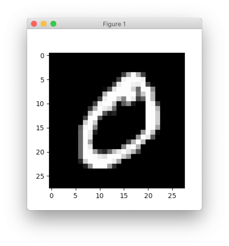
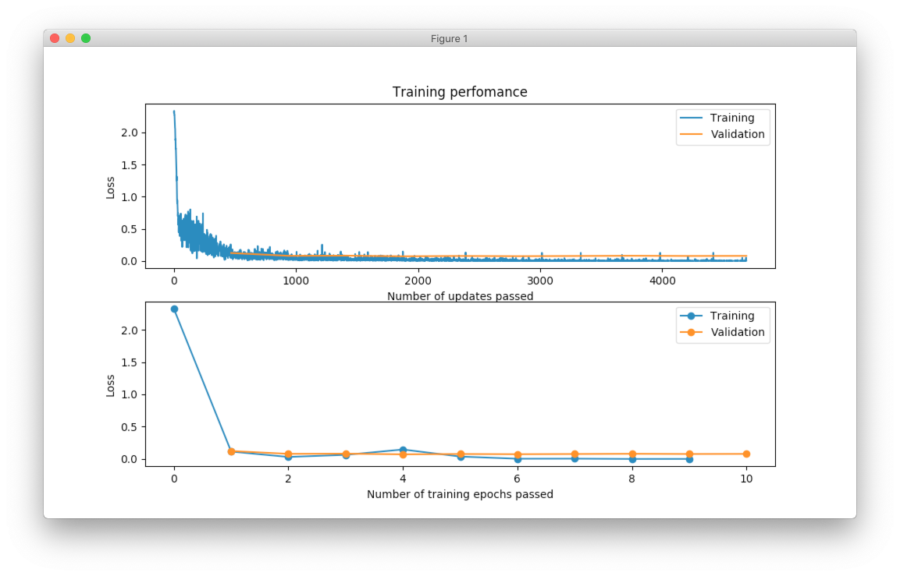

.. _mnist-classification:

Image classification, MNIST digits
==================================

.. raw:: html

    

        

        This short tutorial shows how to design and train simple network for digit classification in NeuPy.
        

    

.. image:: images/random-digits.png
    :align: center
    :alt: MNIST digits example

This short tutorial shows how to build and train simple network for digit classification in NeuPy.

Data preparation
----------------

Data can be loaded in different ways. I used scikit-learn to fetch the MNIST dataset.

.. code-block:: python

    >>> from sklearn import datasets
    >>> mnist = datasets.fetch_mldata('MNIST original')
    >>> X, y = mnist.data, mnist.target

Now that we have the data we need to confirm that we have expected number of samples.

.. code-block:: python

    >>> X.shape
    (70000, 784)
    >>> y.shape
    (70000,)

Every data sample has 784 features and they can be reshaped into 28x28 image.

.. code-block:: python

    >>> import matplotlib.pyplot as plt
    >>> plt.imshow(X[0].reshape((28, 28)), cmap='gray')
    >>> plt.show()

In this tutorial, we will use each image as a vector so we won't need to reshape it to its original size. The only thing that we need to do is to rescale image values. Rescaling images will help network to converge faster.

.. code-block:: python

    >>> X = X.astype(np.float32)
    >>> X /= 255.
    >>> X -= X.mean(axis=0)

Notice the way division and subtraction are specified. In this way, we make update directly on the ``X`` matrix without copying it. It can be validated with simple example.

.. code-block:: python

    >>> import numpy as np
    >>> A = np.random.random((100, 10))
    >>> id(A)  # numbers will be different between runs
    4486892960
    >>>
    >>> A -= 3
    >>> id(A)  # object ID didn't change
    4486892960
    >>>
    >>> A = A - 3
    >>> id(A)  # and now it's different, because it's different object
    4602409968

After last update for matrix ``A`` we got different identifier for the object, which means that it got copied.

In case of the in-place updates, we don't waste memory. Current dataset is relatively small and there is no memory deficiency, but for larger datasets it might make a big difference.

There is one more processing step that we need to do before we can train our network. Let's take a look into target classes.

.. code-block:: python

    >>> import random
    >>> random.sample(y.astype('int').tolist(), 10)
    [9, 0, 9, 7, 2, 2, 3, 0, 0, 8]

All the numbers that we have are specified as integers. For our problem we want network to learn visual representation of the numbers. We cannot use them as integers, because it will create problems during the training. Basically, with the integer definition we're implying that number ``1`` visually more similar to ``0`` than to number ``7``. It happens only because difference between ``1`` and ``0`` smaller than difference between ``1`` and ``7``. In order to avoid making any type of assumptions we will use one-hot encoding technique.

.. code-block:: python

    >>> from sklearn.preprocessing import OneHotEncoder
    >>> encoder = OneHotEncoder(sparse=False)
    >>> y = encoder.fit_transform(y.reshape(-1, 1))
    >>> y.shape
    (70000, 10)

You can see that every digit was transformed into a 10 dimensional vector.

And finally, we need to divide our data into training and validation set. We won't show validation set to the network and we will use it only to test network's classification accuracy.

.. code-block:: python

    >>> import numpy as np
    >>> from sklearn.model_selection import train_test_split
    >>>
    >>> x_train, x_test, y_train, y_test = train_test_split(
    ...     X.astype(np.float32),
    ...     y.astype(np.float32),
    ...     test_size=(1 / 7.)
    ... )

Notice that data was converted into 32 bit float numbers. This is the only float type that currently supported by NeuPy.

Model initialization
--------------------

It's very easy to define neural network architectures in the NeuPy. We can define simple architecture that excepts input vector with 784 features and outputs probabilities per each digit class. In addition, we can two hidden layers with 500 and 300 output units respectively. Each hidden layer will use relu as activation function

.. code-block:: python

    from neupy.layers import *

    network = join(
        # Every image in the MNIST dataset has 784 pixels (28x28)
        Input(784),

        # Hidden layers
        Relu(500),
        Relu(300),

        # Softmax layer ensures that we output probabilities
        # and specified number of outputs equal to the unique
        # number of classes
        Softmax(10),
    )

Because our neural network is quite small, we can rewrite this architecture with a help of the inline operator.

.. code-block:: python

    network = Input(784) > Relu(500) > Relu(300) > Softmax(10)

Now that we have our architecture we can initialize training algorithm.

.. code-block:: python

    from neupy import algorithms

    mnet = algorithms.Momentum(
        network,

        # Categorical cross-entropy is very popular loss function
        # for the multi-class classification problems
        error='categorical_crossentropy',

        # Number of samples propagated through the network
        # before every weight update
        batch_size=128,

        # Learning rate
        step=0.01,

        # Makes sure that training progress will be
        # printed in the terminal
        verbose=True,

        # Training data will be shuffled before every epoch
        # It ensures that every batch will have different number of samples
        shuffle_data=True,

        # Options specific for the momentum training algorithm
        momentum=0.99,
        nesterov=True,
    )

All the most important information related to the neural network you can find in the terminal output. If you run the code that shown above you should see output similar to the one shown below.

.. code-block:: python

    Main information

    [ALGORITHM] Momentum

    [OPTION] batch_size = 128
    [OPTION] verbose = True
    [OPTION] epoch_end_signal = None
    [OPTION] show_epoch = 1
    [OPTION] shuffle_data = True
    [OPTION] step = 0.01
    [OPTION] train_end_signal = None
    [OPTION] error = categorical_crossentropy
    [OPTION] momentum = 0.99
    [OPTION] nesterov = True

    [TENSORFLOW] Initializing Tensorflow variables and functions.
    [TENSORFLOW] Initialization finished successfully. It took 0.30 seconds

In addition, for feedforward neural networks it's possible to check architecture in form of a table.

.. code-block:: python

    >>> mnet.architecture()

    Network's architecture

    -----------------------------------------------
    | # | Input shape | Layer type | Output shape |
    -----------------------------------------------
    | 1 |         784 |      Input |          784 |
    | 2 |         784 |       Relu |          500 |
    | 3 |         500 |       Relu |          300 |
    | 4 |         300 |    Softmax |           10 |
    -----------------------------------------------

Training
--------

Now that we have everything specified we are finally can train our network. In addition, we can add test data for which we will be able to monitor network's training progress on the unseen data.

.. code-block:: python

    >>> mnet.train(x_train, y_train, x_test, y_test, epochs=10)

    Start training

    [TRAINING DATA] shapes: (60000, 784)
    [TEST DATA] shapes: (10000, 784)
    [TRAINING] Total epochs: 10

    ---------------------------------------------------------
    |    Epoch    |  Train err  |  Valid err  |    Time     |
    ---------------------------------------------------------
    |           1 |     0.27667 |    0.099501 |       2 sec |
    |           2 |    0.068402 |    0.089827 |       2 sec |
    |           3 |    0.037638 |    0.080401 |       2 sec |
    |           4 |    0.023067 |     0.07487 |       2 sec |
    |           5 |    0.014583 |    0.069704 |       2 sec |
    |           6 |   0.0083044 |      0.0672 |       2 sec |
    |           7 |   0.0037654 |    0.068787 |       2 sec |
    |           8 |   0.0019174 |    0.071364 |       2 sec |
    |           9 |   0.0010768 |    0.071117 |       2 sec |
    |          10 |  0.00082685 |     0.07037 |       2 sec |
    ---------------------------------------------------------

Evaluations
-----------

From the table it's hard to see network's training progress. We can make error plot that can help us to visualize how it performed on the training and validation datasets separately.

.. code-block:: python

    >>> from neupy import plots
    >>> plots.error_plot(mnet)

From the figure above, you can notice that validation error does not decrease all the time. Sometimes it goes up and sometimes down, but it doesn't mean that network trains poorly. Let's check small example that can explain who it can happen.

.. code-block:: python

    >>> actual_values = np.array([1, 1, 0])
    >>> model1_prediction = np.array([0.9, 0.9, 0.6])
    >>> model2_prediction = np.array([0.6, 0.6, 0.4])

Above, you can see two predictions from different models. The first model predicted two samples right and one wrong. The second one predicted everything perfectly, but predictions from second model are less certain (probabilities are close to random prediction - ``0.5``). Let's check the binary cross entropy error.

.. code-block:: python

    >>> from sklearn.metrics import log_loss as binary_crossentropy
    >>> binary_crossentropy(actual_values, model1_prediction)
    0.37567
    >>> binary_crossentropy(actual_values, model2_prediction)
    0.51083

The second model made better prediction in terms of accuracy, but it got larger cross entropy error. Larger error means that network is less certain about its prediction. Similar situation we've observed in the plot above.

Instead of using cross-entropy error for model performance assessment we can build our own report using functions available in scikit-learn library.

.. code-block:: python

    >>> from sklearn import metrics
    >>>
    >>> y_predicted = mnet.predict(x_test).argmax(axis=1)
    >>> y_actual = np.asarray(y_test.argmax(axis=1)).reshape(len(y_test))
    >>>
    >>> print(metrics.classification_report(y_actual, y_predicted))
                  precision    recall  f1-score   support

               0       0.99      0.99      0.99       972
               1       0.99      0.99      0.99      1130
               2       0.99      0.98      0.98       997
               3       0.99      0.98      0.98      1061
               4       0.97      0.99      0.98       966
               5       0.98      0.98      0.98       865
               6       0.99      0.99      0.99      1029
               7       0.98      0.99      0.98      1017
               8       0.98      0.98      0.98       952
               9       0.97      0.98      0.98      1011

       micro avg       0.98      0.98      0.98     10000
       macro avg       0.98      0.98      0.98     10000
    weighted avg       0.98      0.98      0.98     10000

    >>> score = metrics.accuracy_score(y_actual, y_predicted)
    >>> print("Validation accuracy: {:.2%}".format(score))
    Validation accuracy: 98.37%

The 98.37% accuracy is pretty good accuracy for such a simple solution. Additional modification can improve network's accuracy.

.. author:: default
.. categories:: none
.. tags:: classification, tutorials, supervised, backpropagation, image recognition, deep learning
.. comments::
