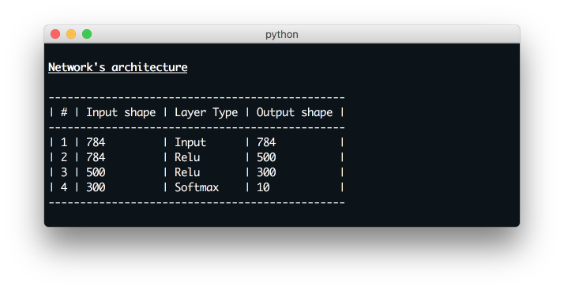
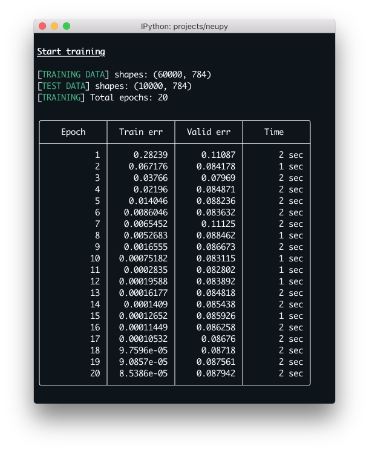

.. _mnist-classification:

MNIST Classification
====================

The MNIST problem is probably the most known for those who have already
heared about neural networks. This short tutorial shows you how to build prediction models in NeuPy. Let's start developing model.

First of all we need to load data.

.. code-block:: python

    >>> from sklearn import datasets, model_selection
    >>> mnist = datasets.fetch_mldata('MNIST original')
    >>> data, target = mnist.data, mnist.target

I used scikit-learn to fetch the MNIST dataset, but you can load it in different way.

Data doesn't have appropriate format for neural network, so we need to make simple transformation before use it.

.. code-block:: python

    >>> from sklearn.preprocessing import OneHotEncoder
    >>>
    >>> data = data / 255.
    >>> data = data - data.mean(axis=0)
    >>>
    >>> target_scaler = OneHotEncoder()
    >>> target = target_scaler.fit_transform(target.reshape(-1, 1))
    >>> target = target.todense()

Next we need to divide dataset into two parts: train and test. Regarding `The
MNIST Database <http://yann.lecun.com/exdb/mnist/>`_ page we will use 60,000
samples for training and 10,000 for test.

.. code-block:: python

    >>> from neupy import environment
    >>> import numpy as np
    >>> from sklearn.model_selection import train_test_split
    >>>
    >>> environment.reproducible()
    >>>
    >>> x_train, x_test, y_train, y_test = train_test_split(
    ...     data.astype(np.float32),
    ...     target.astype(np.float32),
    ...     train_size=(6. / 7)
    ... )

In the previous procedure I converted all data to `float32` data type. This
simple trick will help us use less memory and decrease computational time.
Theano is a main backend for the Gradient Descent based algorithms in NeuPy.
For the Theano we need to add additional configuration that will explain Theano that
we are going to use 32bit float numbers.

.. code-block:: python

    >>> import theano
    >>> theano.config.floatX = 'float32'

We prepared everything that we need for the neural network training. Now we are
able to create the neural network that will classify digits for us.

Let's start with an architecture. I didn't reinvent the wheel and used one of the know architectures from `The Database <http://yann.lecun.com/exdb/mnist/>`_ page which is 784 > 500 > 300 > 10. As the main activation function I used Relu and Softmax for the final layer. The main algorithm is a Nesterov Momentum that uses 100 samples per batch iteration. Actually all this and other network configuration should be clear from the code shown below.

.. code-block:: python

    >>> from neupy import algorithms, layers
    >>>
    >>> network = algorithms.Momentum(
    ...     [
    ...         layers.Input(784),
    ...         layers.Relu(500),
    ...         layers.Relu(300),
    ...         layers.Softmax(10),
    ...     ],
    ...     error='categorical_crossentropy',
    ...     step=0.01,
    ...     verbose=True,
    ...     shuffle_data=True,
    ...     momentum=0.99,
    ...     nesterov=True,
    ... )

Isn't it simple and clear? All the most important information related to the neural network you can find in the terminal output. If you run the code that shown above you would get the same output as on the figure below.

.. image:: images/bpnet-config-logs.png
    :width: 70%
    :align: center
    :alt: Gradient Descent configuration

From this output we can extract a lot of information about network configurations.

First of all, as we can see, most of options have green color label, but some of them are gray. Green color defines all options which we put in network manually and gray color options are default parameters. All properties separeted on few groups and each group is a :network:`Momentum`  parent classes. More information about :network:`Momentum` algorithm properties you will find in documentation, just click on algorithm name link and you will see it.

In addition for feedforward neural networks it's possible to check architecture in form of a table.

.. code-block:: python

    >>> network.architecture()

Now we are going to train network. Let set up 20 epochs for training procedure and check the result.

.. code-block:: python

    >>> network.train(x_train, y_train, x_test, y_test, epochs=20)

Output in terminal should look similar to this one:

Output show the most important information related to training procedure. Each epoch contains 4 columns. First one identified epoch. The second one show training error. The third one is optional. In case you have validation dataset, you can check learning perfomanse using dataset separated from the learning procedure. And the last column shows how many time network trains during this epoch.

From the table is not clear network's training progress. We can check it very easy. Network instance contains built-in method that build line plot that show training progress. Let's check our progress.

.. code-block:: python

    >>> from neupy import plots
    >>> plots.error_plot(network)

.. image:: images/bpnet-train-errors-plot.png
    :width: 70%
    :align: center
    :alt: GradientDescent epoch errors plot

From the figure above you can notice that validation error does not decrease over time. Sometimes it goes up and sometimes down, but it doesn't mean that network trains poorly. Let's check small example that can make this problem clear.

.. code-block:: python

    >>> actual_values = np.array([1, 1, 1])
    >>> model1_prediction = np.array([0.9, 0.9, 0.4])
    >>> model2_prediction = np.array([0.6, 0.6, 0.6])

In the code above you can see two prediction releate to the different models. The first model predicted two samples right and one wrong. The second one predicted everything right. But second model's predictions are less certain. Let's check the cross entropy error.

.. code-block:: python

    >>> from neupy import estimators
    >>> estimators.binary_crossentropy(actual_values, model1_prediction)
    0.3756706118583679
    >>> estimators.binary_crossentropy(actual_values, model2_prediction)
    0.5108255743980408

That is the result that we looked for. The second model made better prediction, but it got a higher cross entropy error. It means that we less certain about our prediction. Similar situation we've observed in the plot above.

Let's finally make a simple report for our classification result.

.. code-block:: python

    >>> from sklearn import metrics
    >>>
    >>> y_predicted = network.predict(x_test).argmax(axis=1)
    >>> y_test = np.asarray(y_test.argmax(axis=1)).reshape(len(y_test))
    >>>
    >>> print(metrics.classification_report(y_test, y_predicted))
            precision    recall  f1-score   support

        0       0.98      0.99      0.99       936
        1       0.99      0.99      0.99      1163
        2       0.98      0.98      0.98       982
        3       0.98      0.99      0.98      1038
        4       0.98      0.98      0.98       948
        5       0.99      0.98      0.98       921
        6       0.99      0.99      0.99      1013
        7       0.98      0.98      0.98      1029
        8       0.98      0.98      0.98       978
        9       0.98      0.96      0.97       992

        avg / total       0.98      0.98      0.98     10000

    >>> score = metrics.accuracy_score(y_test, y_predicted)
    >>> print("Validation accuracy: {:.2%}".format(score))
    Validation accuracy: 98.37%

The 98.37% accuracy is pretty good for such a quick solution. Additional modification can improve prediction accuracy.

.. author:: default
.. categories:: none
.. tags:: classification, tutorials, supervised, backpropagation, image recognition, deep learning
.. comments::
