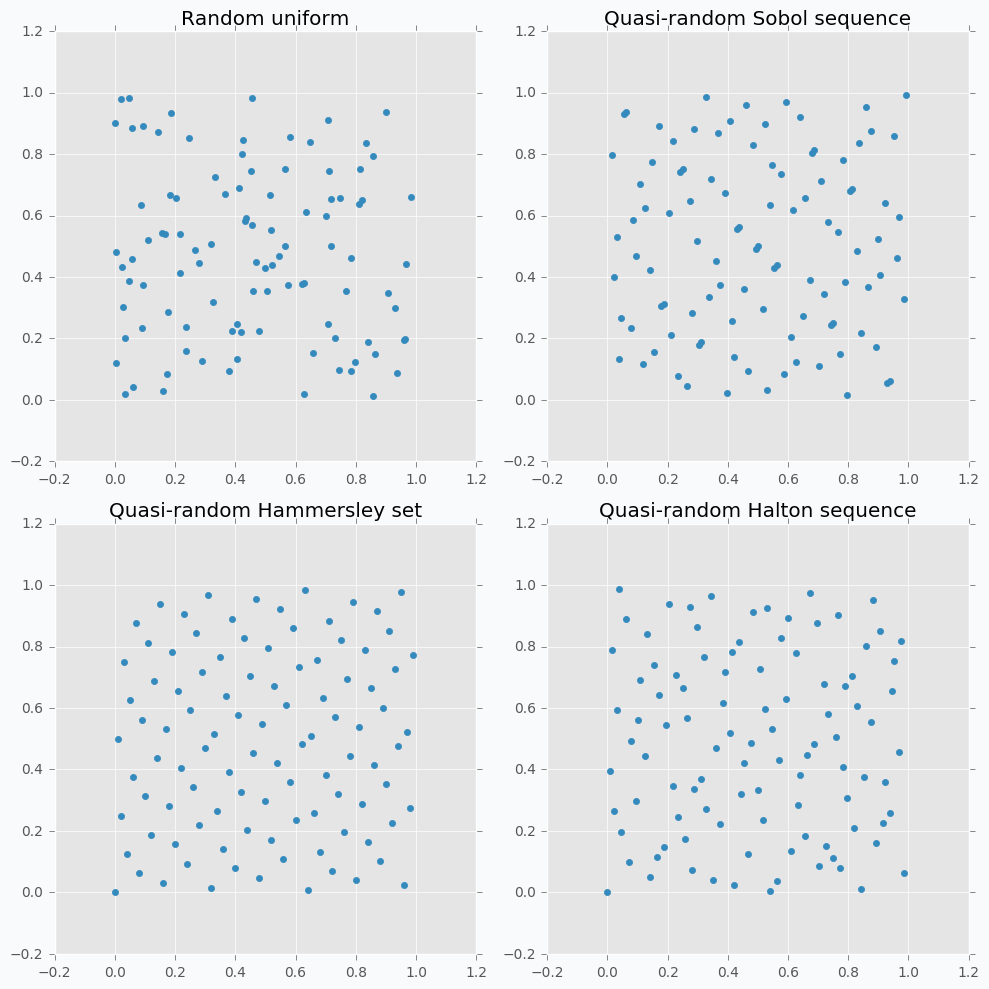
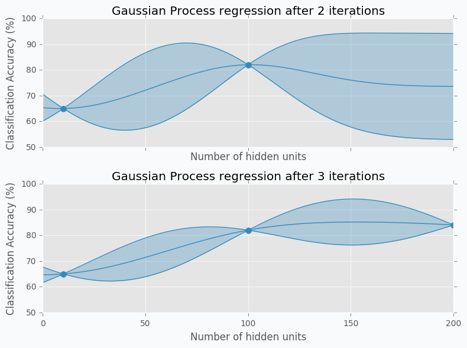
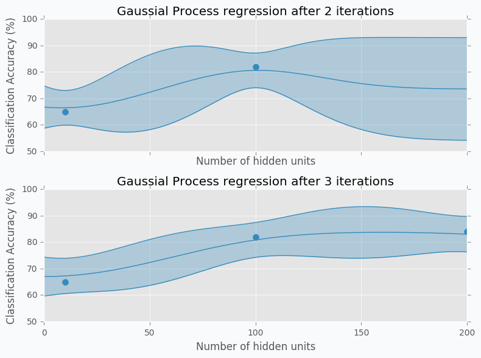
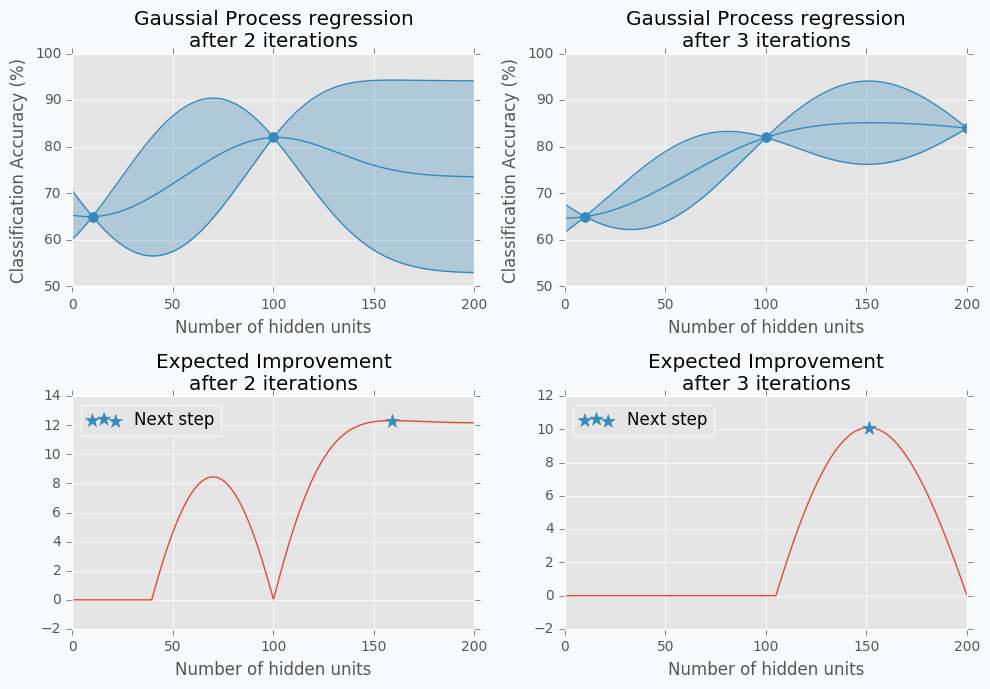
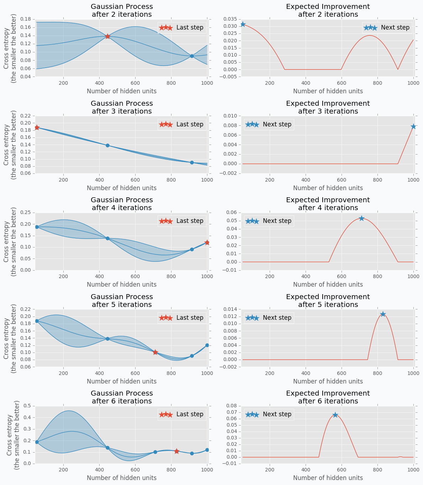
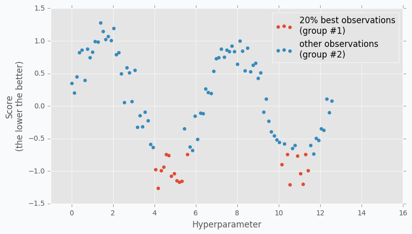
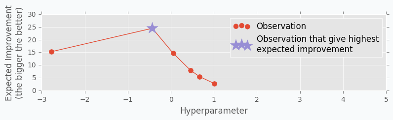

Hyperparameter optimization for Neural Networks
===============================================

.. raw:: html

    

        
        

        This article explains different hyperparameter algorithms that can be used for neural networks. It covers simple algorithms like Grid Search, Random Search and more complicated algorithms like Gaussian Process and Tree-structured Parzen Estimators (TPE).
        

         
    

.. contents::

Introduction
------------

Sometimes it can be difficult to choose a correct architecture for Neural Networks. Usually, this process requires a lot of experience because networks include many parameters. Let's check some of the most important parameters that we can optimize for the neural network:

* Number of layers
* Different parameters for each layer (number of hidden units, filter size for convolutional layer and so on)
* Type of activation functions
* Parameter initialization method
* Learning rate
* Loss function

Even though the list of parameters in not even close to being complete, it's still impressive how many parameters influences network's performance.

Hyperparameter optimization
---------------------------

In this article, I would like to show a few different hyperparameter selection methods.

* Grid Search
* Random Search
* Hand-tuning
* Gaussian Process with Expected Improvement
* Tree-structured Parzen Estimators (TPE)

Grid Search
-----------

The simplest algorithms that you can use for hyperparameter optimization is a Grid Search. The idea is simple and straightforward. You just need to define a set of parameter values, train model for all possible parameter combinations and select the best one. This method is a good choice only when model can train quickly, which is not the case for typical neural networks.

Imagine that we need to optimize 5 parameters. Let's assume, for simplicity, that we want to try 10 different values per each parameter. Therefore, we need to make 100,000 (:math:`10 ^ 5`) evaluations. Assuming that network trains 10 minutes on average we will have finished hyperparameter tuning in almost 2 years. Seems crazy, right? Typically, network trains much longer and we need to tune more hyperparameters, which means that it can take forever to run grid search for typical neural network. The better solution is random search.

Random Search
-------------

The idea is similar to Grid Search, but instead of trying all possible combinations we will just use randomly selected subset of the parameters. Instead of trying to check 100,000 samples we can check only 1,000 of parameters. Now it should take a week to run hyperparameter optimization instead of 2 years.

Let's sample 100 two-dimensional data points from a uniform distribution.

.. figure:: images/100-uniform-data-points.png
    :width: 100%
    :align: center
    :alt: Randomly generated 100 data points

In case if there are not enough data points, random sampling doesn't fully covers parameter space. It can be seen in the figure above because there are some regions that don't have data points. In addition, it samples some points very close to each other which are redundant for our purposes. We can solve this problem with `Low-discrepancy sequences <https://en.wikipedia.org/wiki/Low-discrepancy_sequence>`_ (also called quasi-random sequences).

There are many different techniques for quasi-random sequences:

* Sobol sequence
* Hammersley set
* Halton sequence
* Poisson disk sampling

Let's compare some of the mentioned methods with previously random sampled data points.

As we can see now sampled points spread out through the parameter space more uniformly. One disadvantage of these methods is that not all of them can provide you good results for the higher dimensions. For instance, Halton sequence and Hammersley set do not work well for dimension bigger than 10 [7]_.

Even though we improved hyperparameter optimization algorithm it still is not suitable for large neural networks.

But before we move on to more complicated methods I want to focus on parameter hand-tuning.

Hand-tuning
-----------

Let's start with an example. Imagine that we want to select the best number of units in the hidden layer (we set up just one hyperparameter for simplicity). The simplest thing is to try different values and select the best one. Let's say we set up 10 units for the hidden layer and train the network. After the training, we check the accuracy for the validation dataset and it turns out that we classified 65% of the samples correctly.

.. figure:: images/hid-units-vs-accuracy-iter1.png
    :width: 100%
    :align: center
    :alt: Hidden units vs Accuracy, Iteration #1

The accuracy is low, so it's intuitive to think that we need more units in a hidden layer. Let's increase the number of units and check the improvement. But, by how many should we increase the number of units? Will small changes make a significant effect on the prediction accuracy? Would it be a good step to set up a number of hidden units equal to 12? Probably not. So let's go further and explore parameters from the next order of magnitude. We can set up a number of hidden units equal to 100.

.. figure:: images/hid-units-vs-accuracy-iter2.png
    :width: 100%
    :align: center
    :alt: Hidden units vs Accuracy, Iteration #2

For the 100 hidden units, we got prediction accuracy equal to 82% which is a great improvement compared to 65%. Two points in the figure above show us that by increasing number of hidden units we increase the accuracy. We can proceed using the same strategy and train network with 200 hidden units.

.. figure:: images/hid-units-vs-accuracy-iter3.png
    :width: 100%
    :align: center
    :alt: Hidden units vs Accuracy, Iteration #3

After the third iteration, our prediction accuracy is 84%. We've increased the number of units by a factor of two and got only 2% of improvement.

We can keep going, but I think judging by this example it is clear that human can select parameters better than Grid search or Random search algorithms. The main reason why is that we are able to learn from our previous mistakes. After each iteration, we memorize and analyze our previous results. This information gives us a much better way for selection of the next set of parameters. And even more than that. The more you work with neural networks the better intuition you develop for what and when to use.

Nevertheless, let's get back to our optimization problem. How can we automate the process described above? One way of doing this is to apply a Bayesian Optimization.

Bayesian Optimization
---------------------

Bayesian optimization is a derivative-free optimization method. There are a few different algorithm for this type of optimization, but I was specifically interested in Gaussian Process with Acquisition Function. For some people it can resemble the method that we've described above in the Hand-tuning section. Gaussian Process uses a set of previously evaluated parameters and resulting accuracy to make an assumption about unobserved parameters. Acquisition Function using this information suggest the next set of parameters.

Gaussian Process
~~~~~~~~~~~~~~~~

The idea behind Gaussian Process is that for every input :math:`x` we have output :math:`y = f(x)`, where :math:`f` is a stochastic function. This function samples output from a gaussian distribution. Also, we can say that each input :math:`x` has associated gaussian distribution. Which means that for each input :math:`x` gaussian process has defined mean  :math:`\mu` and standard deviation :math:`\sigma` for some gaussian distribution.

Gaussian Process is a generalization of `Multivariate Gaussian Distribution <https://en.wikipedia.org/wiki/Multivariate_normal_distribution>`_. Multivariate Gaussian Distribution is defined by mean vector and covariance matrix, while Gaussian Process is defined by mean function and covariance function. Basically, a function is an infinite vector. Also, we can say that Multivariate Gaussian Distribution is a Gaussian Process for the functions with a discrete number of possible inputs.

I always like to have some picture that shows me a visual description of an algorithm. One of such visualizations of the Gaussian Process I found in the Introduction to Gaussian Process slides [3]_.

Let's check some Multivariate Gaussian Distribution defined by mean vector :math:`\mu`

.. math::

    \begin{align*}
        \mu =
        \left[
        \begin{array}{c}
          0.0 & 1.0 \\
        \end{array}
        \right]
    \end{align*}

and covariance matrix :math:`\Sigma`

.. math::

    \begin{align*}
        \Sigma =
        \left[
        \begin{array}{c}
          1.0 & 0.7 \\
          0.7 & 2.5 \\
        \end{array}
        \right]
    \end{align*}

We can sample 100 points from this distribution and make a scatter plot.

.. figure:: images/mulvar-gauss-dist-example.png
    :width: 100%
    :align: center
    :alt: Multivariate Gaussian Distribution Example

Another way to visualize these samples might be `Parallel Coordinates <https://en.wikipedia.org/wiki/Parallel_coordinates>`_.

.. figure:: images/mulvar-gauss-dist-parallel-coords.png
    :width: 100%
    :align: center
    :alt: Multivariate Gaussian Distribution in Parallel Coordinates Example

You should understand that lines that connect points are just an imaginary relations between each coordinate. There is nothing in between Random variable #1 and Random variable #2.

An interesting thing happens when we increase the number of samples.

.. figure:: images/mulvar-gauss-dist-parallel-coords-many-samples.png
    :width: 100%
    :align: center
    :alt: Multivariate Gaussian Distribution in Parallel Coordinates Example with 3000 samples

Now we can see that lines form a smooth shape. This shape defines a correlation between two random variables. If it's very narrow in the middle then there is a negative correlation between two random variables.

With scatter plot we are limited to numbers of dimensions that we can visualize, but with Parallel Coordinates we can add more dimensions. Let's define new Multivariate Gaussian Distribution using 5 random variables.

.. figure:: images/mulvar-gauss-dist-parallel-coords-5d.png
    :width: 100%
    :align: center
    :alt: Multivariate Gaussian Distribution in Parallel Coordinates for multiple dimensions

With more variables, it looks more like a function. We can increase the number of dimensions and still be able to visualize Multivariate Gaussian Distribution. The more dimensions we add the more it looks like a set of functions sampled from the Gaussian Process. But in case of Gaussian Process number of dimensions should be infinite.

Let's get data from the Hand-tuning section (the one where with 10 hidden units we got 65% of accuracy). Using this data we can train Gaussian Process and predict mean and standard deviation for each point :math:`x`.

The blue region defines 95% confidence interval for each point :math:`x`. It's easy to see that the further we go from the observed samples the wider confidence interval becomes which is a logical conclusion. The opposite is true as well. Very similar to the logic that a person uses to select next set of parameters.

From the plot, it looks like observed data points doesn't have any variance. In fact, the variance is not zero, it's just really tiny. That's because our previous Gaussian Process configuration is expecting that our prediction was obtained from a deterministic function which is not true for most neural networks. To fix it we can change the parameter for the Gaussian Process that defines the amount of noise in observed variables. This trick will not only give us a prediction that is less certain but also a mean of the number of hidden units that won't go through the observed data points.

Acquisition Function
~~~~~~~~~~~~~~~~~~~~

Acquisition Function defines the set of parameter for our next step. There are many different functions [1]_ that can help us calculate the best value for the next step. One of the most common is Expected Improvement. There are two ways to compute it. In case if we are trying to find minimum we can use this formula.

.. math::

    g_{min}(x) = max(0, y_{min} - y_{lowest\ expected})

where :math:`y_{min}` is the minimum observed value :math:`y` and :math:`y_{lowest\ expected}` lowest possible value from the confidence interval associated with each possible value :math:`x`.

In our case, we are trying to find the maximum value. With the small modifications, we can change last formula in the way that will identify Expected Improvement for the maximum value.

.. math::

    g_{max}(x) = max(0, y_{highest\ expected} - y_{max})

where :math:`y_{max}` is the maximum observed value and :math:`y_{highest\ expected}` highest possible value from the confidence interval associated with each possible value :math:`x`.

Here is an output for each point :math:`x` for the Expected Improvement function.

Find number of hidden units
~~~~~~~~~~~~~~~~~~~~~~~~~~~

Let's try to build a hyperparameter optimizer based on Gaussian Process regression and Expected Improvement function. We will continue work with the previous problem where we tried to find the best number of hidden units. But for this time we will try to create a network for digit classification tasks.

Let's define a function that trains the neural network and return prediction error.

.. code-block:: python

    from neupy import algorithms, layers

    def train_network(n_hidden, x_train, x_test, y_train, y_test):
        network = algorithms.Momentum(
            [
                layers.Input(64),
                layers.Relu(n_hidden),
                layers.Softmax(10),
            ],

            # Randomly shuffle dataset before each
            # training epoch.
            shuffle_data=True,

            # Do not show training progress in output
            verbose=False,

            step=0.001,
            batch_size=128,
            loss='categorical_crossentropy',
        )
        network.train(x_train, y_train, epochs=100)

        # Calculates categorical cross-entropy error between
        # predicted value for x_test and y_test value
        return network.score(x_test, y_test)

Let's import digits dataset from scikit-learn.

.. code-block:: python

    import numpy as np
    from sklearn import datasets
    from sklearn.model_selection import train_test_split
    from neupy import utils

    utils.reproducible()

    dataset = datasets.load_digits()
    n_samples = dataset.target.size
    n_classes = 10

    # One-hot encoder
    target = np.zeros((n_samples, n_classes))
    target[np.arange(n_samples), dataset.target] = 1

    x_train, x_test, y_train, y_test = train_test_split(
        dataset.data, target, test_size=0.3
    )

And for the last step, we need to define parameter selection procedure. First, we need to define a function that performs Gaussian Process regression and returns mean and standard deviation of the prediction for the specified input vector.

.. code-block:: python

    import numpy as np
    from sklearn.gaussian_process import GaussianProcess

    def vector_2d(array):
        return np.array(array).reshape((-1, 1))

    def gaussian_process(x_train, y_train, x_test):
        x_train = vector_2d(x_train)
        y_train = vector_2d(y_train)
        x_test = vector_2d(x_test)

        # Train gaussian process
        gp = GaussianProcess(corr='squared_exponential',
                             theta0=1e-1, thetaL=1e-3, thetaU=1)
        gp.fit(x_train, y_train)

        # Get mean and standard deviation for each possible
        # number of hidden units
        y_mean, y_var = gp.predict(x_test, eval_MSE=True)
        y_std = np.sqrt(vector_2d(y_var))

        return y_mean, y_std

Next, we need to apply to the predicted output Expected Improvement (EI) and find out next optimal step.

.. code-block:: python

    def next_parameter_by_ei(y_min, y_mean, y_std, x_choices):
        # Calculate expecte improvement from 95% confidence interval
        expected_improvement = y_min - (y_mean - 1.96 * y_std)
        expected_improvement[expected_improvement < 0] = 0

        max_index = expected_improvement.argmax()
        # Select next choice
        next_parameter = x_choices[max_index]

        return next_parameter

And finally, we can override all procedure in one function.

.. code-block:: python

    import random

    def hyperparam_selection(func, n_hidden_range, func_args=None, n_iter=20):
        if func_args is None:
            func_args = []

        scores = []
        parameters = []

        min_n_hidden, max_n_hidden = n_hidden_range
        n_hidden_choices = np.arange(min_n_hidden, max_n_hidden + 1)

        # To be able to perform gaussian process we need to
        # have at least 2 samples.
        n_hidden = random.randint(min_n_hidden, max_n_hidden)
        score = func(n_hidden, *func_args)

        parameters.append(n_hidden)
        scores.append(score)

        n_hidden = random.randint(min_n_hidden, max_n_hidden)

        for iteration in range(2, n_iter + 1):
            score = func(n_hidden, *func_args)

            parameters.append(n_hidden)
            scores.append(score)

            y_min = min(scores)
            y_mean, y_std = gaussian_process(parameters, scores,
                                             n_hidden_choices)

            n_hidden = next_parameter_by_ei(y_min, y_mean, y_std,
                                            n_hidden_choices)

            if y_min == 0 or n_hidden in parameters:
                # Lowest expected improvement value have been achieved
                break

        min_score_index = np.argmin(scores)
        return parameters[min_score_index]

Now we are able to run a few iterations and find a number of hidden units that gave better results during the training.

.. code-block:: python

    best_n_hidden = hyperparam_selection(
        train_network,
        n_hidden_range=[50, 1000],
        func_args=[x_train, x_test, y_train, y_test],
        n_iter=6,
    )

With small modifications, it's possible to add an additional functionality to the function that allows optimizing more hyperparameters at once.

Disadvantages of GP with EI
~~~~~~~~~~~~~~~~~~~~~~~~~~~

There are a few disadvantages related to the Gaussian Process with Expected Improvement.

1. It doesn't work well for categorical variables. In case if neural networks it can be a type of activation function.

2. GP with EI selects new set of parameters based on the best observation. Neural Network usually involves randomization (like weight initialization and dropout) during the training process which influences a final score. Running neural network with the same parameters can lead to different scores. Which means that our best score can be just lucky output for the specific set of parameters.

3. It can be difficult to select right hyperparameters for Gaussian Process. Gaussian Process has lots of different kernel types. In addition you can construct more complicated kernels using simple kernels as a building block.

4. It works slower when number of hyperparameters increases. That's an issue when you deal with a huge number of parameters.

Tree-structured Parzen Estimators (TPE)
---------------------------------------

Overview
~~~~~~~~

Tree-structured Parzen Estimators (TPE) fixes disadvantages of the Gaussian Process. Each iteration TPE collects new observation and at the end of the iteration, the algorithm decides which set of parameters it should try next. The main idea is similar, but an algorithm is completely different

At the very beginning, we need to define a prior distribution for out hyperparameters. By default, they can be all uniformly distributed, but it's possible to associate any hyperparameter with some random unimodal distribution.

For the first few iterations, we need to warn up TPE algorithm. It means that we need to collect some data at first before we can apply TPE. The best and simplest way to do it is just to perform a few iterations of Random Search. A number of iterations for Random Search is a parameter defined by the user for the TPE algorithm.

When we collected some data we can finally apply TPE. The next step is to divide collected observations into two groups. The first group contains observations that gave best scores after evaluation and the second one - all other observations. And the goal is to find a set of parameters that more likely to be in the first group and less likely to be in the second group. The fraction of the best observations is defined by the user as a parameter for the TPE algorithm. Typically, it's 10-25% of observations.

As you can see we are no longer rely on the best observation. Instead, we use a distribution of the best observations. The more iterations we use during the Random Search the better distribution we have at the beginning.

The next part of the TPE is to model likelihood probability for each of the two groups. This is the next big difference between Gaussian Process and TPE. For Gaussian Process we've modeled posterior probability instead of likelihood probability. Using the likelihood probability from the first group (the one that contains best observations) we sample the bunch of candidates. From the sampled candidates we try to find a candidate that more likely to be in the first group and less likely to be in the second one. The following formula defines Expected Improvement per each candidate.

.. math::

    EI(x) = \frac{l(x)}{g(x)}

Where :math:`l(x)` is a probability being in the first group and :math:`g(x)` is a probability being in the second group.

Here is an example. Let's say we have predefined distribution for both groups. From the group #1, we sample 6 candidates. And for each, we calculate Expected Improvement. A parameter that has the highest improvement is the one that we will use for the next iteration.

.. figure:: images/tpe-sampled-candidates.png
    :width: 100%
    :align: center
    :alt: Candidates sampling for TPE

In the example, I've used t-distributions, but in TPE distribution models using `parzen-window density estimators <https://www.cs.utah.edu/~suyash/Dissertation_html/node11.html>`_. The main idea is that each sample defines gaussian distribution with specified mean (value of the hyperparameter) and standard deviation. Then all these points stacks together and normalized to assure that output is Probability Density Function (PDF). That's why `Parzen estimators` appears in the name of the algorithm.

.. figure:: images/parzen-estimators.png
    :width: 100%
    :align: center
    :alt: Parzen estimators

And the `tree-structured` means that parameter space defines in a form of a tree. Later we will try to find the best number of layers for the network. In our case, we will try to decide whether it's better to use one or two hidden layers. In case if we use two hidden layers we should define the number of hidden units for the first and second layer independently. If we use one hidden layer we don't need to define the number of hidden units for the second hidden layer, because it doesn't exist for the specified set of parameter. Basically, it means that a number of hidden units in the second hidden layer depends on the number of hidden layers. Which means that parameters have tree-structured dependencies.

Hyperparameter optimization for MNIST dataset
~~~~~~~~~~~~~~~~~~~~~~~~~~~~~~~~~~~~~~~~~~~~~

Let's make an example. We're going to use MNIST dataset.

.. code-block:: python

    import numpy as np
    from sklearn import datasets, preprocessing
    from sklearn.model_selection import train_test_split

    X, y = datasets.fetch_openml('mnist_784', version=1, return_X_y=True)

    target_scaler = preprocessing.OneHotEncoder(sparse=False, categories='auto')
    y = target_scaler.fit_transform(y.reshape(-1, 1))

    X /= 255.
    X -= X.mean(axis=0)

    x_train, x_test, y_train, y_test = train_test_split(
        X.astype(np.float32),
        y.astype(np.float32),
        test_size=(1 / 7.)
    )

For hyperparameter selection, I'm going to use `hyperopt <https://github.com/hyperopt/hyperopt>`_ library. It has implemented TPE algorithm.

The hyperopt library gives the ability to define a prior distribution for each parameter. In the table below you can find information about parameters that we are going to tune.

.. csv-table::
    :header: "Parameter name", "Distribution", "Values"

    "Step size", "Log-uniform", ":math:`x \in [0.01, 0.5]`"
    "Batch size", "Log-uniform integer", ":math:`x \in [16, 512]`"
    "Activation function", "Categorical", ":math:`x \in \{Relu, PRelu, Elu, Sigmoid, Tanh\}`"
    "Number of hidden layers", "Categorical", ":math:`x \in \{1, 2\}`"
    "Number of units in the first layer", "Uniform integer", ":math:`x \in [50, 1000]`"
    "Number of units in the second layer (In case if it defined)", "Uniform integer", ":math:`x \in [50, 1000]`"
    "Dropout layer", "Uniform", ":math:`x \in [0, 0.5]`"

Here is one way to define our parameters in hyperopt.

.. code-block:: python

    import numpy as np
    from hyperopt import hp

    def uniform_int(name, lower, upper):
        # `quniform` returns:
        # round(uniform(low, high) / q) * q
        return hp.quniform(name, lower, upper, q=1)

    def loguniform_int(name, lower, upper):
        # Do not forget to make a logarithm for the
        # lower and upper bounds.
        return hp.qloguniform(name, np.log(lower), np.log(upper), q=1)

    parameter_space = {
        'step': hp.uniform('step', 0.01, 0.5),
        'layers': hp.choice('layers', [{
            'n_layers': 1,
            'n_units_layer': [
                uniform_int('n_units_layer_11', 50, 500),
            ],
        }, {
            'n_layers': 2,
            'n_units_layer': [
                uniform_int('n_units_layer_21', 50, 500),
                uniform_int('n_units_layer_22', 50, 500),
            ],
        }]),
        'act_func_type': hp.choice('act_func_type', [
            layers.Relu,
            layers.PRelu,
            layers.Elu,
            layers.Tanh,
            layers.Sigmoid
        ]),

        'dropout': hp.uniform('dropout', 0, 0.5),
        'batch_size': loguniform_int('batch_size', 16, 512),
    }

I won't get into details. I think that definitions are pretty clear from the code. In case if you want to learn more about hyperopt parameter space initialization you can check `this link <https://github.com/hyperopt/hyperopt/wiki/FMin#21-parameter-expressions>`_.

Next we need to construct a function that we want to minimize. In our case function should train network using training dataset and return cross entropy error for validation dataset.

.. code-block:: python

    from pprint import pprint

    def train_network(parameters):
        print("Parameters:")
        pprint(parameters)
        print()

First of all, in the training function, we need to extract our parameter.

.. code-block:: python

    step = parameters['step']
    batch_size = int(parameters['batch_size'])
    proba = parameters['dropout']
    activation_layer = parameters['act_func_type']
    layer_sizes = [int(n) for n in parameters['layers']['n_units_layer']]

Note that some of the parameters I converted to the integer. The problem is that hyperopt returns float types and we need to convert them.

Next, we need to construct network based on the presented information. In our case, we use only one or two hidden layers, but it can be any arbitrary number of layers.

.. code-block:: python

    from neupy import layers

    network = layers.Input(784)

    for layer_size in layer_sizes:
        network = network > activation_layer(layer_size)

    network = network > layers.Dropout(proba) > layers.Softmax(10)

To learn more about layers in NeuPy you should check :ref:`documentation <layers-basics>`.

After that, we can define training algorithm for the network.

.. code-block:: python

    from neupy import algorithms
    from neupy.exceptions import StopTraining

    def on_epoch_end(network):
        if network.training_errors[-1] > 10:
            raise StopTraining("Training was interrupted. Error is to high.")

    mnet = algorithms.RMSProp(
        network,

        batch_size=batch_size,
        step=step,

        loss='categorical_crossentropy',
        shuffle_data=True,

        signals=on_epoch_end,
    )

All settings should be clear from the code. You can check :network:`RMSProp` documentation to find more information about its input parameters. In addition, I've added a simple rule that interrupts training when the error is too high. This is an example of a simple rule that can be changed.

Now we can train our network.

.. code-block:: python

    mnet.train(x_train, y_train, epochs=50)

And at the end of the function, we can check some information about the training progress.

.. code-block:: python

    score = mnet.score(x_test, y_test)

    y_predicted = mnet.predict(x_test).argmax(axis=1)
    accuracy = metrics.accuracy_score(y_test.argmax(axis=1), y_predicted)

    print("Final score: {}".format(score))
    print("Accuracy: {:.2%}".format(accuracy))

    return score

You can see that I've used two evaluation metrics. First one is cross-entropy. NeuPy uses it as a validation error function when we call the ``score`` method. The second one is just a prediction accuracy.

And finally, we run hyperparameter optimization.

.. code-block:: python

    import hyperopt
    from functools import partial

    # Object stores all information about each trial.
    # Also, it stores information about the best trial.
    trials = hyperopt.Trials()

    tpe = partial(
        hyperopt.tpe.suggest,

        # Sample 1000 candidate and select candidate that
        # has highest Expected Improvement (EI)
        n_EI_candidates=1000,

        # Use 20% of best observations to estimate next
        # set of parameters
        gamma=0.2,

        # First 20 trials are going to be random
        n_startup_jobs=20,
    )

    hyperopt.fmin(
        train_network,

        trials=trials,
        space=parameter_space,

        # Set up TPE for hyperparameter optimization
        algo=tpe,

        # Maximum number of iterations. Basically it trains at
        # most 200 networks before selecting the best one.
        max_evals=200,
    )

And after all trials, we can check the best one in the ``trials.best_trial`` attribute.

Disadvantages of TPE
~~~~~~~~~~~~~~~~~~~~

On of the biggest disadvantages of this algorithm is that it selects parameters independently from each other. For instance, there is a clear relation between regularization and number of training epoch parameters. With regularization, we usually can train network for more epochs and with more epochs we can achieve better results. On the other hand without regularization, many epochs can be a bad choice because network starts overfitting and validation error increases. Without taking into account the state of the regularization variable each next choice for the number of epochs can look arbitrary.

It's good in case if you now that some variables have relations. To overcome problem from the previous example you can construct two different choices for epochs. The first one will enable regularization and selects a number of epochs from the :math:`[500, 1000]` range. And the second one without regularization and selects number of epochs from the :math:`[10, 200]` range.

.. code-block:: python

    hp.choice('training_parameters', [
        {
            'regularization': True,
            'n_epochs': hp.quniform('n_epochs', 500, 1000, q=1),
        }, {
            'regularization': False,
            'n_epochs': hp.quniform('n_epochs', 20, 300, q=1),
        },
    ])

Summary
-------

The Bayesian Optimization and TPE algorithms show great improvement over the classic hyperparameter optimization methods. They allow to learn from the training history and give better and better estimations for the next set of parameters. But it still takes lots of time to apply these algorithms. It’s great if you have an access to multiple machines and you can parallel parameter tuning procedure [4]_, but usually, it’s not an option. Sometimes it’s better just to avoid hyperparameter optimization. In case if you just try to build a network for trivial problems like image classification it’s better to use existed architectures with pre-trained parameters like `VGG19 <https://github.com/itdxer/neupy/tree/master/examples/cnn/vgg19.py>`_ or `ResNet <https://github.com/itdxer/neupy/tree/master/examples/cnn/resnet50.py>`_.

For unique problems that don’t have pre-trained networks the classic and simple hand-tuning is a great way to start. A few iterations can give you a good architecture which won’t be the state-of-the-art but should give you satisfying result with a minimum of problems. In case if accuracy does not suffice your needs you can always boost your performance getting more data or developing ensembles with different models.

Source Code
-----------

All source code is available on GitHub in the `iPython notebook <https://github.com/itdxer/neupy/blob/master/notebooks/Hyperparameter%20optimization%20for%20Neural%20Networks.ipynb>`_. It includes all visualizations and hyperparameter selection algorithms.

References
----------

.. [1] Bayesian Optimization and Acquisition Functions from http://www.cse.wustl.edu/~garnett/cse515t/files/lecture_notes/12.pdf

.. [2] Gaussian Processes in Machine Learning from http://mlg.eng.cam.ac.uk/pub/pdf/Ras04.pdf

.. [3] Slides: Introduction to Gaussian Process from https://www.cs.toronto.edu/~hinton/csc2515/notes/gp_slides_fall08.pdf

.. [4] Preliminary Evaluation of Hyperopt Algorithms on HPOLib from http://compneuro.uwaterloo.ca/files/publications/bergstra.2014.pdf

.. [5] Algorithms for Hyper-Parameter Optimization from http://papers.nips.cc/paper/4443-algorithms-for-hyper-parameter-optimization.pdf

.. [6] Slides: Pattern Recognition, Lecture 6 from http://www.csd.uwo.ca/~olga/Courses/CS434a_541a/Lecture6.pdf

.. [7] Low-discrepancy sampling methods from http://planning.cs.uiuc.edu/node210.html

.. [8] Parzen-Window Density Estimation from https://www.cs.utah.edu/~suyash/Dissertation_html/node11.html

.. author:: default
.. categories:: none
.. tags:: visualization, backpropagation, supervised, hyperparameter optimization
.. comments::
