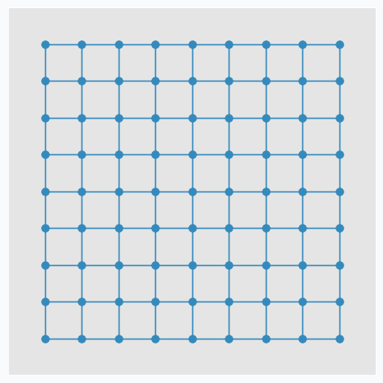
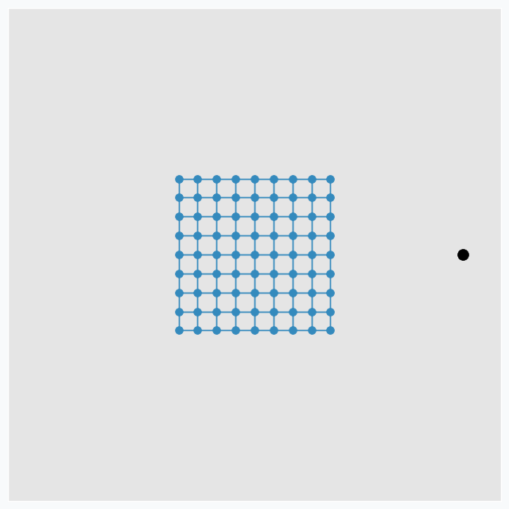
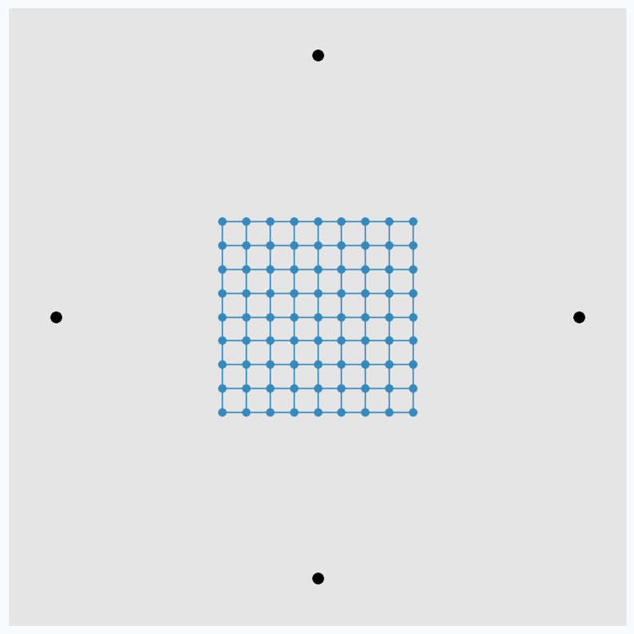
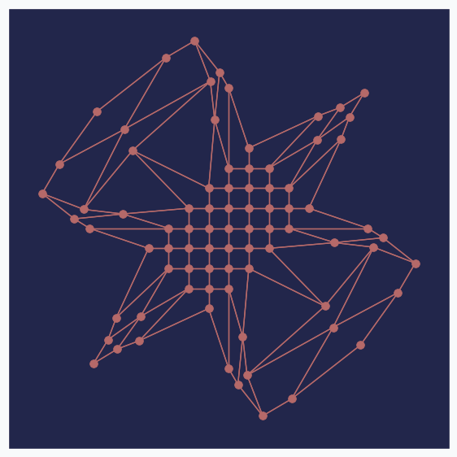
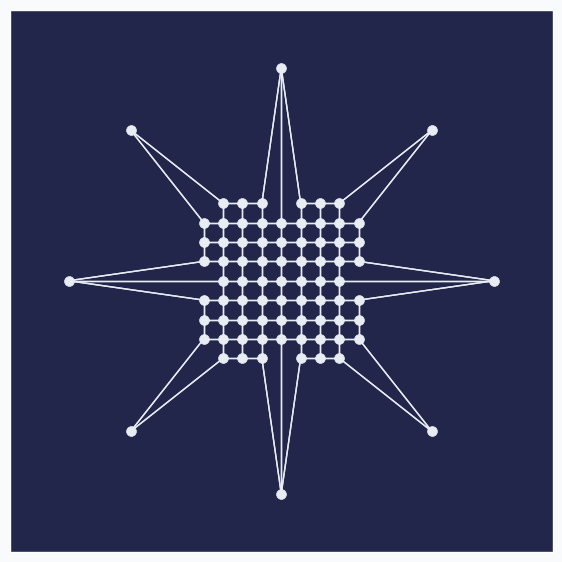
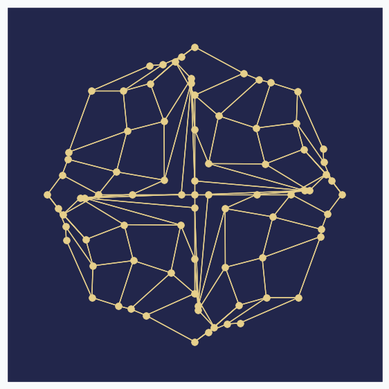

The Art of SOFM
===============

Introduction
------------

In this article, I just want to show how beautiful sometimes can be a neural network. I think, it's quite rare that algorithm can not only extract knowledge from the data, but also produce something beautiful using exactly the same set of training rules without any modifications.

The main idea
-------------

SOFM consists of multiple neurons that typically arranged in the **grid** with connections between some of the neurons. In this article, we will use grid in the shape of the square that looks like this.

During the training iteration we introduce some data point near the grid.

SOFM finds neuron that closest to the introduced data point. After that, it pushes neuron towards this data point. In addition, it finds a few neighbour neurons within specified radius, that we call **learning radius**, and pushes these neurons towards data point as well, but not as much as it pushed closest neuron.

.. figure:: images/sofm-update-with-one-data-point.png
    :width: 70%
    :align: center
    :alt: SOFM updated after one data point was introduced

To make it more interesting, we can put few extra points around the same grid.

And applying one update per each data point at a time we can get nice pattern.

.. figure:: images/sofm-4-dots-update.png
    :width: 70%
    :align: center
    :alt: SOFM symmetrically update weights

We can make patterns look more interestingly if we start moving data points around. Let's now use only two points and put one on the left and one on the right side from the grid. We do the same SOFM update again, but as soon as it's done we rotate two data points by 45 degrees counterclockwise. After repeating this process a few times, we can get another pattern.

.. figure:: images/sofm-update-and-rotate.png
    :width: 70%
    :align: center
    :alt: SOFM symmetrically update weights rotating data points

Black dots are two initial data points. And gray dots show places where we've seen these two data points after each new 45 degree rotation.

It's pretty cool that this simple approach can produce such a beautiful patterns. We can even define set of variables changing which we can generate different patterns.

Making patterns more interesting
--------------------------------

Randomizing some of the SOFM parameters we can produce different patterns on each run. In this article, we will use 3 most important SOFM parameters:

1. Learning rate
2. Learning radius
3. Learning rate for the neighbour neurons

**Learning rate** defines by how much we will push neurons during the updated. If learning rate value is small then we won't push it to far from the initial position.

**Learning radius** defines how many neighbour neurons will be updated. The larger the radius the more neighbours would be updated after each iteration. If learning radius equal to zero then only one neuron will be updated.

And the last one is a parameter that controls **learning rate for the neighbour neurons**. The larger the value the bigger update neighbour neurons will get.

Generate interesting patterns
-----------------------------

As in the example before, we will use only two data points and we will rotate them after each update by 45 degree counterclockwise. Each of the 3 SOFM parameter we randomly sample from the uniform distribution. Here are 16 randomly generated patterns.

.. figure:: images/sofm-16-generated-patterns.png
    :width: 100%
    :align: center
    :alt: 16 randomly generated patterns with SOFM network

You can see that even small changes in some of the parameters can produce very different results. One of the patterns even look like a bird.

Applications
------------

It looks a bit strange to think about this approach in context of practical applications, but there are some things that you can do with these patterns. For instance, it can be used to generate unique avatar images for the new website users. Adding more rules and variables to the image generating function we can make patterns even more diverse.

I also tried to play a game with these patterns in order to train my intuition. We use SOFM network parameters in order to generate these image, but reverse procedure is also possible. Seeing the generated pattern we can guess parameters that was used to generate it. For instance, here is a simple example of the pattern that looks like star

We can see that only one dot moved in each direction, so we can say that learning radius was zero. Since updated neurons moved far away from the initial grid we can say that learning rate was large.

Here is another one, more complicated.

In this example it's harder to say what happened, but we have at least one clue.In the center of the grid there are three dots, arranged horizontally, that didn't move after all updates. Knowing that there are nine dots in the row, we can conclude that learning radius was 2 or 3. We not sure which one, but if you see that there are just 5 dots left on their initial positions then it's very likely that radius was 3 since we moved more neurons into new positions.

I hope you got the idea. It's not always possible to guess the exact values, but each pattern can reveal some clues about the algorithm's set up.

Further reading
---------------

If you want to learn more about SOFM, you can :ref:`check article <sofm-applications>` that covers basic ideas behind SOFM and some of the problems that can be solved with this algorithm.

Code
----

All the code that was used to generate images in the article you can find in iPython notebook on github.

.. author:: default
.. categories:: none
.. tags:: sofm, unsupervised, visualization
.. comments::
