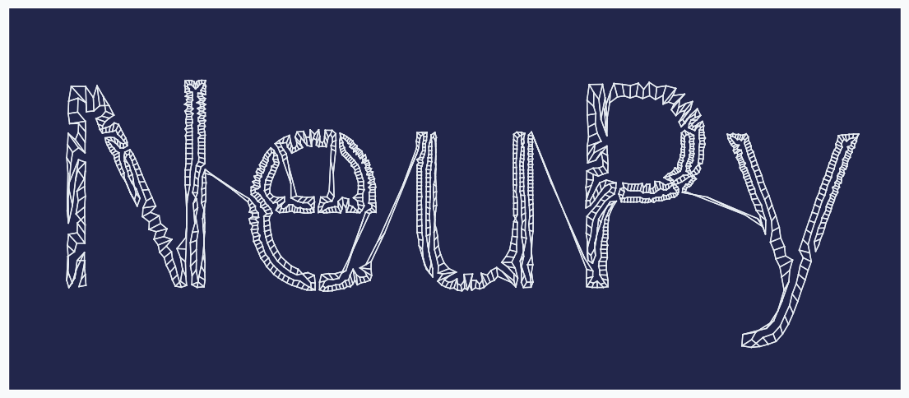
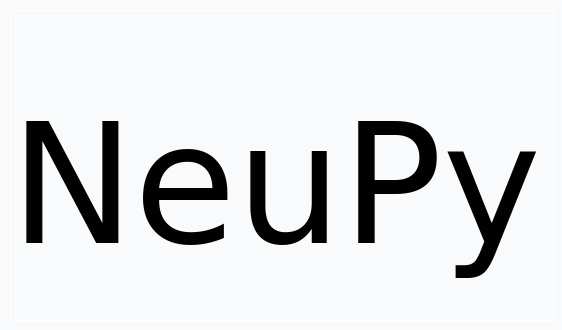
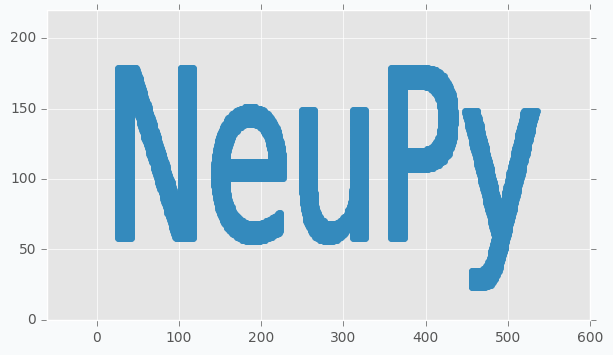
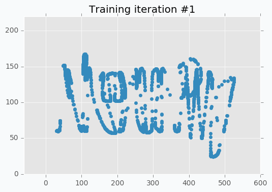
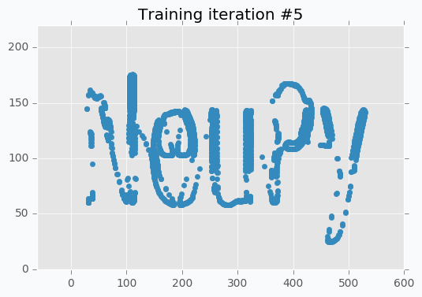
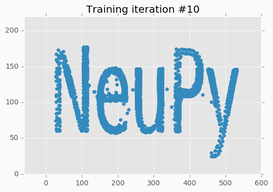

Create unique text-style with SOFM
==================================

Introduction
------------

In this article, I want to show how to generate unique text style using Self-Organizing Feature Maps (SOFM). I won't explain how SOFM works in this article, but if you want to learn more about algorithm you can check these articles.

1. :ref:`Self-Organizing Maps and Applications <sofm-applications>`
2. :ref:`The Art of SOFM <sofm-art>`

Transforming text into the data
-------------------------------

In order to start, we need to have some text prepared. I generated image using matplotlib, but anything else that able to generate image from the text will work.

.. code-block:: python

    import matplotlib.pyplot as plt

    red, blue, white = ('#E24A33', '#348ABD', '#FFFFFF')

    ax = plt.gca()
    ax.patch.set_facecolor(white)
    ax.text(0, 0.25, 'NeuPy', fontsize=120)

    plt.xticks([])
    plt.yticks([])

    plt.savefig('neupy-text.png', facecolor=white, bbox_inches='tight')

We cannot train SOFM using image, for this reason we will have to transform image into a set of data points. In order to do it we will encode every black pixel as data point and we will ignore white pixels. It's hard to see from the picture, but not all pixels are black and white. If you zoom close enough you will see that there are some gray pixels near the edge of each letter. For this reason, we have to binarize our image first.

.. code-block:: python

    from scipy.misc import imread

    neupy_text = imread('neupy-text.png')
    # Encode black pixels as 1 and white pixels as 0
    neupy_text = (1 - neupy_text / 255.).round().max(axis=2)

After binarization we have to filter all pixels that have value 1 and use pixel coordinates as a data point coordinates.

.. code-block:: python

    data = []
    for (x, y), value in np.ndenumerate(neupy_text):
        if value == 1:
            data.append([y, -x + 300])

    data = np.array(data)

We can use scatter plot to show that collected data points still resemble the shape of the main text.

.. code-block:: python

    plt.scatter(*data.T, color=blue)
    plt.show()

Weight initialization
---------------------

Weight initialization is very important step. With default random initialization it can be difficult for the network to cover the text, since in many cases neurons will have to travel across all image in order to get closer to their neighbors. In order to avoid this issue we have to manually generate grid of neurons, so that it would be easier for the network to cover the text.

I tried many different patterns and most of them work, but one-dimensional or *nearly* one-dimensional grids produced best patterns. It's mostly because patterns generated using two-dimensional grid look very similar to each other. With one-dimensional grid it's like covering the same text with long string. Network will be forced to stretch and rollup in order to cover the text. I mentioned term *nearly* one-dimensional, because that's the shape that I used at the end. Term "nearly" means that grid is two-dimensional, but because number of neurons along one dimension much larger than along the other we can think of it as almost one-dimensional. In the final solution I used grid with shape 2x1000.

.. code-block:: python

    # This parameter will be also used in the SOFM
    n = 1000

    # Generate weights and arange them along sine wave.
    # Because sine way goes up and down the final pattern
    # will look more interesting.
    weight = np.zeros((2, n))

    # Width of the weights were selected specifically for the NeuPy text
    weight[0, :] = np.linspace(25, 500, n)

    # Amplitute of the sine function also was selected in order
    # to roughly match height of the text
    weight[1, :] = (np.sin(np.linspace(0, 100, n)) + 1) * 50 + 50
    weight = np.concatenate([weight, weight], axis=1)

You can notice from the code that I applied sine function on the y-axis coordinates of the grid. With two-dimensional grid it's easy to cover the text. We just put large rectangular grid over the text. With nearly one-dimensional grid it's a bit tricky. We need to have a way that will allow us to cover our text and sine is one of the simple functions that can provide such a property. From the image below you can see how nicely it cover our text.

.. code-block:: python

    plt.figure(figsize=(16, 6))
    plt.scatter(*weight, zorder=100, color=blue)
    plt.scatter(*data.T, color=red, alpha=0.01)
    plt.show()

.. figure:: images/initialized-sofm-weights.png
    :width: 100%
    :align: center
    :alt: Initialized SOFM weights along sine wave

Training network
----------------

And the last step is to train the network. It took me some time to find right parameters for the network. Typically it was easy to see that there is something wrong with a training when all neurons start forming strange shapes that look nothing like the text. The main problem I found a bit latter. Because we have roughly 20,000 data points and 2000 neurons we make to many updates during one iteration without reducing parameter values. Reducing step size helped to solve this issue, because every update makes small change to the grid and making lots of these small changes make noticeable difference.

.. code-block:: python

    from neupy import algorithms

    sofm = algorithms.SOFM(
        n_inputs=2,
        features_grid=(2, n),
        weight=weight,

        # With large number of training samples it's safer
        # to use small step (learning rate)
        step=0.05,

        # Learning radis large for first 10 iterations, after that we
        # assume that neurons found good positions on the text and we just
        # need to move them a bit independentl in order to cover text better
        learning_radius=10,

        # after 10 iteration learning radius would be 0
        reduce_radius_after=1,

        # slowly decrease step size
        reduce_step_after=10,
    )

Because of the small step size we have to do more training iterations. It takes more time to converge, but final results are more stable to some changes in the input data. It's possible to speed up the overall process tuning parameter more carefully, but I decided that it's good enough.

I run training procedure for 30 iterations.

.. code-block:: python

    for iteration in range(30):
        sofm.train(data, epochs=1)

        plt.title('Training iteration #{}'.format(iteration))
        plt.scatter(*sofm.weight, color=blue)
        plt.show()

SOFM was trained for only one iteration and we already can vaguely see most of the latters. Let's wait a few more iterations.

.. figure:: images/sofm-training-iteration-3.png
    :width: 80%
    :align: center
    :alt: SOFM training iteration #3

Now it's way more clear that network makes progress during the training. And after 5 more iterations it's almost perfectly covers text.

But even after 10 iterations we still can see that some of the letters still require some polishing. For instance, left part of the letter N hasn't been properly covered.

In addition, it's important to point out that we specified step reduction after every 10 iterations. It means that now we won't move neurons as much as we did before. Also, learning radius was reduced to zero, which means that after 10th iteration each neuron will move independently. And these two changes are exactly what we need. We can see from the picture that network covers text pretty good, but small changes will make it look even better.

.. figure:: images/sofm-training-iteration-15.png
    :width: 80%
    :align: center
    :alt: SOFM training iteration #15

.. figure:: images/sofm-training-iteration-30.png
    :width: 80%
    :align: center
    :alt: SOFM training iteration #30

You can notice that there is almost no difference between iteration #15 and #30. It doesn't look like we made any progress after 15th iteration, but it's not true. If you stop training after 15th iteration, you will notice that some parts of the letters look a bit odd. These 15 last iterations do small changes that won't be noticeable from the scatter plot, but they are important.

And finally after all training iterations we can use our weights to generate logo.

.. code-block:: python

    # Function comes from the neupy's examples folder
    from examples.competitive.utils import plot_2d_grid

    background_color = '#22264b'
    text_color = '#e8edf3'

    fig = plt.figure(figsize=(14, 6))
    ax = plt.gca()
    ax.patch.set_facecolor(background_color)

    sofm_weights = sofm.weight.T.reshape((2, n, 2))
    plot_2d_grid(np.transpose(sofm_weights, (2, 0, 1)), color=text_color)

    plt.xticks([])
    plt.yticks([])

    # Coordinates were picked so that text
    # will be in the center of the image
    plt.ylim(0, 220)
    plt.xlim(-10, 560)

    plt.show()

Generalized approach for any text
---------------------------------

There are some challenges that you can face when you try to adopt this solution for different text. First of all, from the code you could have noticed that I "hard-coded" bounds of the text. In more general solution they can be identified from the image, but it will make solution more complex. For instance, the right bound of the text can be associated with data point that has largest x-coordinate. And the same can be done for the upper bound of the text. Second problem is related to the parameters of the SOFM. The main idea was to make lots of small updates for a long time, but it might fail for some other text that has more letters, because we will have more data points and more updates during each iterations. Problem can be solved if step size will be reduced.

Further reading
---------------

If you want to learn more about SOFM, you can read the :ref:`"Self-Organizing Maps and Applications" <sofm-applications>` article that covers basic ideas behind SOFM and some of the problems that can be solved with this algorithm.

Code
----

All the code that was used to generate images in the article you can find in `iPython notebook on github <https://github.com/itdxer/neupy/blob/master/notebooks/sofm/Generating%20NeuPy%20logo%20with%20SOFM.ipynb>`_.

.. author:: default
.. categories:: none
.. tags:: sofm, unsupervised, art
.. comments::
