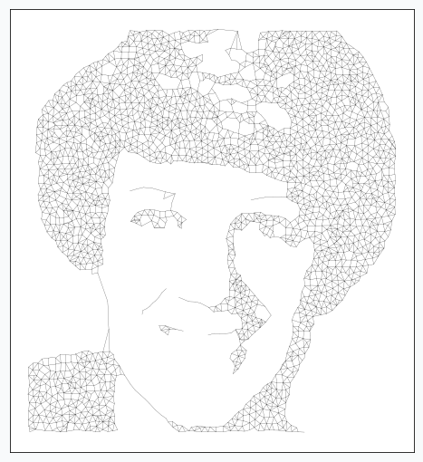
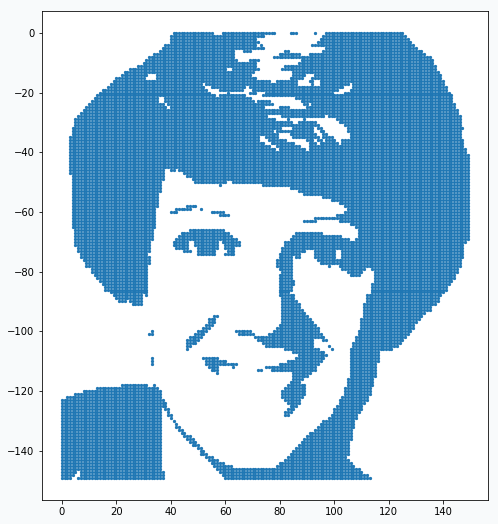
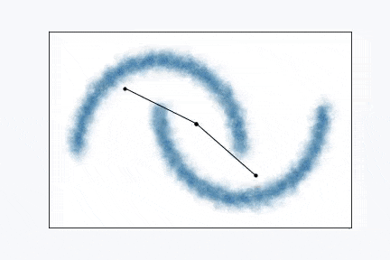
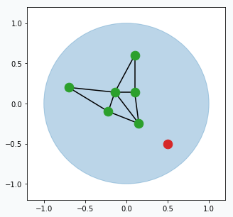
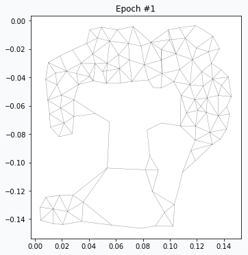
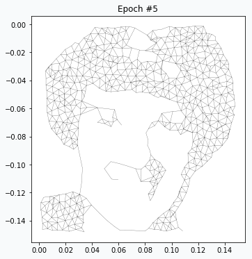
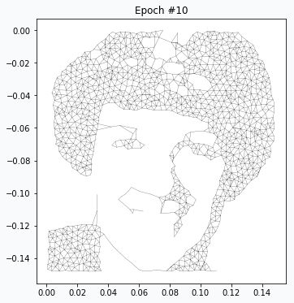

Making Art with Growing Neural Gas
==================================

Introduction
------------

Image processing pipeline
-------------------------

Growing Neural Gas network doesn't work with images. For this reason, we need to represent in format that can be understood by the network. The right format for the network would be set of data points. These data points have to somehow resemble original image. In order to do it we can binarize our image and after that every pixel on the image will be either black or white. Each black pixel we can use as a data point and pixel's position as a feature of this data point. In this way, we would be able to extract topological structure of the image.

Conversion from the color image to binirized image requires three simple image processing steps that we will apply in sequential way.

1. We need to load our image first

   .. code-block:: python

       # skimage version 0.13.1
       from skimage import data, img_as_float

       astro = img_as_float(data.astronaut())
       astro = astro[30:180, 150:300]

   .. figure:: images/colored-image.png
       :align: center
       :alt: Astronaut image

2. Convert color image to greyscale

   .. code-block:: python

       from skimage import color
       astro_grey = color.rgb2grey(astro)

   .. figure:: images/grey-image.png
       :align: center
       :alt: Greyscaled astronaut image

3. Apply gausian bluring. It will allow us to reduce image detalization.

   .. code-block:: python

       from skimage.filters import gaussian
       blured_astro_grey = gaussian(astro_grey, sigma=0.6)

   .. figure:: images/blured-image.png
       :align: center
       :alt: Blured and greyscaled astronaut image

4. Find binarization threshold and convert to the black color every pixel that above this threshold.

   .. code-block:: python

       from skimage.filters import threshold_otsu
       # Increase threshold in order to add more
       # details to the binarized image
       thresh = threshold_otsu(astro_grey) + 0.1
       binary_astro = astro_grey < thresh

   .. figure:: images/binary-image.png
       :align: center
       :alt: Binarized astronaut image

   In some cases, it might be important to adjust threshold in order to be able to capture all important details. In this example, I added `0.1` to the threshold.

And finally, from the binary image it's easy to make data points.

.. code-block:: python

    data = []
    for (x, y), value in np.ndenumerate(binary_astro):
        if value == 1:
            data.append([y, -x])

    plt.scatter(*np.array(data).T)

From the scatter plot it probably doesn't look like these are data points, but if you zoom in you will see that they really are.

.. figure:: images/data-points-eye-scatter-plot.png
    :align: center

Growing Neural Gas
------------------

Animation above pretty much shows Growing Neural Gas (GNG) algorithm in action. Algorithm, typically, starts with two random points and expands over the space.

In the original paper [1]_, algorithm looks a bit compliated with all variables and terminology, but in reality it's quite simple. Simplified version of the algorithm might look like this:

1. Pick one data point at random (red data point).

   .. figure:: images/gng-sampled-point-with-graph.png
       :align: center

2. Find two closest neurons (blue data points) to the sampled data point and connect these neurons with an edge.

   .. figure:: images/gng-added-edge.png
       :align: center

3. Pull closest neuron towards the data point. In addition, you can update neurons that connected by the edge with closest neuron.

   .. figure:: images/gng-updated.png
       :align: center

4. For each updated neuron we have to updated accumulated error. Update will be just a distance (euclidian) from the neuron to the data point. The further the neuron from the data point the larger the error.

5. Remove edges that haven't been updated for a while (maybe after 50, 100 or 200 iterations, up to you). In case if there are any neurons that doesn't have edges then we can remove them too.

6. From time to time (maybe every 100 or 200 iterations) we can find neuron that has largest accumulated error. For this neuron we can find it's neighbour with the highest accumulated error. In the middle way between them we can create new neuron (blue data point) that will be automatically connected to the other two neurons and original edge between them will be destroyed.

   .. figure:: images/gng-new-neuron-added.png
       :align: center

7. Repeat all the steps many times.

There are a few extentions to the algorithm has to be added in order to be able to call it Growing Neural Gas, but the most important principles are there.

Putting everything together
---------------------------

And now we ready to combine power of the image processing pipeline with GNG algorithm.

After running for one epoch we can alreadu see some progress. Minimalistic graph resembles some distinctive features of our original image. It's clear that we don't have enough neurons in the graph.

After 4 more iterations, image looks much closer to the original. You can notice that regions with large amount of data points have been developed properly, but small features like eyes, nose and mouth hasn't been formed yet. We just have to wait more.

After 4 more iterations we have visible progress. We can clearly see eyes and eyebrows.

And after 9 more interations we can stop training.

.. figure:: images/gng-art-epoch-20.png
    :align: center

Code
----

A few notebooks with code are available on github.

- `Main notebook <https://github.com/itdxer/neupy/blob/master/notebooks/growing-neural-gas/Making%20Art%20with%20Growing%20Neural%20Gas.ipynb>`_ that generates image of the astronaut.
- `Growing Neural Gas animation notebook <https://github.com/itdxer/neupy/blob/master/notebooks/growing-neural-gas/Growing%20Neural%20Gas%20animated.ipynb>`_
- Notebook that generates `step by step visualizations for the Growing Neural Gas <https://github.com/itdxer/neupy/blob/master/notebooks/growing-neural-gas/Growing%20Neural%20Gas%20-%20step%20by%20step%20visualizations.ipynb>`_ algorithm

References
----------

.. [1] A Growing Neural Gas Network Learns Topologies, Bernd Fritzke et al. https://papers.nips.cc/paper/893-a-growing-neural-gas-network-learns-topologies.pdf

.. [2] Thresholding, tutorial from scikit-image library http://scikit-image.org/docs/dev/auto_examples/xx_applications/plot_thresholding.html

.. [3] Thresholding (image processing), wikipedia article https://en.wikipedia.org/wiki/Thresholding_%28image_processing%29

.. author:: default
.. categories:: none
.. tags:: image processing, unsupervised, art
.. comments::
