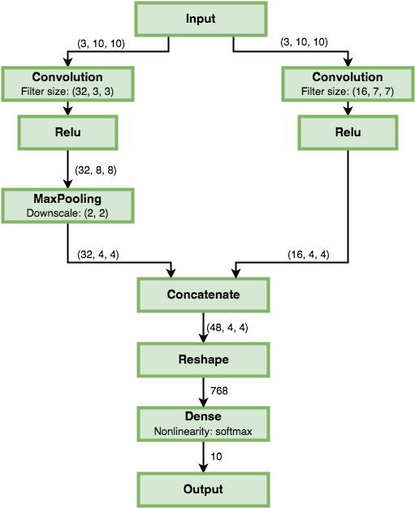

.. _layers-basics:

Basics
======

.. contents::

Layer is a building block for constructible neural networks. NeuPy has a simple and flexible framework that allows to construct complex neural networks.

Join layers
-----------

Let's start with basics. The most useful function to define relations between layers is ``layers.join``. It accepts sequence of layers and join them into the network.

.. code-block:: python

    >>> from neupy import layers
    >>>
    >>> layers.join(
    ...     layers.Sigmoid(1),
    ...     layers.Sigmoid(2),
    ... )
    Sigmoid(1) > Sigmoid(2)
    >>>
    >>> layers.join(
    ...     layers.Sigmoid(2),
    ...     layers.Sigmoid(1),
    ... )
    Sigmoid(2) > Sigmoid(1)

Inline operator
---------------

Also, NeuPy provides a special **inline** operator that helps to define sequential relations between layers.

.. code-block:: python

    >>> from neupy import layers
    >>>
    >>> network = layers.Sigmoid(2) > layers.Sigmoid(1)
    >>> network
    Sigmoid(2) > Sigmoid(1)

Input and output shapes
-----------------------

In the previous examples, each layer accepted one argument that defines it's output shape, but there is no information about network's input shape.

.. code-block:: python

    >>> from neupy import layers
    >>>
    >>> network = layers.Sigmoid(2) > layers.Sigmoid(1)
    >>> network
    Sigmoid(2) > Sigmoid(1)
    >>>
    >>> print(network.input_shape)
    None
    >>> network.output_shape
    (1,)

Network has two properties that provide information about network's input and output shape. In addition, we can iterate through each layer in the network and check their input and output shapes.

.. code-block:: python

    >>> from neupy import layers
    >>>
    >>> network = layers.Sigmoid(2) > layers.Sigmoid(1)
    >>>
    >>> for layer in network:
    ...     print(layer)
    ...     print('----------')
    ...     print('Input shape: {}'.format(layer.input_shape))
    ...     print('Output shape: {}'.format(layer.output_shape))
    ...     print()
    ...
    Sigmoid(2)
    ----------
    Input shape: None
    Output shape: (2,)

    Sigmoid(1)
    ----------
    Input shape: (2,)
    Output shape: (1,)

From the output we can clearly see that ``Sigmoid(1)`` layer has defined input and output shape. Input shape for the ``Sigmoid(1)`` layer has been provided by the ``Sigmoid(2)``, but ``Sigmoid(2)`` layer doesn't have any input connections and we know nothing about it's input shape. To be able to fix it we need to add the :layer:`Input` layer.

Input layer
-----------

The :layer:`Input` layer defines input shape for the network.

.. code-block:: python

    >>> network = layers.Input(3) > network
    >>>
    >>> for layer in network:
    ...     print(layer)
    ...     print('----------')
    ...     print('Input shape: {}'.format(layer.input_shape))
    ...     print('Output shape: {}'.format(layer.output_shape))
    ...     print()
    ...
    Input(3)
    ----------
    Input shape: (3,)
    Output shape: (3,)

    Sigmoid(2)
    ----------
    Input shape: (3,)
    Output shape: (2,)

    Sigmoid(1)
    ----------
    Input shape: (2,)
    Output shape: (1,)

The :layer:`Input` layer accepts one parameter that defines network's input shape. When we connected this layer to our previous network we defined input shape for the whole network.

Build networks from the code
----------------------------

You could have noticed that in the previous examples we was able to re-use previously defined network. In fact, we can simply construct network from the code.

.. code-block:: python

    >>> from neupy import layers
    >>>
    >>> network = layers.Input(10)
    >>>
    >>> for size in (8, 6, 4, 2):
    ...     network = network > layers.Sigmoid(size)
    ...
    >>> network
    Input(10) > Sigmoid(8) > Sigmoid(6) > Sigmoid(4) > Sigmoid(2)

Code above is equivalent to the following code

.. code-block:: python

    >>> from neupy import layers
    >>>
    >>> network = layers.join(
    ...     layers.Input(10),
    ...     layers.Sigmoid(8),
    ...     layers.Sigmoid(6),
    ...     layers.Sigmoid(4),
    ...     layers.Sigmoid(2),
    ... )
    >>> network
    Input(10) > Sigmoid(8) > Sigmoid(6) > Sigmoid(4) > Sigmoid(2)

.. raw:: html

     

Mutlilayer Perceptron (MLP)
===========================

In this section, we are going to learn more about layers with activation function which are the most important building blocks for the MLP networks. Let's consider the following example.

.. code-block:: python

    from neupy import layers

    network = layers.join(
        layers.Input(784),
        layers.Relu(500),
        layers.Relu(300),
        layers.Softmax(10),
    )

.. figure:: images/feedforward-graph-connection.png
    :align: center
    :alt: Feedforward connections in NeuPy

You can see from the figure above that each layer with activation function defines dense connection. The NeuPy combines layer that applies linear transformation with non-linear activation function into one layer. It's possible to break down this layer into two separate operations.

.. code-block:: python

    from neupy import layers

    network = layers.join(
        layers.Input(784),

        layers.Linear(500),
        layers.Relu(),

        layers.Linear(300),
        layers.Relu(),

        layers.Linear(10),
        layers.Softmax(),
    )

Example above defines exactly the same architecture as before. We just split each layer with activation function into simple operations. Operation in the ``layers.Relu(500)`` is the same as ``layers.Linear(500) > layers.Relu()``.

Convolutional Neural Networks (CNN)
===================================

NeuPy supports Convolutional Neural Networks. Let's consider the following example.

.. code-block:: python

    from neupy import layers

    convnet = layers.join(
        layers.Input((28, 28, 3)),

        layers.Convolution((3, 3, 32)),
        layers.Relu(),
        layers.Convolution((3, 3, 48)),
        layers.Relu(),
        layers.MaxPooling((2, 2)),

        layers.Reshape(),
        layers.Softmax(10),
    )

.. figure:: images/conv-graph-connection.png
    :align: center
    :alt: Convolutional Neural Network in NeuPy

There are a few new layers that we are going to explore in more details.

Reshape
-------

.. code-block:: python

    layers.Reshape()

This layer does the same as the `numpy.reshape <https://docs.scipy.org/doc/numpy/reference/generated/numpy.reshape.html>`_ function. The main different is that argument that defines new shape has default value. When shape is not specified explicitly, the :layer:`Reshape` layer converts input to 2D matrix.

.. code-block:: python

    >>> from neupy import layers
    >>> network = layers.Input((3, 10, 10)) > layers.Reshape()
    >>> connection.input_shape
    (3, 10, 10)
    >>> connection.output_shape
    (300,)

Also, we can specify expected output shape as a parameters for the :layer:`Reshape` layer.

.. code-block:: python

    >>> from neupy import layers
    >>> network = layers.Input((3, 10, 10)) > layers.Reshape((3, 100))
    >>> connection.input_shape
    (3, 10, 10)
    >>> connection.output_shape
    (3, 100)

Convolution
-----------

.. code-block:: python

    layers.Convolution((3, 3, 32))

Each of the convolutional layers takes one mandatory argument that defines convolutional filter. Input argument contains three integers ``(number of rows, number of columns, number of filters)``. Information about the stack size was taken from the previous layer.

NeuPy supports only 2D convolution, but it's trivial to make a 1D convolution. We can, for instance, set up width equal to ``1`` like in the following example.

.. code-block:: python

    >>> from neupy import layers
    >>>
    >>> layers.join(
    ...     layers.Input((10, 30)),
    ...     layers.Reshape((10, 1, 30)),
    ...     layers.Convolution((3, 1, 16)),
    ... )

Convolutional layer has a few other attributes that you can modify. You can check the :layer:`Convolutional <Convolution>` layer's documentation and find more information about its arguments.

Pooling
-------

.. code-block:: python

    layers.MaxPooling((2, 2))

Pooling layer has also one mandatory argument that defines a factor by which to downscale ``(vertical, horizontal)``. The ``(2, 2)`` value will halve the image in each dimension.

Pooling works only with 4D inputs, but you can use in case of 3D if you apply the same trick that we did for convolutional layer. You need to define one of the downscale factors equal to ``1``.

.. code-block:: python

    >>> from neupy import layers
    >>>
    >>> layers.join(
    ...     layers.Input((10, 30)),
    ...     layers.Reshape((10, 1, 30)),
    ...     layers.MaxPooling((2, 1)),
    ... )

.. raw:: html

     

Parallel connections
====================

Any connection between layers in NeuPy is a `Directional Acyclic Graph (DAG) <https://en.wikipedia.org/wiki/Directed_acyclic_graph>`_. So far we've encountered only sequential connections which is just a simple case of DAG. In NeuPy, we are allowed to build much more complex relations between layers.

.. code-block:: python

    from neupy import layers

    network = layers.join(
        layers.Input((10, 10, 3)),
        [[
            layers.Convolution((3, 3, 32)),
            layers.Relu(),
            layers.MaxPooling((2, 2)),
        ], [
            layers.Convolution((7, 7, 16)),
            layers.Relu(),
        ]],
        layers.Concatenate()

        layers.Reshape(),
        layers.Softmax(10),
    )

You can see two new layers. The first one is the Parallel layer. This layer accepts two parameters. First one is an array of multiple connections. As you can see from the figure above each of the connections above accepts the same input, but each of the do different transformation to this input. The second parameter is an layer that accepts multiple inputs and combine then into single output. From our example we can see that from the left branch we got output shape equal to ``(4, 4, 32)`` and from the right branch - ``(4, 4, 16)``. The :layer:`Concatenate` layer joins layers over the last dimension and as output returns tensor with shape ``(4, 4, 48)``.

Also its possible to define the same graph relations between layers with inline operator.

.. code-block:: python

    >>> from neupy import layers
    >>>
    >>> input_layer = layers.Input((10, 10, 3))
    >>> left_branch = layers.join(
    ...    layers.Convolution((3, 3, 32)),
    ...     layers.Relu(),
    ...     layers.MaxPooling((2, 2)),
    ... )
    >>>
    >>> right_branch = layers.join(
    ...     layers.Convolution((7, 7, 16)),
    ...     layers.Relu(),
    ... )
    >>>
    >>> network = input_layer > [left_branch, right_branch] > layers.Concatenate()
    >>> network = network > layers.Reshape() > layers.Softmax()

Notice that we've used Python's list with NeuPy's inline operator. List helps us to define one to many relations.

.. code-block:: python

    input_layer > [left_branch, right_branch]

and many to one

.. code-block:: python

    [left_branch, right_branch] > layers.Concatenate()

.. raw:: html

     

.. _subnetworks:

Subnetworks
===========

**Subnetworks** is a method that improves readability of the networks architecture. Instead of explaining it's much easier to show the main advantage of this method. Here is an example of the simple convolutional network.

.. code-block:: python

    from neupy.layers import *

    network = layers.join(
        Input((1, 28, 28)),

        Convolution((32, 3, 3)),
        Relu(),
        BatchNorm(),

        Convolution((48, 3, 3)),
        Relu(),
        BatchNorm(),
        MaxPooling((2, 2)),

        Convolution((64, 3, 3)),
        Relu(),
        BatchNorm(),
        MaxPooling((2, 2)),

        Reshape(),

        Relu(1024),
        BatchNorm(),

        Softmax(10),
    )

Does it look simple to you? Not at all. However, this is a really simple network. It looks a bit complicated, because it contains a lot of simple layers that usually combined into one. For instance, non-linearity like :layer:`Relu` is usually built-in inside the :layer:`Convolution` layer. So instead of combining simple layers in one complicated, in NeuPy it's better to use subnetworks. Here is an example on how to re-write network's structure from the previous example in terms of subnetworks.

.. code-block:: python

    from neupy.layers import *

    network = layers.join(
        Input((28, 28, 1)),

        Convolution((3, 3, 32)) > Relu() > BatchNorm(),
        Convolution((3, 3, 48)) > Relu() > BatchNorm(),
        MaxPooling((2, 2)),

        Convolution((3, 3, 64)) > Relu() > BatchNorm(),
        MaxPooling((2, 2)),

        Reshape(),

        Relu(1024) > BatchNorm(),
        Softmax(10),
    )

As you can see, we use an ability to organize sequence of simple layer in one small network. Each subnetwork defines a sequence of simple operations. You can think about subnetworks as a simple way to define more complicated layers. But instead of creating redundant classes that define complex layers you can define everything in place. In addition, it improves the readability, because now you can see order of these simple operations inside the subnetwork.
