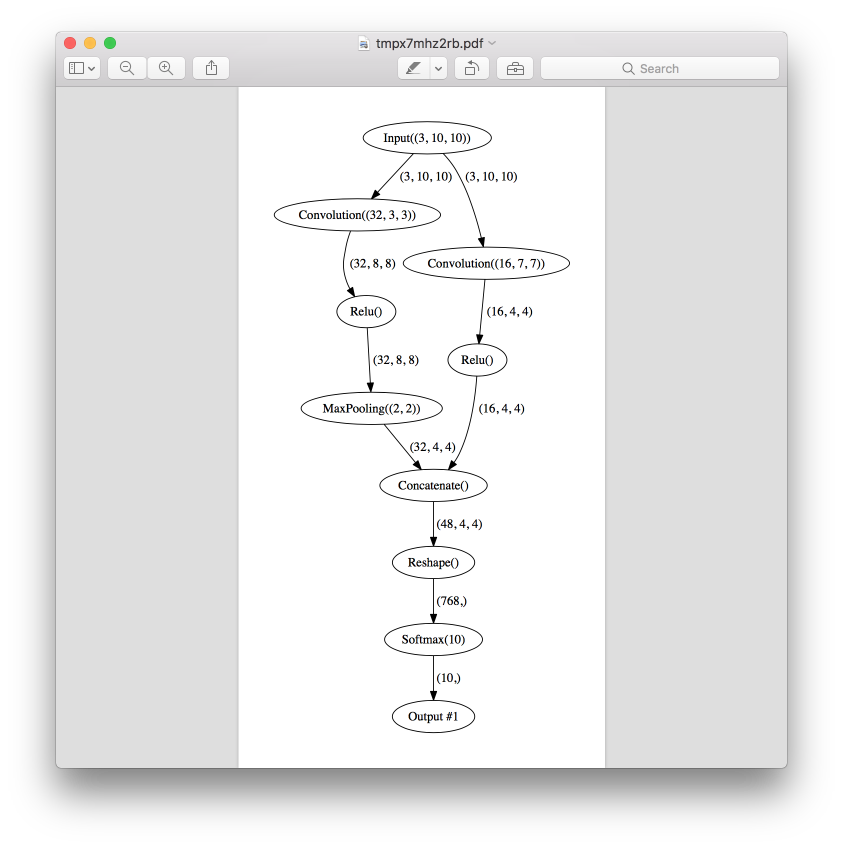
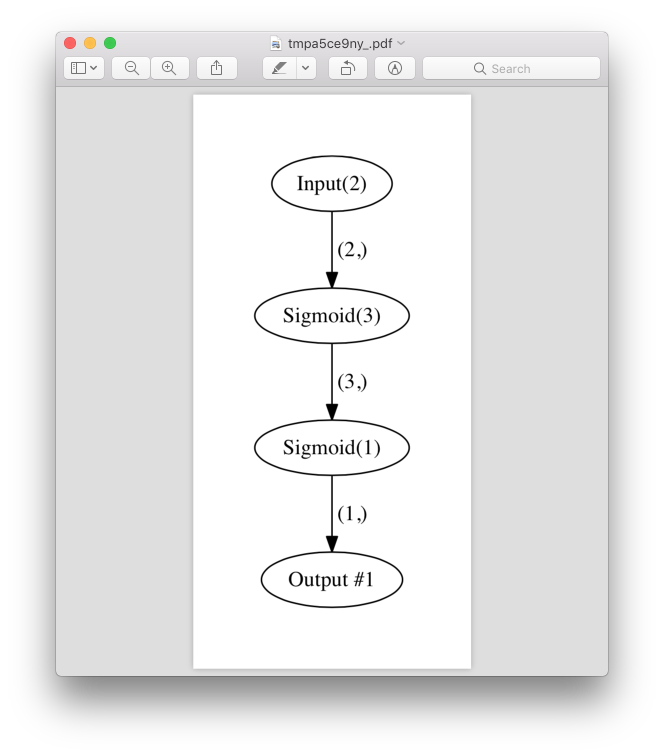

Debug layer connections
=======================

Explore connection shapes
--------------------------

The simples way to debug you connection is just to explore input and output shapes.

.. code-block:: python

    >>> from neupy import layers
    >>> connection = layers.Input(10) > layers.Relu(5) > layers.Softmax(3)
    >>> connection
    Input(10) > Relu(5) > Softmax(3)
    >>>
    >>> connection.input_shape
    (10,)
    >>> connection.output_shape
    (3,)

Also it's possible to iterate through layers and check shapes per each layer separately.

.. code-block:: python

    >>> for layer in connection:
    ...     print(layer)
    ...     print("Input shape: {}".format(layer.input_shape))
    ...     print("Output shape: {}".format(layer.output_shape))
    ...     print()
    ...
    Input(10)
    Input shape: (10,)
    Output shape: (10,)

    Relu(5)
    Input shape: (10,)
    Output shape: (5,)

    Softmax(3)
    Input shape: (5,)
    Output shape: (3,)

More complex connection that are not suitable for sequential iteration will be topologicaly sorted at first and then presented one by one during the iteration.

Debug Theano

Visualize connections
---------------------

For the debugging it's useful to explore connection's structure. It's possible to create graph visualization in NeuPy. Let's say we have this network.

.. code-block:: python

    from neupy import layers

    network = layers.join(
        layers.Input((3, 10, 10)),

        [[
            layers.Convolution((32, 3, 3)),
            layers.Relu(),
            layers.MaxPooling((2, 2)),
        ], [
            layers.Convolution((16, 7, 7)),
            layers.Relu(),
        ]],
        layers.Concatenate()

        layers.Reshape(),
        layers.Softmax(10),
    )

To be able to visualize it we can just use :class:`layer_structure <neupy.plots.layer_structure>` function.

.. code-block:: python

    from neupy import plots
    plots.layer_structure(network)

.. raw:: html

     

This function will pop-up PDF file with graph that defines all layers and relations between them. In addition it shows input and output shape per each layer.

Also you can save it in separate file if you need.

.. code-block:: python

    from neupy import plots
    plots.layer_structure(connection, filepath='connection.pdf',
                          show=False)

Function also works for the networks.

.. code-block:: python

    from neupy import algorithms, plots

    nnet = algorithms.GradientDescent((2, 3, 1))
    plots.layer_structure(nnet)

.. raw:: html

     

Count number of parameters
--------------------------

.. code-block:: python

    >>> from neupy import layers
    >>>
    >>> connection = layers.join(
    ...     layers.Input(10),
    ...     layers.Relu(5),  # weight: 10 * 5, bias: 5, total: 55
    ...     layers.Relu(2),  # weight:  5 * 2, bias: 2, total: 12
    ... )
    >>> layers.count_parameters(connection)
    67

Exploring graph connections
---------------------------

Any relation between layers stores in the specific graph. To be able to debug connections you can check network graph to make sure that all connections defined correctly.

.. code-block:: python

    >>> from neupy import layers
    >>>
    >>> input_layer = layers.Input(10)
    >>> input_layer.graph
    [(Input(10), [])]

Since layer doesn't have any relations its graph is empty. We can define new network and check graph again.

.. code-block:: python

    >>> network = layers.join(
    ...     input_layer,
    ...     [[
    ...         layers.Relu(10),
    ...         layers.Relu(20),
    ...     ], [
    ...         layers.Relu(30),
    ...     ]],
    ...     layers.Concatenate()
    ... )
    >>> network.graph
    [(Input(10), [Relu(10), Relu(30)]),
     (Relu(10), [Relu(20)]),
     (Relu(20), [Concatenate()]),
     (Relu(30), [Concatenate()]),
     (Concatenate(), [])]

Graph has formatted representation in case if you print it. But if you need to access it directly you need to get ``forward_graph`` attribute.

.. code-block:: python

    >>> network.graph.forward_graph
    OrderedDict([(Input(10), [Relu(10), Relu(30)]), (Relu(10),
    [Relu(20)]), (Relu(20), [Concatenate()]), (Relu(30),
    [Concatenate()]), (Concatenate(), [])])

**Do not try to modify graph**. Modifications can break relations between layers. This feature is only available for debugging.
