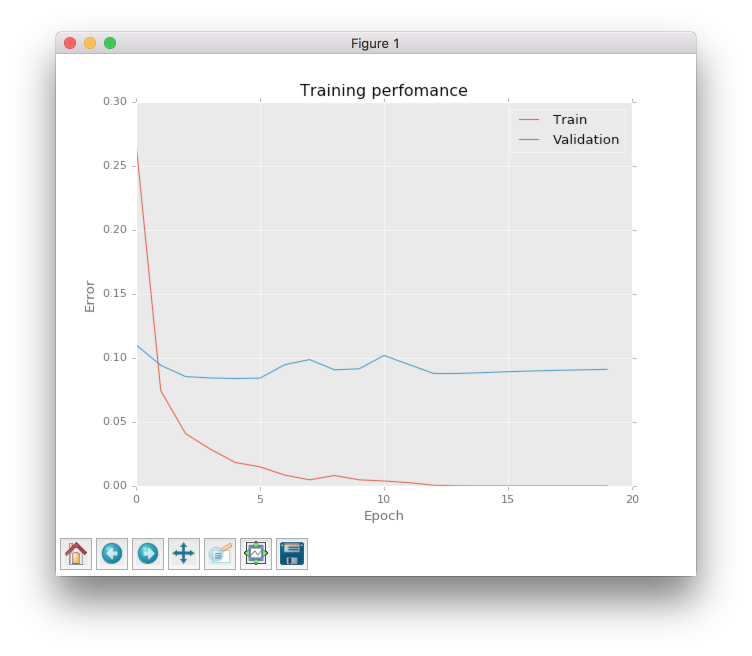
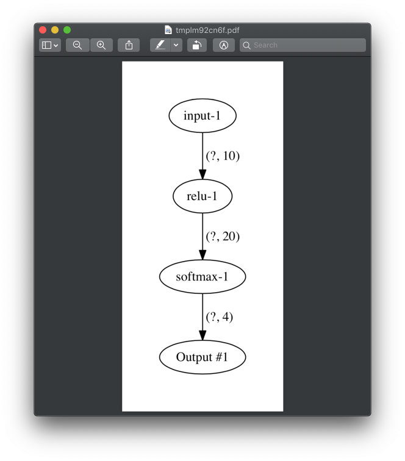

Visualizations
==============

Hinton diagram
--------------

More information about the Hinton diagram you can find in :plot:`documentation <hinton>`. The small example is shown below.

.. code-block:: python

    import numpy as np
    import matplotlib.pyplot as plt
    from neupy import plots

    weight = np.random.randn(20, 20)

    plt.style.use('ggplot')
    plt.figure(figsize=(16, 12))
    plt.title("Hinton diagram")
    plots.hinton(weight)
    plt.show()

.. figure:: images/plots-hinton-example.png
    :width: 100%
    :align: center
    :alt: Hinton diagram example from NeuPy library

Error plot
----------

The plot shows the basic information about network's training progress.

.. code-block:: python

    from neupy import algorithms, plots

    gdnet = algorithms.GradientDescent((2, 3, 1))
    gdnet.train(x_train, y_train, x_test, y_test, epochs=100)

    plots.error_plot(gdnet)

More information related to this plot function you can in the :plot:`error_plot` documentation.

Layer structure
---------------

Visualize relations between layers in the network.

.. code-block:: python

    from neupy import layers, plots

    network = layers.join(
        layers.Input(10),
        layers.Relu(20),
        layers.Softmax(4),
    )
    plots.layer_structure(network)

.. raw:: html

     

